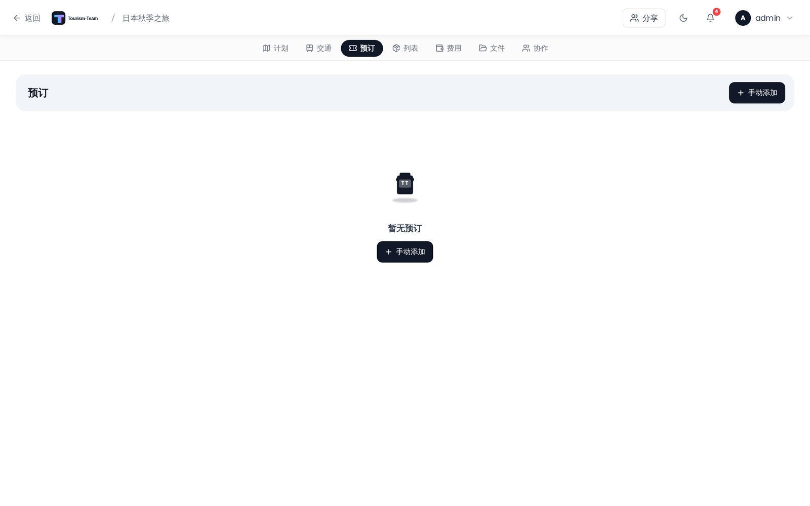
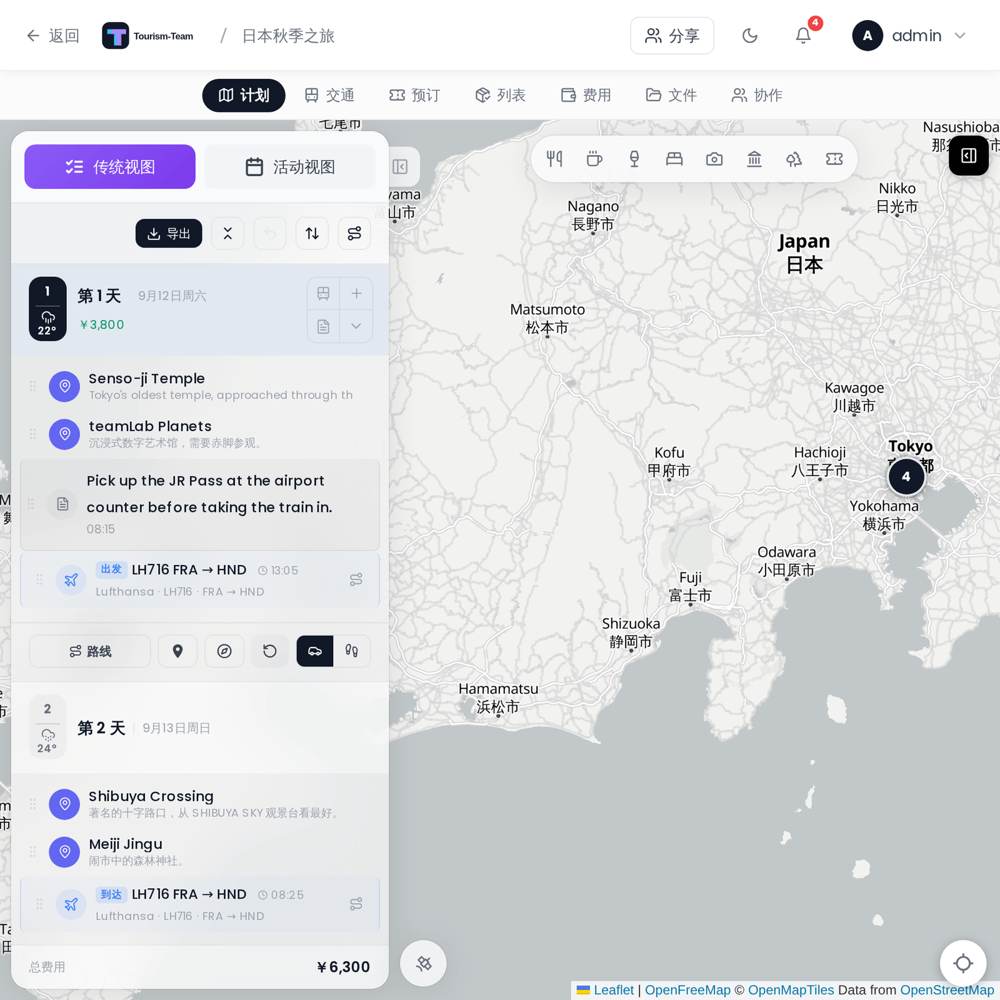

# 住宿

把住宿关联到具体的入住日和退房日，使其在你停留的每一天都出现。住宿是一种独立的记录类型，由 `day_accommodations` 表支撑，与常规预订分开，不过每条住宿都会自动创建一条关联的 **酒店** 预订。

## 创建住宿

有两种创建住宿的方式：

**从预订面板：** 点击 **手动预订** 并选择 **酒店** 作为预订类型。当类型设为酒店时，日期/时间和位置字段会被住宿专用输入替代（见下文）。保存表单会同时创建酒店预订和底层的住宿记录。

**从日程详情面板：** 点击日程详情浮层中的酒店图标或 **添加住宿** 按钮。会出现一个选择器，让你从旅行中选择一个地点、选择日程范围，并可选地填入入住/退房时间和确认码。这会同时创建住宿记录及其关联的酒店预订。

## 住宿专用字段

在预订面板中以 **酒店** 类型创建或编辑时，日期/时间和位置字段会被住宿专用输入替代：

| 字段 | 说明 |
|-------|-------------|
| **住宿** | 搜索或选择一个现有旅行地点作为该住所关联。选择地点时，如果标题为空会预填标题，如果该地点有地址会预填位置字段 |
| **从** | 入住日 |
| **到** | 退房日 |
| **入住** | 你可以入住的最早时间 |
| **入住截止** | 前台接受入住的最晚时间 |
| **退房** | 你必须退房的最晚时间 |

**确认码**、**状态**（待定 / 已确认）和 **备注** 字段也可用，与所有预订类型一样。

## 在日程详情面板中

对于 **从** 日到 **到** 日（含）之间的每一天，住宿都会出现在日程详情面板浮层中。它显示关联的地点名称和地址、相关边界日的入住或退房标签，以及入住窗口、退房时间和确认码（如果设置了）。中间的夜晚只显示地点名称，不带入住/退房标签。关联的酒店预订的状态和确认号也会内联显示。

## 在日程计划侧栏中

住宿会作为小的颜色编码徽标出现在日程计划侧栏的日程标题行中：

- **绿色徽标** —— 入住日
- **红色徽标** —— 退房日
- **中性徽标** —— 其间的夜晚（持续停留）

点击徽标会导航到关联的地点。酒店类型的预订会被从地点之间的内联交通卡片列表中过滤掉；它们不会作为交通项出现在时间轴中。

## 在预订面板中

预订面板中的酒店预订卡片会显示关联的住宿名称（地点名称），与确认码和状态等标准预订字段并列。入住和退房时间在设置后显示在卡片的元数据区域。

---

**另见：** [预订与订单](Reservations-and-Bookings) · [交通：航班、火车、汽车](Transport-Flights-Trains-Cars) · [日程计划与备注](Day-Plans-and-Notes)
