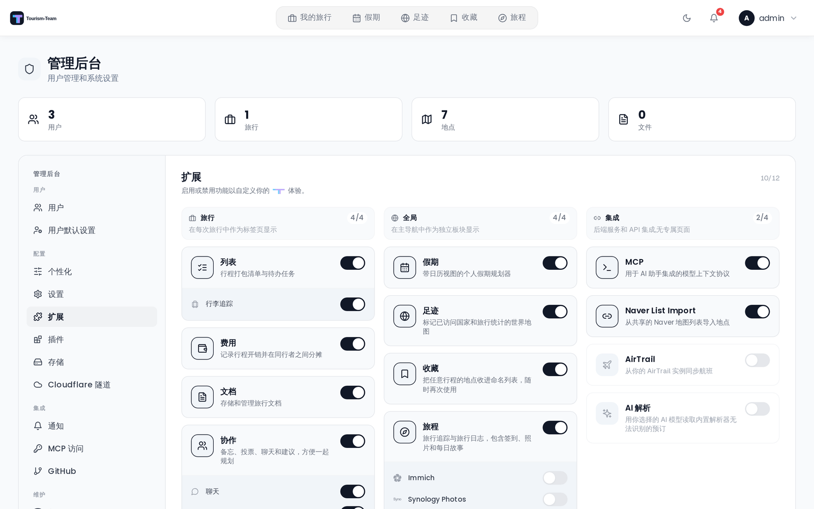

# 扩展概览

扩展是可选功能，管理员可以针对整个 Tourism-Team 实例启用或禁用它们。扩展被禁用后，它的导航标签页、菜单项和 API 路由会对所有用户隐藏。

## 扩展是什么

每个扩展都为 Tourism-Team 增添核心行程规划功能之外的能力。扩展是全局管理的 —— 你无法只为一个用户启用某个扩展。一旦启用，该功能就会对实例上的所有用户可用。

## 扩展列表

以下扩展已注册在系统中（定义于 `server/src/db/seeds.ts`；`server/src/addons.ts` 中的 TypeScript 常量 `ADDON_IDS` 覆盖了除 `naver_list_import` 之外的所有扩展）：

| 扩展 ID | 类型 | 说明 |
|---|---|---|
| `mcp` | integration | 通过 Model Context Protocol 把 Tourism-Team 的数据和操作开放给 AI 助手集成。 |
| `packing` | trip | **列表** —— 旅行的行李清单和待办任务。见 [行李清单](Packing-Lists)。 |
| `budget` | trip | **费用** —— 记录和分摊旅行支出。见 [费用](Budget-Tracking)。 |
| `documents` | trip | 旅行的文档与文件附件 —— 存放行程单、签证复印件和其他文件。见 [文档与文件](Documents-and-Files)。 |
| `vacay` | global | 个人假期日程规划器，带年度日历、节假日包、协作者融合和只读日历分享。见 [假期](Vacay)。 |
| `atlas` | global | 交互式世界地图，展示你去过的国家和地区，另含心愿单。见 [足迹](Atlas)。 |
| `collab` | trip | 用于旅行协作的笔记、投票和实时聊天。见 [实时协作](Real-Time-Collaboration)。 |
| `journey` | global | 旅行追踪与旅行日志 —— 打卡、照片和每日故事。见 [旅程](Journey-Journal)。 |
| `collections` | global | 个人的、服务器范围的地点库，把地点保存在具名列表中，带想法/想去/去过状态、分类，以及按成员角色分享的融合功能。见 [收藏](Collections)。 |
| `airtrail` | integration | 从你自托管的 AirTrail 实例同步航班到旅行中。 |
| `llm_parsing` | integration | AI 解析 —— 当 KDE Itinerary 读不了确认文件时，用大模型兜底提取订单信息。见 [AI 订单导入](AI-Booking-Import)。 |
| `naver_list_import` | trip | 从分享的 Naver 地图列表直接导入地点到旅行中。 |

## 启用扩展

> **管理员：**所有扩展都在管理后台中开关。前往 [管理：扩展](Admin-Addons) 为你的实例启用或禁用各个扩展。

## 各扩展的子功能

有些扩展提供了管理员可以独立开关的子功能。例如 [实时协作](Real-Time-Collaboration) 扩展允许管理员决定它的四个子功能（聊天、笔记、投票和接下来）中哪些在整个实例范围内启用。这些都在 [管理：扩展](Admin-Addons) 面板中与该扩展的主开关一起配置。
