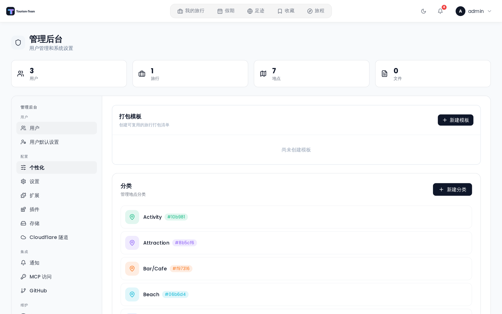

# 管理 — 分类

**个性化** 标签页 → **分类** 分区让你管理全局地点分类。分类在实例上的所有旅行和所有用户之间共享。

## 分类是什么

一个分类由名称、颜色和图标三部分组成的标签。用户在创建或编辑地点时为地点指定分类。分类会出现在：

- 地点表单的分类选择器中
- 地点卡片上的彩色标签
- 地点筛选面板中
- 作为地点地图标记的颜色，以及标记的悬停弹窗中

## 创建分类

点击 **新建分类**（分类分区右上角）。表单会就地展开：

1. **名称** —— 必填。分类的自由文本标签。
2. **图标** —— 约 47 个精选 Lucide 图标的可滚动网格（图钉、酒店、餐厅、交通、自然等）。点击任意图标即可选中。默认图标是 `MapPin`。
3. **颜色** —— 12 个预设色块，外加一个自定义取色器（吸管按钮）。默认颜色是 `#6366f1`（靛蓝）。这 12 个预设是：

   `#6366f1` · `#8b5cf6` · `#ec4899` · `#ef4444` · `#f97316` · `#f59e0b` · `#10b981` · `#06b6d4` · `#3b82f6` · `#84cc16` · `#6b7280` · `#1f2937`

4. 一个 **实时预览** 标签会随着你的选择显示该分类在用户眼中的样子。

点击 **创建** 保存。

## 编辑分类

点击任意分类行上的铅笔图标。同一个表单会就地展开，并预填现有值。修改任意字段后点击 **更新**。

## 删除分类

点击分类行上的垃圾桶图标并确认。删除会把所有曾指定该分类的地点的 `category_id` 置为 `NULL` —— 地点本身不受影响，只是变成未分类。

## 列表排序

分类始终按名称的字母顺序显示。不支持手动重排。

## 相关页面

- [地点与搜索](Places-and-Search)
- [管理后台概览](Admin-Panel-Overview)
