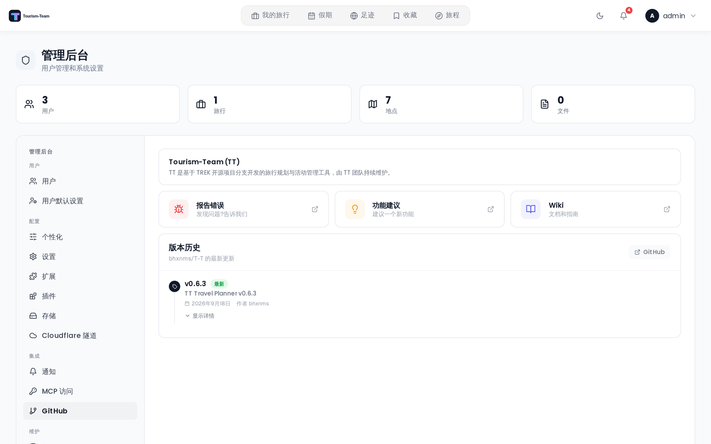

# 管理 — GitHub 发布

**GitHub** 标签页显示从 GitHub 获取的 Tourism-Team 版本历史，并提供社区资源和支持方式的链接。

## 支持与资源

标签页顶部的五张卡片链接到外部资源：

| 卡片 | 链接 |
|------|------|
| **Ko-fi** | 从经济上支持本项目 |
| **Buy Me a Coffee** | 另一种支持方式 |
| **报告错误** | 使用错误报告模板提交 GitHub issue |
| **功能建议** | 在功能建议分类下发起 GitHub Discussion |
| **Wiki** | 打开 GitHub Wiki |

## 版本时间线

支持卡片下方是按时间顺序排列的时间线，列出 `bhxnms/T-T` 仓库的 GitHub 发布。每一条显示：

- **版本标签**（如 `v2.9.14`）
- 所显示列表中第一条（最新一条）上的 **最新** 徽章
- **发布日期** 和作者
- 一个 **显示详情 / 隐藏详情** 开关，用于展开发布说明（Markdown 内联渲染）

预发布条目默认隐藏，除非服务器既发现了更新的版本，自身又正运行预发布版。在其他所有情况下——包括已经是最新预发布版的预发布安装——时间线只显示稳定版发布。

发布每次加载 10 条。点击时间线底部的 **加载更多** 获取后续分页。

如果管理端 API 请求失败，时间线区域会显示错误信息。如果服务器无法访问 GitHub API，时间线不显示任何发布（服务器返回空列表而非错误）。

## 版本检查

服务器每天上午 9 点（服务器时区，默认为 UTC）检查可用更新，并在有新版本发布时发送管理员通知。有可用更新时，管理页面顶部也会在下次加载时显示横幅。

结果缓存 5 分钟，以避免重复调用 API。

## 何时查看

在执行升级前查看 GitHub 标签页，阅读当前安装版本与目标版本之间各版本的发布说明。升级步骤见 [更新](Updating)。

## 相关页面

- [更新](Updating)
- [管理后台概览](Admin-Panel-Overview)
