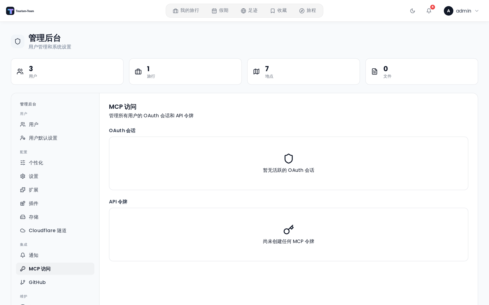

# 管理：MCP 访问

**MCP 访问** 面板显示实例中每个用户的所有活跃 MCP OAuth 会话和 API 令牌。作为管理员，你可以撤销会话和删除令牌。

该面板仅在 [管理：扩展](Admin-Addons) 面板中启用 **MCP 扩展** 时才可见。

## OAuth 会话

OAuth 会话在用户通过 OAuth 2.1 流程授权 MCP 客户端时创建。这是把 MCP 客户端连接到 Tourism-Team 的推荐方式。

**列：**

| 列 | 说明 |
|--------|-------------|
| 客户端 | 已注册 OAuth 客户端的名称。已授予的权限范围以徽章形式显示在名称下方（最多显示 6 个；点击「+N more」展开） |
| 所有者 | 授权该会话的用户的用户名 |
| 创建时间 | 会话建立日期 |
| （操作） | 用于撤销的垃圾桶图标按钮 |

**撤销会话：** 点击该行上的垃圾桶图标并确认。会话立即失效，撤销操作会记录在审计日志中。用户的 MCP 客户端需要重新授权才能继续发起请求。

OAuth 访问令牌使用前缀 `trekoa_`。

## API 令牌

API 令牌是用户在个人设置中创建的长期有效令牌。它们以 `trek_` 前缀标识。

**列：**

| 列 | 说明 |
|--------|-------------|
| 令牌名称 | 用户为该令牌起的标签，下方显示其截断后的前缀 |
| 所有者 | 创建该令牌的用户的用户名 |
| 创建时间 | 令牌创建日期 |
| 最后使用 | 使用该令牌最近一次调用 API 的日期，若未使用过则为「从未」 |
| （操作） | 用于删除的垃圾桶图标按钮 |

**删除令牌：** 点击垃圾桶图标并确认。令牌立即失效。如果用户仍需要访问权限，必须在其设置中创建新令牌。

## 相关页面

- [MCP 概览](MCP-Overview)
- [MCP 配置](MCP-Setup)
- [管理后台概览](Admin-Panel-Overview)
