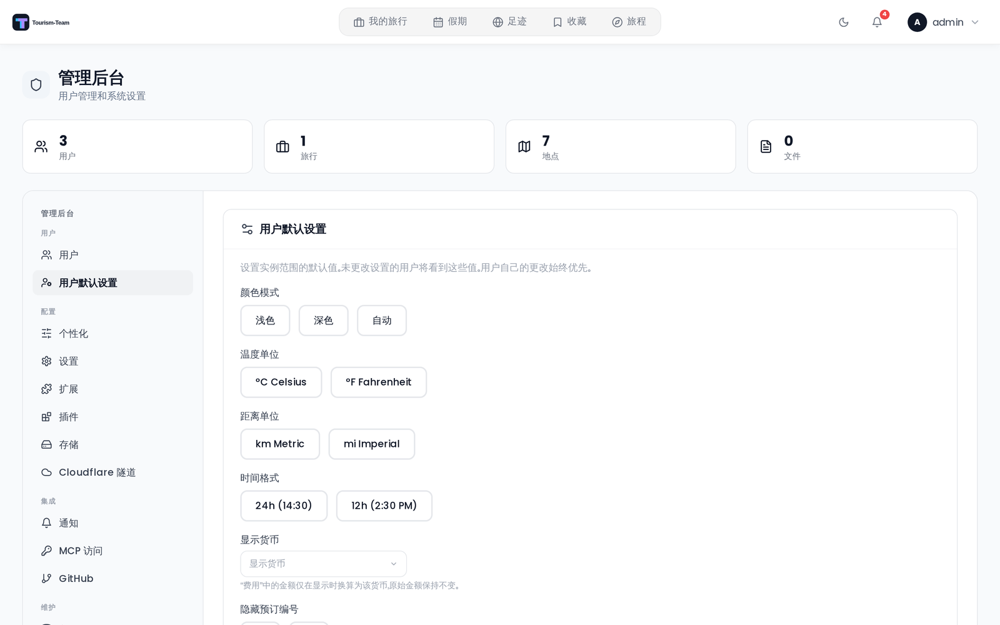

# 管理后台概览

管理后台是 Tourism-Team 实例运维人员的中央控制界面。只有拥有 `admin` 角色的用户才能访问。

## 访问管理后台

打开顶部导航栏中的用户菜单（你的头像），然后选择 **管理**。如果菜单里没有这一项，说明你的账户没有管理员权限。


## 标签页

管理后台分为若干标签页。大多数标签页始终可见；少数只在特定条件下出现。

| 标签页 | 用途 | 是否条件显示？ |
|-----|---------|--------------|
| **用户** | 管理用户、邀请链接和权限 | 否 |
| **个性化** | 打包模板和地点分类 | 否 |
| **用户默认设置** | 应用于新用户的默认设置 | 否 |
| **扩展** | 在整个实例范围内启用或禁用可选功能 | 否 |
| **插件** | 安装、更新和管理插件；重新扫描插件文件夹；查看每个插件的错误日志。见 [管理：插件](Admin-Plugins) | 否 |
| **存储** | 存储后端、分类分配、复制、健康状态 | 托管实例上隐藏 |
| **设置** | 认证方式、MFA、允许的文件类型、API 密钥、OIDC/SSO 配置，以及 JWT 密钥轮换 | 否 |
| **通知** | SMTP、webhook、ntfy 和推送通知渠道配置；旅行提醒开关；管理员通知偏好 | 否 |
| **备份** | 手动和定时的整实例备份：数据库、上传文件、插件数据和插件代码。见 [备份](Backups) | 托管实例上隐藏 |
| **审计** | 按时间顺序的活动日志 | 否 |
| **MCP 访问** | OAuth 会话和静态 API 令牌 | 仅在 MCP 扩展启用时 |
| **GitHub** | 发布版本时间线和支持链接 | 托管实例上隐藏 |
| **Dev: Notifications** | 测试通知发送 | 仅在开发模式（`NODE_ENV=development`）下 |



### 直接链接到某个标签页

每个面板都可以通过 URL 访问，因此书签、入职邮件或支持回复可以指向它所说的那一个标签页，而不必指向一个有十三个标签页的页面顶部：

```
/admin?tab=audit
```

与行程规划器的 `tab` 参数不同，这个参数会留在地址栏中，并在你切换标签页时被重写，因此 URL 始终表明你正在看哪个面板。它以替换而非新增的方式改写当前历史记录条目，所以后退按钮仍会离开管理页面，而不会倒退着你访问过的标签页走一遍。

| 标签页 | Id |
|-----|-----|
| 用户 | `users`（默认值——不携带 `?tab=`） |
| 个性化 | `config` |
| 用户默认设置 | `defaults` |
| 扩展 | `addons` |
| 插件 | `plugins` |
| 存储 | `storage` |
| 设置 | `settings` |
| 通知 | `notifications` |
| 备份 | `backup` |
| 审计 | `audit` |
| MCP 访问 | `mcp-tokens` |
| GitHub | `github` |
| Dev: Notifications | `dev-notifications` |

没有对应面板的 id 会打开 **用户**，而在托管实例上，那里隐藏的三个标签页——`storage`、`github` 和 `backup`——也会回退到 **用户**。另外两个条件标签页的行为不同：`mcp-tokens` 和 `dev-notifications` 即使在 MCP 扩展关闭或实例未处于开发模式时也会打开自己的面板，只是侧边栏中没有高亮项，因为该条目不在其中。

## 插件活动与审计

被授予数据访问能力的插件，其所做的每一次经主机中转的操作都会记录在防篡改、哈希链式的日志中。此日志与上面所述的实例 **审计** 标签页是分开的。

- **管理员** 可以查看每个插件的能力审计——插件所做过的每一次核心数据读取、广播、通知和 AI 调用，包含操作者、涉及的资源和结果。它由 `GET /api/admin/plugins/<id>/audit` 提供；管理端的插件视图本身目前只呈现每个插件的错误日志（**查看错误日志**）。
- **每位用户**（不只是管理员）都可以在 **设置 → 插件** 下看到以自己的名义执行的插件操作。正是这一点让插件宽泛的读取授权对数据被读取的人负责。

关于哈希链以及这两个日志有何不同，见 [审计日志](Audit-Log)。

## 相关页面

- [管理：用户与邀请](Admin-Users-and-Invites)
- [管理：扩展](Admin-Addons)
- [管理：分类](Admin-Categories)
- [管理：打包模板](Admin-Packing-Templates)
- [管理：权限](Admin-Permissions)
- [[管理：存储|Admin-Storage]]
- [管理：MCP 访问](Admin-MCP-Tokens)
- [管理：GitHub 发布](Admin-GitHub-Releases)
