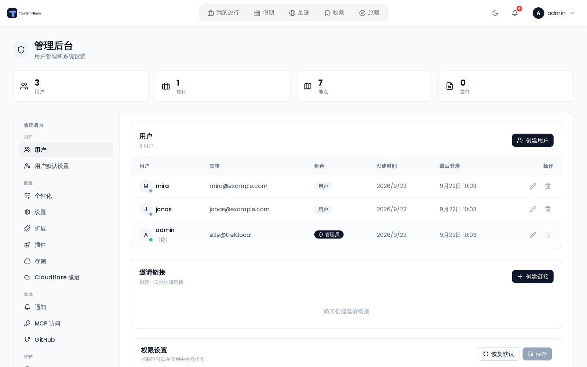

# 管理：权限

权限设置面板位于 **用户** 标签页的底部，它控制执行每项操作所需的角色级别。更改会立即在整个实例范围内生效。

## 角色模型

Tourism-Team 使用四个权限级别，按权限从高到低排列：

| 级别 | 包含谁 |
|-------|----------------|
| `admin` | 仅实例管理员 |
| `trip_owner` | 创建该旅行的用户 |
| `trip_member` | 作为该旅行成员的任何用户 |
| `everybody` | 任何已认证用户（对 `trip_create` 而言：无需旅行上下文；对所有其他操作而言：任何具有旅行访问权限的已认证用户） |

每项操作都分配了一个最低所需级别。角色达到或高于该级别的用户即可执行该操作。并非每个级别对每项操作都可用 —— 每项操作只暴露对它合理的那些级别。例如，`trip_create` 只允许 `everybody` 或 `admin`，而 `trip_edit` 只允许 `trip_owner` 或 `trip_member`。

## 操作分类

操作分为五个类别：

### 旅行

| 操作键 | 控制内容 |
|------------|-----------------|
| `trip_create` | 创建新旅行 |
| `trip_edit` | 编辑旅行名称、日期、描述和货币 |
| `trip_delete` | 永久删除旅行 |
| `trip_archive` | 归档或取消归档旅行 |
| `trip_cover_upload` | 上传或更改旅行的封面图片 |

### 成员

| 操作键 | 控制内容 |
|------------|-----------------|
| `member_manage` | 邀请或移除旅行成员 |

### 文件

| 操作键 | 控制内容 |
|------------|-----------------|
| `file_upload` | 向旅行上传文件 |
| `file_edit` | 编辑文件描述和链接 |
| `file_delete` | 把文件移至回收站或永久删除它们 |

### 内容与日程

| 操作键 | 控制内容 |
|------------|-----------------|
| `place_edit` | 添加、编辑或删除地点 |
| `day_edit` | 编辑日程、日程备注和地点分配 |
| `reservation_edit` | 创建、编辑或删除预订 |

### 预算、行李与协作

| 操作键 | 控制内容 |
|------------|-----------------|
| `budget_edit` | 创建、编辑或删除预算项目 |
| `packing_edit` | 管理行李物品和包袋 |
| `collab_edit` | 创建笔记、投票和发送消息 |
| `share_manage` | 读取、创建或删除公开分享链接和日历订阅链接 |

## 更改权限

每个操作行都有一个下拉框。选择所需的最低角色级别。任何已被更改过默认值的操作旁会出现 **已自定义** 徽章。

点击 **保存**（面板右上角）以持久化你的更改。使用 **恢复默认** 按钮（圆形箭头图标）可把所有操作还原为出厂默认值而不保存 —— 如果你想持久化还原后的状态，还原后仍需要点击 **保存**。

## 相关页面

- [管理后台概览](Admin-Panel-Overview)
- [管理：用户与邀请](Admin-Users-and-Invites)
