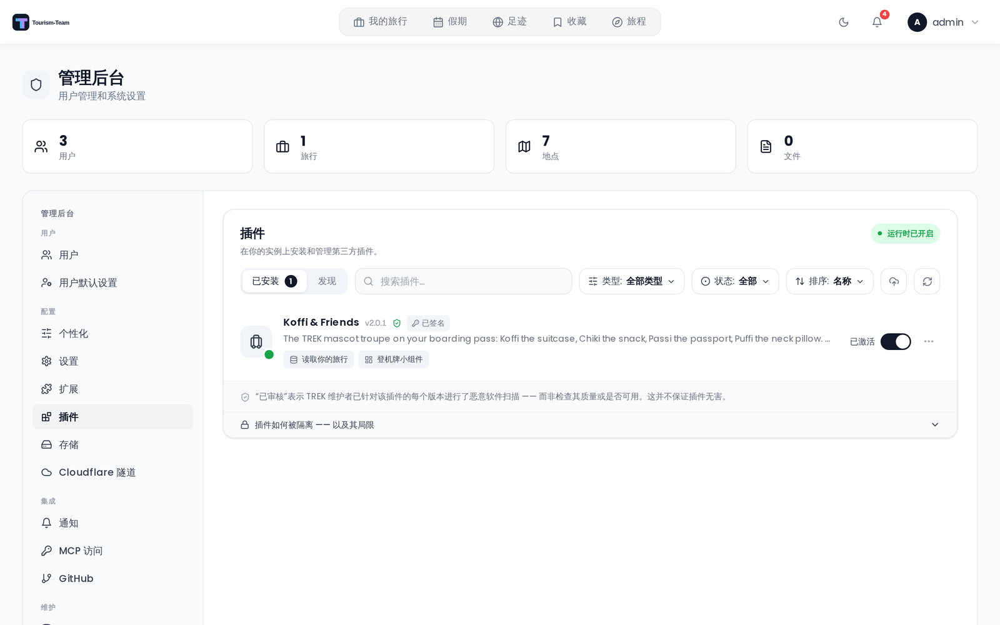

# 管理：插件

在你的实例上安装、审查、启用、更新和移除第三方插件。

## 在哪里找到它

打开 **管理后台** 并选择 **插件** 标签页。*在你的实例上安装和管理第三方插件。*

> **管理员：** 整个面板仅限管理员访问。它还需要开启插件运行时 —— 否则你会看到 *插件功能已禁用*：**插件运行时已关闭（`TREK_PLUGINS_ENABLED`）。在管理员于服务器配置中启用之前，任何插件都无法运行。** 当运行时开启时，标题栏中会出现一个绿色的 **运行时已开启** 胶囊。

关于插件是什么以及用户如何与它们交互，见 [插件](Plugins)。

## 两个视图

顶部的分段切换在以下两者之间切换：

- **已安装** —— 本实例上有什么，并带有数量。
- **发现** —— 社区注册表，以卡片形式浏览。

两个视图共用一个工具栏：一个 **搜索插件…** 框、一个 **类型** 筛选（小组件 / 页面 / 集成 / 行程页面）、一个 **排序** 菜单、一个 **上传插件** 按钮，以及一个 **重新扫描** 按钮。**已安装** 视图额外提供一个 **状态** 筛选（已激活 / 已关闭 / 有可用更新 / 错误）。

**重新扫描** 做两件事：重新发现本地安装的插件*并且*强制拉取注册表，绕过 30 分钟的服务器缓存和 GitHub 的 CDN，使一个刚发布的插件立即出现，而不是要等上最多约 35 分钟。

## 从注册表安装

1. 切换到 **发现**。每张卡片显示图标、名称、作者、描述、类型、适用时的 **已审核** 徽章、**已签名**/**未签名** 徽章、最新版本，以及下载次数。
2. 点击一张卡片，打开 **安装前审查对话框**（见下文）。
3. 点击 **安装**。

如果最新的发布版本不支持你正在运行的 Tourism-Team —— 要么它需要更新的版本，要么你的 Tourism-Team 已经超出了它声明的上限（比如在 Tourism-Team 4 上的 `>=3.2.0 <4.0.0`）—— 按钮会随之改变：当还有更旧的发布版本仍然适用时，你会得到针对它的 **安装 {version}**；当没有任何版本适用时，按钮读作 **不兼容** 并被禁用。无论哪种情况，对话框都会在一条琥珀色说明中解释原因 —— 它不会把理由藏进工具提示里。

新安装的插件处于 **关闭** 状态。在你启用它之前，什么都不会运行。

### 安装前审查对话框

安装之前，请阅读这些分区：

- **可访问的内容** —— 用平实语言概括插件的权限让它能做什么（「读取你的旅行」、「编辑地点」、「提供照片」），外加一行关于它自己的隔离数据库的说明。这是一份摘要，不是原始权限列表：Tourism-Team 没有对应摘要行的权限 —— `notify:send`、`ai:invoke`、`jobs:run`、`db:write:members` 以及其他 —— 在这里根本不会出现，而一个只请求这些权限的插件仍然读作*不需要任何特殊访问权。* 完整列表请阅读插件源代码仓库中的清单。只有针对更新的同意对话框才会逐条代码地渲染权限，未知代码按原样显示。
- **连接到** —— 清单声明它可以访问的每一台主机，以等宽胶囊形式显示。
- **设置** —— 插件将要求你（或每位用户）填写的设置项，标注为 **全实例** 或 **按用户**，适用时还标注 **必填**。
- **详情** —— 版本、大小、它要求的 Tourism-Team 版本范围、审查时间，以及总下载次数。

页脚提供指向 **源代码仓库**、**报告问题** 以及插件 **主页** 的链接。

### 运维方出站主机

有些插件要通信的服务只有*你*才能说出名字 —— 一个自托管的 Gotify、ntfy 或类似服务。它们的清单无法列出主机，因此审查对话框会添加一个 **+ 你添加的主机** 标签和这段说明：

> *此插件要通信的服务只有你才能说出名字。安装后，在 ⋯ → 允许的主机 下添加它可以访问的主机。它无法访问其他任何主机。*

安装之后，打开该行的 **⋯ → 允许的主机** 对话框，一次添加一个主机名。在你至少添加一个之前，该插件的行会显示一个琥珀色的 **添加允许的主机** 标签，因为它什么也访问不到，否则就会看起来像静默地坏掉了。一旦主机存在，该标签会变为蓝色并统计它们。

保存会重启插件，使它读取新的列表 —— 运行中插件的允许清单永远无法就地放宽。

## 启用、重启与停用

每个已安装的行都有一个开关（**启用插件**），并显示 **已激活** 或 **已关闭**。图标磁贴上的一个彩色圆点反映运行时健康状态：插件处于激活状态时为绿色，启动过程中为脉冲蓝色，出错时为红色，未运行时为灰色。不兼容不是一种圆点颜色 —— 这个 Tourism-Team 无法运行的插件会在该行上得到一个琥珀色标签。

启用可能因为正当理由被拒绝。前三条是版本门禁，它们先于其他一切运行 —— 一个无法在这个 Tourism-Team 上运行的插件永远不会得到权限对话框，因为同意并不能让它启动：

- **这个 Tourism-Team 超出了插件声明的范围** —— 该行带有琥珀色的 *需要 Tourism-Team {range} —— 本服务器运行 {host}* 标签，且开关被拒绝。预计在重大升级之后会遇到这种情况：一个声明了 `>=3.2.0 <4.0.0` 的插件在 Tourism-Team 4 上不再激活，尽管它前一天还运行良好。没有对话框可以点过去，它需要来自作者的一个承认这个 Tourism-Team 的发布版本 —— 而一旦注册表有了一个，该行的 **更新** 按钮就会提供它。
- **插件没有说明它支持哪些 Tourism-Team 版本** —— 标签读作 *未说明它支持哪些 Tourism-Team 版本*。那是一个早于范围字段的插件文件夹，或者是被手工放进插件目录的：**重新扫描** 会注册它，而不是让它静默消失，随后该门禁会拒绝它，而不是靠猜测。它需要一个带有 `trek` 范围的清单。
- **版本检查已关闭** —— 运维方设置了 `TREK_PLUGINS_IGNORE_TREK_RANGE`（见 [环境变量](Environment-Variables)），标题栏显示琥珀色的 *版本检查已关闭* 胶囊。上述两种情况于是不再是阻碍：只要插件在这里运行，该行就会带有琥珀色的 *超出其 Tourism-Team 范围（{range}）—— 版本检查已关闭*（或 *未声明 Tourism-Team 范围 —— 版本检查已关闭*）标签，但开关可以使用。在 **发现** 中，注册表标记为不兼容的条目会得到一个 **仍然安装** 按钮，而不是一个失效的按钮；按下它会先弹出警告 —— 作者尚未针对这个 Tourism-Team 更新插件的范围，没有任何东西保证它能工作，且在极少数情况下，版本不匹配的插件可能损坏 Tourism-Team 数据 —— 只有那个对话框中的 **仍然安装** 才会发出请求。一次手动加载、dev-link、更新或依赖下载如果落在其范围之外，则无法先询问，因此同样的警告会在它成功之后立即出现。该绕过永远不会解除插件 API 版本门禁。
- **插件需要更新的插件 API** —— 其清单的 `apiVersion` 高于这个 Tourism-Team 实现的插件 API（当前为 v1）。安装、上传和 dev-link 会提前拒绝它，因此这只会出现在一个从磁盘上的插件目录被拾取的插件上 —— 它在下次重启时注册，或在你按下 **重新扫描** 时注册。
- **某个必需的扩展被禁用** —— 一条 toast 会指出该扩展；在 [管理：扩展](Admin-Addons) 中打开它。
- **某个插件依赖缺失或已过时** —— 一个对话框会列出每项依赖，并带一键 **下载** / **更新**，它会安装最新的兼容版本，然后重试。
- **更新扩大了它的权限** —— 见下方的同意对话框。

已安装但处于停用状态的依赖会作为级联被自动启用，并有一条 toast 告诉你都启用了哪些。

该行的 **⋯** 菜单提供 **重启**（仅限已激活的插件）、**查看错误日志**、**允许的主机**，指向注册表插件的 **源代码仓库** 和 **报告问题** 的链接，以及 **删除**。

## 更新

当存在更新的版本时，该行会长出一个 **更新 → v{version}** 按钮，列表上方的一条横条读作 *你的插件有 {count} 个可用更新。* 并带有一个 **全部更新** 按钮。

如果新版本请求了你尚未授予的权利，Tourism-Team 会安装它，但让它保持关闭，并显示 **此次更新需要新的权限**：

> *{name} v{version} 请求了你尚未授予的权限。新版本已安装，但在你批准之前将保持关闭。*

该对话框列出 **新请求的权限** 和 **新的出站连接**。选择 **批准并启用** 或 **暂时保持关闭**。一次更新多个插件会把这些提示排入队列，因此没有任何一个会被跳过。如果要批准的版本未签名，对话框会添加一行说明：没有任何东西把它与作者绑定在一起。

### 被阻止的更新

如果作者的签名密钥不再与安装时固定的那个匹配，更新会被拒绝，该行显示 **更新已阻止 —— {reason}** 并带一个 **查看** 链接。对话框随后会把固定密钥的指纹与所提供的那个并排显示：

> *Tourism-Team 无法区分正当的密钥轮换与一次接管 —— 从这里看，两者别无二致。在接受之前，请通过你原本就信任的渠道向作者核实这把新密钥。*

只有 **密钥变更** 可以覆盖（**信任新密钥并更新**）。一个无效、缺失或声明不完整的签名会得到一段说明，并且 **完全没有覆盖按钮** —— 服务器也会拒绝那些。

## 卸载

**⋯ → 删除** 会询问 **卸载插件？** —— *这将停止该插件、移除其代码并删除其全部数据。此操作无法撤销。*

## 徽章：它们保证什么、不保证什么

- **已审核** —— *「已审核」表示 Tourism-Team 维护者已针对该插件的每个版本进行了恶意软件扫描 —— 而非检查其质量或是否可用。这并不保证插件无害。*
- **已签名** —— 安装时文件已对照作者的签名密钥校验过，且该密钥被固定。校验和已经证明文件是*注册表*所担保的内容；签名则证明它们来自*作者*。
- **未签名** —— *文件与注册表所担保的内容一致，但没有任何东西能把它们与作者关联起来。少了一重保证 —— 但并非不安全。* 如今大多数注册表插件都未签名，这就是为什么这是一条琥珀色说明，而不是一个警报。

两个徽章都没有说明代码*做什么*。该标签页底部一个可折叠的 **插件如何被隔离 —— 以及其局限** 面板会详细说明隔离模型、权限实际约束什么、Tourism-Team 无法承诺什么，以及最坏情况。读它一遍。

## 手动加载与 dev-link

两条路径可以安装一个从未经过注册表的插件：

- **上传插件**（工具栏按钮，或把 `.zip` 拖到面板上）—— 以 **未激活** 状态安装该压缩包；你仍然要在激活时表示同意。该行被标记为 **手动加载**：*手动上传 —— 不来自注册表，未签名且未经审核。*
- **链接本地插件** —— 一个路径字段，从本地构建目录注册插件，并针对真实数据热重载它。仅限开发，且只有在服务器设置 `TREK_PLUGINS_DEV_LINK=1` 时才显示。该行被标记为 **Dev-Link**。

对这些徽章意味着什么，要对自己诚实：两者都只是*卡片上的一个标签*。它们记录代码来自哪里 —— 它们不检查、不以不同方式沙箱化、也不限制它。一个手动加载或 dev-link 的插件运行时拥有的正是它声明的权限，与来自注册表的插件一样，而且它没有经过恶意软件扫描，也不携带签名。这个标签的存在，是为了让你能一眼看出：除了你自己，没有任何人为那段代码担保。（在那些行上，来源徽章也会取代已签名/未签名徽章，因为它已经说明了更强的东西。）

## 权限

这个面板上的每个端点除 `TREK_PLUGINS_ENABLED` 运行时终止开关之外，都要求管理员账户。dev-link 还额外要求 `TREK_PLUGINS_DEV_LINK`。

审查和同意对话框中显示的按插件权限记录在 [插件权限](Plugin-Permissions)。

## 另见

- [插件](Plugins)
- [插件权限](Plugin-Permissions)
- [插件开发](Plugin-Development)
- [发布插件](Plugin-Publishing)
- [管理：扩展](Admin-Addons)
- [管理后台概览](Admin-Panel-Overview)
- [环境变量](Environment-Variables)
- [安全加固](Security-Hardening)
