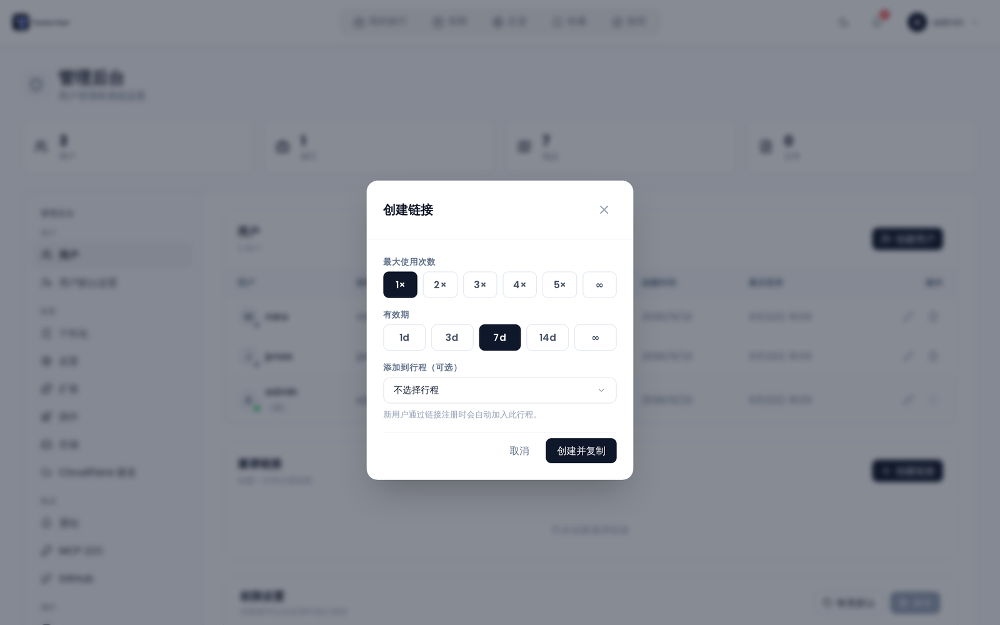

# 管理：用户与邀请

管理后台中的 **用户** 标签页让你查看所有已注册用户、管理他们的账户，并创建邀请链接，让新用户无需开放注册也能注册。


## 用户列表

用户表显示每个已注册账户，包含以下列：

| 列 | 说明 |
|--------|-------------|
| **用户** | 头像、用户名，以及一个始终可见的在线状态圆点（绿色 = 在线，灰色 = 离线） |
| **邮箱** | 账户邮箱地址 |
| **角色** | 显示 **管理员** 或 **用户** 的徽章 |
| **创建时间** | 账户创建日期 |
| **最后登录** | 最近一次登录的日期和时间 |
| **操作** | 编辑和删除按钮 |

你自己的账户行会高亮显示。你无法删除自己的账户。

## 用户操作

### 编辑用户

点击任意行上的铅笔图标打开编辑表单。你可以更改：

- **用户名**
- **邮箱地址**
- **角色** —— 一个包含 **用户** 和 **管理员** 的下拉框
- **密码** —— 设置新密码。密码必须至少 8 个字符，且包含一个大写字母、一个小写字母、一个数字和一个特殊字符；常用密码和由单个重复字符组成的字符串会被拒绝。同样的规则也适用于你在 [直接创建用户](#creating-a-user-directly) 下设置的密码。见 [登录与注册](Login-and-Registration#password-requirements)。

点击 **保存** 应用更改。

字段下方是 **重置通行密钥**，它会移除该用户注册的所有通行密钥 —— 这是有人丢失身份验证器时的恢复途径。它会要求确认，报告移除了多少个通行密钥，并立即生效而不是等到点击 **保存**。用户仍然可以用密码登录。见 [通行密钥](Passkeys)。

### 删除用户

点击垃圾桶图标并确认。删除是永久性的。用户的账户连同其数据一起从数据库中移除（级联行为在数据库层面强制执行）。

以该用户身份登录时，你无法删除自己的账户。

## 直接创建用户

点击 **创建用户**（用户标签页右上角）可在没有邀请链接的情况下创建账户。你在创建时设置用户名、邮箱、密码和角色。

## 邀请链接

邀请链接让特定数量的人自行注册。当开放注册被禁用时，这很有用。



### 创建邀请

点击 **创建链接**（邀请链接区域，位于用户表下方）。配置：

- **最大使用次数** —— 链接在过期前可被使用的次数：`1×`、`2×`、`3×`、`4×`、`5×` 或 `∞`（不限）。默认为 `1×`。
- **有效期** —— 链接保持有效的时间：`1d`、`3d`、`7d`、`14d` 或 `∞`（不过期）。默认为 `7d`。
- **添加到行程（可选）** —— 把邀请绑定到某个旅行。任何通过该链接注册的人都会被自动作为成员加入该旅行。默认为 **不选择行程**（普通的注册邀请）。只有当至少存在一个旅行时，该选择器才会出现。

创建后链接会自动复制到你的剪贴板。把它分享给预定的接收者。URL 格式为：

```
<APP_URL>/register?invite=<token>
```

### 邀请列表

已有的邀请列在创建按钮下方。每一行显示：

- 邀请令牌（截断显示，等宽字体）
- 状态徽章 —— `active`、`used up` 或 `expired`
- **已使用** —— `used / max`（不限次数时为 `used / ∞`）
- **过期时间** 日期（如果设置了的话）
- **加入** —— 绑定的旅行（如果该邀请绑定了旅行）
- **由** —— 生成该链接的管理员
- 一个 **复制链接** 按钮（仅对有效邀请显示）
- 一个 **删除**（撤销）按钮

撤销邀请会立即使其失效；撤销后任何通过该链接访问的人都会收到错误。

## 权限

**用户** 标签页底部还承载着权限设置面板，它控制哪些角色可以执行哪些操作。详情见 [管理：权限](Admin-Permissions)。

## 相关页面

- [登录与注册](Login-and-Registration)
- [邀请链接](Invite-Links)
- [管理：权限](Admin-Permissions)
- [两步验证](Two-Factor-Authentication)
- [通行密钥](Passkeys)
- [管理后台概览](Admin-Panel-Overview)
