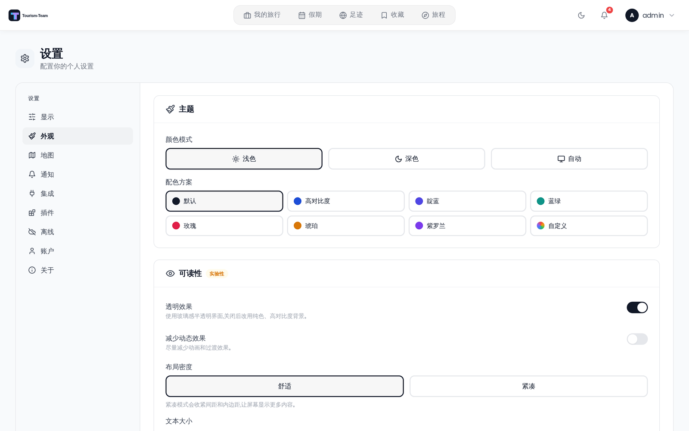

# 外观设置

调整 Tourism-Team 的外观——颜色模式、强调色方案、可读性，以及你看到哪些仪表盘小组件。

## 在哪里找到

打开 **设置**，选择 **外观** 标签页。

更改会立即预览，稍后保存到你的账户，因此它们会跟随你登录的每个浏览器。标签页底部的 **恢复默认设置** 按钮一键恢复配色方案、可读性设置、仪表盘小组件和移动端布局。你的 **颜色模式**（浅色 / 深色 / 自动）是独立设置，保持原样。

> 这些是个人设置——不受权限或管理端开关的限制。

## 主题

### 颜色模式

三个分段按钮：**浅色**、**深色** 和 **自动**。**自动** 跟随操作系统的浅色/深色偏好。

### 配色方案

一组强调色方案，每个都带一个按你当前模式预览的颜色圆点：

- **默认** —— Tourism-Team 的单色外观。
- **高对比度** —— 提高文本和边框的对比度。
- **靛蓝**、**蓝绿**、**玫瑰**、**琥珀**、**紫罗兰** —— 彩色强调。
- **自定义** —— 自己挑选强调色（见下）。

### 自定义强调色

选择 **自定义** 会显示一个 **自定义强调色** 选择器：

1. 点击十个预设色块之一，把浅色和深色设为同一种颜色，或
2. 使用 **浅色** 和 **深色** 颜色输入为每种模式挑选不同的强调色。

在选择器旁边，一个实时对比度徽章会把你当前看到的强调色与白色做比较并显示比值：

- **对比度良好 (n.n:1)** —— 该比值满足 WCAG AA 对正文的要求（4.5:1 或更好）。
- **对比度偏低 (n.n:1)** —— 低于 4.5:1；该强调色上的白色文字将难以阅读。

该徽章仅供参考。Tourism-Team 仍会允许你应用低对比度的强调色。

## 可读性

整个区块都带有一个 **实验性** 徽章。

- **透明效果** —— *使用玻璃感半透明界面，关闭后改用纯色、高对比度背景。*
- **减少动态效果** —— *尽量减少动画和过渡效果。*
- **布局密度** —— **舒适** 或 **紧凑**。*紧凑模式会收紧间距和内边距，让屏幕显示更多内容。*

### 文本大小

文本缩放有四个维度外加一个总控。每个滑块的范围都是 **80%** 到 **160%**，以 5% 为步进，并在右侧显示当前百分比。

- **全部** —— 在各级数值之上再应用的全局缩放。
- **大** —— *标题、大数字*
- **中** —— *小标题*
- **标准** —— *地点名称、描述*
- **小** —— *地址、标签*

四行中的每一行都会以该级字号渲染一个实时示例（「大标题」「中等副标题」「正文文本」「小说明 / 地址」），因此你可以在拖动时看到效果。

## 仪表盘小组件

*分别控制桌面端和移动端仪表盘组件的显示。* 这不会检测你当前的设备——它设置两套独立的布局，仪表盘会选取与渲染时视口匹配的那一套。两套布局都存储在你的账户中，因此在笔记本电脑上所做的更改也会改变手机显示的内容。

### 桌面端

- **顶部摘要下方** —— **足迹 / 国家**、**行程总数**、**已旅行天数**、**飞行距离**。
- **右侧栏** —— 一个总开关（*控制整个右侧栏，关闭后仪表盘会居中显示。*），下面嵌套四个小组件：**货币**、**收藏**、**时区**、**接下来的预订**。关闭总开关会把嵌套开关置灰；它们各自的状态会被记住，以便你重新打开时恢复。

### 移动端

- **顶部摘要下方** —— **行程总数**、**已旅行天数**。
- **页面底部** —— **货币**、**收藏**、**时区**、**接下来的预订**。

在这里隐藏某个小组件只影响你自己的仪表盘。依赖扩展的小组件（例如 **收藏**）还需要管理员启用该扩展——见 [仪表盘小组件](Dashboard-Widgets) 和 [管理：扩展](Admin-Addons)。

## 在手机上

在手机上打开时，外观屏幕会多出一张桌面端标签页没有的 **移动端** 卡片：

- **底部导航栏** —— 哪些项目位于底栏、以什么顺序排列，以及哪些被降级到 **更多** 之下。**仪表盘** 固定在最前，无法移动；它旁边还能放两个项目，列表上方的计数器显示底栏有多满。两列表都保持不动则沿用 Tourism-Team 的自动划分。
- **仪表盘排序** —— 重新排列行程列表和内联小组件在手机仪表盘上的堆叠顺序。精选行程始终固定在顶部。小组件在 **仪表盘组件** 下被关闭的区块会保留它在列表中的位置，并标记为 **已隐藏**。

两者都与其余外观设置一起存储在你的账户中，也都会被 **恢复默认设置** 清除。

## 权限

无。此标签页上的每项设置只作用于你自己的账户。

## 参见

- [常规设置](Display-Settings)
- [用户设置](User-Settings)
- [仪表盘小组件](Dashboard-Widgets)
- [我的旅行](My-Trips-Dashboard)
- [地图设置](Map-Settings)
