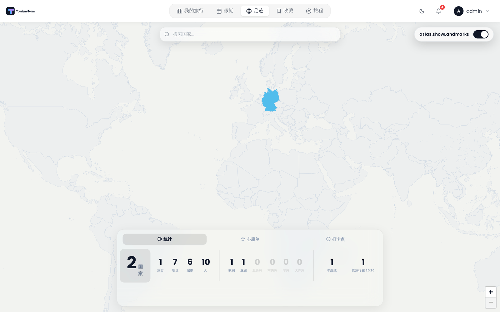

# 足迹

足迹是一张交互式世界地图，展示你在所有旅行中去过的国家和地区，同时带一份你想去的地方的心愿单。

> **管理员：** 在 [管理：扩展](Admin-Addons) 中启用足迹。

## 足迹是什么

足迹让你直观地总览自己的旅行足迹。去过的国家会在地图上高亮。你还可以标记单个下级行政区，并维护一份未来目的地的心愿单。

## 进入足迹

管理员启用足迹扩展后，主导航中会出现一个 **足迹** 条目。你去过的国家会根据既有旅行自动填充。

## 去过的和计划中的国家

只有当带你去那里的旅行已经开始后，一个国家才算去过。当前正在进行的旅行也算 —— 你人已经在那里了。未来才开始的旅行中的国家算作 **计划中**，而没有填写任何日期就保存的旅行会被视为想法，完全不进入你的统计。

计划中的国家默认在地图上隐藏。用地图上方的 **显示计划中的国家** 开关把它们调出来；它们会以虚线轮廓出现，因此永远不会看起来像你已经去过的地方。该开关只在你确实有即将到来的旅行时出现，并且会记住你的选择。

你手动标记的国家无论前往那里的旅行日期如何，始终算作去过。

在你心愿单上、你还没去过的国家会以斜线填充绘制，颜色是该国在你到达后会带的颜色。这样一条心愿单条目就很容易与去过的国家、以及其他地方一律的灰色区分开。每个国家永久保留自己的颜色：把再一个国家标记为去过永远不会打乱地图的其余部分。

## 把国家标记为去过

点击地图上的任意国家即可打开一个操作弹窗，在那里你可以把它标记为去过或加入心愿单。用地图顶部的搜索栏查找并飞往某个国家 —— 按回车或从下拉列表中选择一项，都会打开同一个操作弹窗。

搜索框还能找到 **地点**，不只是国家。输入城市、地标或地址，匹配项会出现在国家结果下方的 **地点** 标题下。选中一项会飞往那里，并判断该坐标落在哪个下级行政区，因此你可以通过搜索米兰把伦巴第标记为去过，而无需知道米兰在伦巴第。在地图数据包中没有地区数据的国家会回退到国家本身。

要移除手动标记的国家（没有记录任何旅行或地点的国家），在地图上点击它并在弹窗中确认移除。

如果该国已经在你的心愿单上，同一个弹窗会提供 **从心愿单移除**，这会一次性把该国的所有条目从列表中拿走，无需绕道心愿单标签页。

从你的旅行中自动检测到的到访记录，会与你手动标记的任何国家一并显示。

### 下级行政区

在缩放级别 5 及以上，地图会切换到下级行政区视图（州、省等）。你可以把单个地区标记为去过或加入心愿单。标记一个地区时，如果其上级国家尚未标记，也会一并算作去过。

## 心愿单

心愿单与「去过」是分开的。用它跟踪你未来想去的国家或地点。每条心愿单条目可以有一个名称、坐标、国家代码、可选备注和一个目标日期。

## 打卡点

「打卡点」是足迹的第三个标签页（桌面端在侧栏的 **统计 / 心愿单 / 打卡点** 之间切换；移动端是地图上方那颗带对勾的 **打卡点** 按钮，打开一张底部面板）。它记录的是**具体去过哪个地方**，比「去过某个国家」细一层 —— 一个国家可以只去过一次，却在那里打卡了十几个景点。

打卡点有两个来源，面板里分开列出：

- **地标** —— 内置的预设景点。点击地图上的地标标记，在弹窗里点 **打卡** 即可。预设数据覆盖中国 **34 个省级行政区、89 个地标**，按山峰、湖泊、古城、寺庙、博物馆、冰川等 **20 种类型** 分类，每种类型有自己的图标和颜色。地标标记需要地图缩放到一定级别（4 级以上）才出现，并可用 **显示地标** 开关关掉。
- **行程地点** —— 你自己旅行里的地点。在行程规划器里选中一个地点，用地点详情面板中的 **打卡** 按钮（移动端在地点浮层里）标记。这里打卡的地点会同时出现在足迹地图上，形成你自己的打卡点分布。

面板顶部显示 **打卡** 总数，下面按两个来源分别列出清单：地标显示名称和所在省份，行程地点显示名称和打卡日期。点击行程地点的打卡标记，会弹出一个卡片，显示它所在的国家/地区、打卡日期，以及该地点在你旅行中照片的预览（没有照片时这一块不出现）。所有打卡都可以取消：地标在弹窗里再点一次，行程地点在卡片底部取消。

> **打卡会连带更新足迹。** 给一个行程地点打卡时，Tourism-Team 会用它的坐标在内置的多边形数据里定位，把对应的**国家**（以及存在时的下级行政区）一并标记为去过 —— 因此打卡本身就是一种「我来过这里」的记录方式，不用再手动去地图上点一遍国家。定位失败不会阻止打卡本身，只有这条自动标记会跳过。
>
> **取消打卡不会取消国家。** 这条自动标记是**单向**的：取消某个地点的打卡只会移除地点本身的打卡记录，不会把该国从「去过」列表里拿掉。如果那次打卡是误操作、你也不曾真的到过那个国家，请在地图上点击该国（或在统计里）手动移除它的「去过」标记。

> **注意：打卡数据保存在浏览器本地。** 地标打卡和行程地点打卡都存在当前浏览器的本地存储中，**不随账号同步到服务器**。换一台设备、换一个浏览器，或清除浏览器数据后，打卡记录不会跟着走。（「去过」的国家是服务端保存的，不受影响。）

## 统计

你的足迹统计面板显示：

- **去过的国家** —— 你确实到过的不同国家的总数。即将到来的旅行中的国家会单独计数，并显示在这个数字旁边。
- **旅行** —— 全部时间里的旅行总数。
- **地点** —— 旅行中记录的单个地点总数。
- **城市** —— 去过的不同城市总数，由你地点的地址推导而来。Tourism-Team 会去掉以逗号分隔的最后一段（国家），然后往回遍历其余各段，取第一个在剥掉数字、连字符和邮编标记后仍非空的那一段，并转为小写，使拼写变体会合并为同一条目。这是对格式化地址字符串的启发式处理而非查表，因此这个数字是近似的：像 `Osteria Francescana, Italy` 这样的短地址只剩下地点自身的名称，而行政尾部止于州或都道府县的地址（`…, Shibuya, Tokyo, 150-0002, Japan`）会算作该地区而不是城市。
- **旅行天数** —— 旅行中花费的天数总计。
- **大洲分布** —— 每个大洲去过的国家数量（欧洲、亚洲、北美洲、南美洲、非洲、大洋洲）。你去过南极洲之后它才会加入这一行。
- **连续旅行** —— 你至少进行过一次旅行的连续年数。
- **今年旅行** —— 当前日历年内的旅行数量。

## 视觉效果

地图底部的桌面端玻璃面板使用液态玻璃视觉效果 —— 随你的光标在面板上移动的动态内发光和边框高光。

## 插件国家图层

已安装的插件可以用自己的图层给足迹地图上的国家着色 —— 例如心愿单或旅行警示。插件实现 `atlasLayerProvider` 钩子并返回一个或多个图层，每个图层是一组带色调的 ISO 国家代码；Tourism-Team 会校验这些代码并自行着色。图层按用户生效且是增量式的：插件从不触碰地图画布，出错或响应慢的插件不贡献任何内容。

> **插件：** 需要 `hook:atlas-layer-provider` 权限。钩子契约见 [插件开发](Plugin-Development)。

## 另见

- [扩展概览](Addons-Overview)
- [管理：扩展](Admin-Addons)
