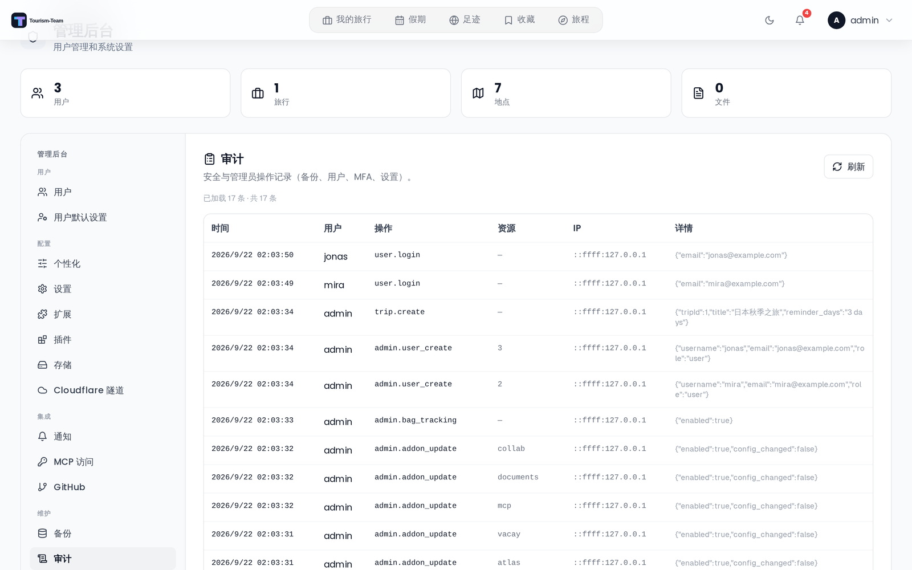

# 审计日志

审计日志记录在你的 Tourism-Team 实例上执行的重要操作。用它来监控登录、管理员更改和集成配置。

## 在哪里找到

**管理后台 → 审计** 标签页。

## 日志记录什么

下面按领域对操作进行分组。**操作键** 是存储在日志中的原始值。

### 认证

| 操作键 | 说明 |
|---|---|
| `user.register` | 用户注册 |
| `user.login` | 用户登录 |
| `user.login_failed` | 登录尝试失败 |
| `user.password_change` | 用户修改了密码 |
| `user.account_delete` | 用户删除了自己的账户 |
| `user.password_reset_request` | 请求了密码重置 |
| `user.password_reset_success` | 密码重置完成 |
| `user.password_reset_fail` | 密码重置尝试被拒绝（详情中有 `reason`） |

对一个确实可以重置的账户提出的请求会写入 **两** 行：邮件交付时写入一行 `delivered: "pending"`，以及一行交付结果。其他所有结果都只写入一行，并携带一个 `reason` —— `no_user`、`oidc_only`、`throttled_per_email` 或 `password_login_disabled`。通行密钥登录不是单独的键：它们以 `user.login` 记录，详情中带 `method: passkey`。

### MFA

| 操作键 | 说明 |
|---|---|
| `user.mfa_enable` | 账户上启用了 MFA |
| `user.mfa_disable` | 账户上停用了 MFA |

### 通行密钥

| 操作键 | 说明 |
|---|---|
| `user.passkey_register` | 注册了通行密钥 |
| `user.passkey_delete` | 移除了通行密钥（resource = 该通行密钥的数字 ID） |
| `user.passkey_clone_suspected` | 某个通行密钥提供的签名计数器没有递增 —— 可能是被克隆的验证器。该断言被拒绝，凭据保持启用 |

### 旅行

| 操作键 | 说明 |
|---|---|
| `trip.create` | 创建了旅行（包含标题） |
| `trip.update` | 更新了旅行（包含更改的字段） |
| `trip.copy` | 复制了旅行（包含源旅行和新旅行的 ID） |
| `trip.delete` | 删除了旅行（包含旅行 ID 和标题） |
| `trip.transfer_ownership` | 转移了旅行所有权（包含旅行标题和双方的邮箱） |
| `trip.invite_link_create` | 创建或轮换了旅行邀请链接（一次旅行只有一个链接，因此再次创建会替换先前的令牌） |
| `trip.invite_link_delete` | 撤销了旅行邀请链接 |
| `trip.invite_link_join` | 接受了某个邀请链接（详情中有 `joined`）。即使没有添加任何人也会写入该行 —— 旅行所有者或已有成员打开该链接会记录 `joined: false` |

### 管理员操作

| 操作键 | 说明 |
|---|---|
| `admin.user_create` | 管理员创建了用户 |
| `admin.user_update` | 管理员编辑了用户（角色、邮箱、用户名等） |
| `admin.user_delete` | 管理员删除了用户 |
| `admin.user_mfa_reset` | 管理员重置了某个用户的 MFA |
| `admin.user_passkeys_reset` | 管理员移除了某个用户的全部通行密钥 |
| `admin.invite_create` | 创建了邀请链接 |
| `admin.invite_delete` | 删除了邀请链接 |
| `admin.permissions_update` | 更新了实例权限 |
| `admin.oidc_update` | 更新了 OIDC/SSO 设置 |
| `admin.addon_update` | 启用、禁用或配置了扩展 |
| `admin.oauth_session_revoke` | 管理员撤销了 OAuth 会话 |
| `admin.mcp_token_delete` | 管理员撤销了 MCP 令牌 |
| `admin.rotate_jwt_secret` | 轮换了 JWT 密钥 |
| `admin.bag_tracking` | 切换了行李追踪功能 |
| `admin.places_photos` | 切换了地点照片功能 |
| `admin.places_autocomplete` | 切换了地点自动补全功能 |
| `admin.places_details` | 切换了地点详情功能 |
| `admin.places_enrich` | 切换了地点信息增强功能 |
| `admin.collab_features` | 更新了协作功能 |
| `admin.packing_template_create` | 创建了打包模板 |
| `admin.packing_template_delete` | 删除了打包模板 |
| `admin.plugin_retrust` | 重新信任了插件签名密钥（记录旧密钥和新密钥的指纹） |
| `admin.storage_update` | 保存了存储配置（详情中的机密已脱敏） |
| `admin.storage_test` | 探测了存储后端（该探测会写入并删除一个测试对象） |
| `admin.storage_backfill` | 启动了副本追赶 |
| `admin.storage_backfill_cancel` | 取消了副本追赶 |
| `admin.storage_migration` | 启动了分类迁移 |
| `admin.storage_migration_cancel` | 取消了分类迁移 |
| `admin.storage_stats_refresh` | 重新计算了存储用量统计 |
| `admin.default_user_settings_update` | 更新了用户默认设置 |
| `admin.demo_baseline_save` | 保存了演示基线快照 |

### 设置

| 操作键 | 说明 |
|---|---|
| `settings.app_update` | 更新了应用设置（SMTP、webhook、MFA 策略等） |
| `settings.api_keys_update` | 更改了地图 / OpenWeather / Unsplash API 密钥。任何用户保存自己的密钥都会写入；管理员的保存还会更新实例级密钥。只记录更改的密钥 **名称**，从不记录其值 |

### 备份

| 操作键 | 说明 |
|---|---|
| `backup.create` | 创建了手动备份 |
| `backup.restore` | 从已存储的备份恢复 |
| `backup.upload_restore` | 从上传的 ZIP 恢复 |
| `backup.delete` | 删除了备份 |
| `backup.auto_settings` | 保存了自动备份计划 |

### MCP

| 操作键 | 说明 |
|---|---|
| `mcp.tool_call` | 调用了 MCP 工具（resource = 工具名） |

### OAuth

| 操作键 | 说明 |
|---|---|
| `oauth.client.create` | 创建了 OAuth 客户端应用 |
| `oauth.client.rotate_secret` | 轮换了 OAuth 客户端密钥 |
| `oauth.client.delete` | 删除了 OAuth 客户端应用 |
| `oauth.consent.grant` | 用户授予了 OAuth 同意 |
| `oauth.token.issue` | 签发了 OAuth 访问令牌 |
| `oauth.token.refresh` | 刷新了 OAuth 访问令牌 |
| `oauth.token.revoke` | 撤销了 OAuth 令牌 |
| `oauth.token.grant_failed` | OAuth 令牌授予尝试失败 |
| `oauth.token.client_auth_failed` | OAuth 客户端认证失败 |
| `oauth.token.replay_detected` | 一个已被撤销的刷新令牌被重放。整条令牌链以及该用户针对该客户端的 OAuth 会话都会被撤销。两个客户端争用同一个令牌 **不会** 记录在这里：那会记为 `oauth.token.refresh` 并带 `concurrent: true` |

### 集成

| 操作键 | 说明 |
|---|---|
| `immich.private_ip_configured` | 保存了解析到私有 IP 的 Immich URL |
| `airtrail.private_ip_configured` | 保存了解析到私有 IP 的 AirTrail URL |

## 日志列

| 列 | 说明 |
|---|---|
| 时间 | 操作的时间戳 |
| 用户 | 操作用户的用户名，回退顺序为邮箱，然后是 `#<user id>`。未认证事件显示 `—`（纯文本日志文件对这类事件改而写入 `anonymous`） |
| 操作 | 操作键（见上表） |
| 资源 | 适用的受影响资源（文件名、旅行 ID、工具名等） |
| IP | 客户端 IP 地址 |
| 详情 | JSON 格式的附加上下文 |

## 分页

面板默认每次加载 100 条记录。点击底部的 **加载更多** 获取下一页。总数显示在表格上方。

## IP 地址

客户端 IP 是 Express 在应用 `TRUST_PROXY` 之后解析出的那个，而不是 `X-Forwarded-For` 响应头碰巧写的内容。这个区别很重要：该响应头由调用方写入，而一条攻击者能把 IP 写成别人的审计记录，比没有记录更糟。

`TRUST_PROXY` 是 **Tourism-Team 前面的代理跳数**，它必须准确。使用 `TRUST_PROXY=1`（默认）时，Tourism-Team 恰好信任一跳，因此经过两个代理的请求会被记录为来自 *外层* 那个 —— 下面示例中的 Cloudflare 边缘，而不是 nginx，也不是真实客户端。如果你的架构是 Cloudflare 在 nginx 前面、nginx 又在 Tourism-Team 前面，请设置 `TRUST_PROXY=2`。设为 `0` 则不信任任何代理，始终记录套接字地址。

见 [环境变量](Environment-Variables)。

## 日志文件

除数据库之外，审计事件还会写入一个纯文本日志文件：

- **路径：** `./data/logs/trek.log`
- **轮转：** 文件达到 10 MB 时轮转
- **保留：** 保留最近 4 个轮转文件（`trek.log.1` 到 `trek.log.4`）

## 数据库保留

数据库中的审计条目永远不会被自动删除。它们会不断累积，并在界面中分页显示。

## 插件能力审计

与上面的实例审计日志分开，Tourism-Team 为已安装的插件维护一份专用的 **哈希链式能力审计**。插件执行的每一次经主机中转的操作 —— 核心数据读取、WebSocket 广播、通知、AI 调用、跨插件调用 —— 都会在插件无法触及的位置记录下来，同时记录操作用户（由主机绑定，从不由插件提供）、涉及到的资源和结果。

每个插件的条目构成一条按插件的哈希链（`hash = sha256(previous_hash + row)`），因此该日志可防篡改：任何被改动或移除的条目都会破坏链条。每个插件达到行数上限后，较旧的行会被清理（默认 20,000 行/插件，可通过 `TREK_PLUGIN_AUDIT_MAX_ROWS` 调整；`0` 禁用清理）。清理会保持保留窗口仍可验证。

有两个视图读取该日志：

| 视图 | 谁 | 位置 | 显示 |
|---|---|---|---|
| 按插件审计 | 管理员 | 管理端插件管理（`GET /api/admin/plugins/:id/audit`） | **一个插件** 跨所有用户执行的每一次操作 |
| 我的插件活动 | 任何用户 | 设置 → 插件（`GET /api/plugin-activity`） | **任何插件** 以 **该用户的名义** 执行的每一次操作 |

面向用户的视图让宽泛的读取授权能对数据被读取的那个人负责，且无需管理员访问权限。

## 参见

- [管理后台概览](Admin-Panel-Overview)
- [安全加固](Security-Hardening)
- [环境变量](Environment-Variables)
