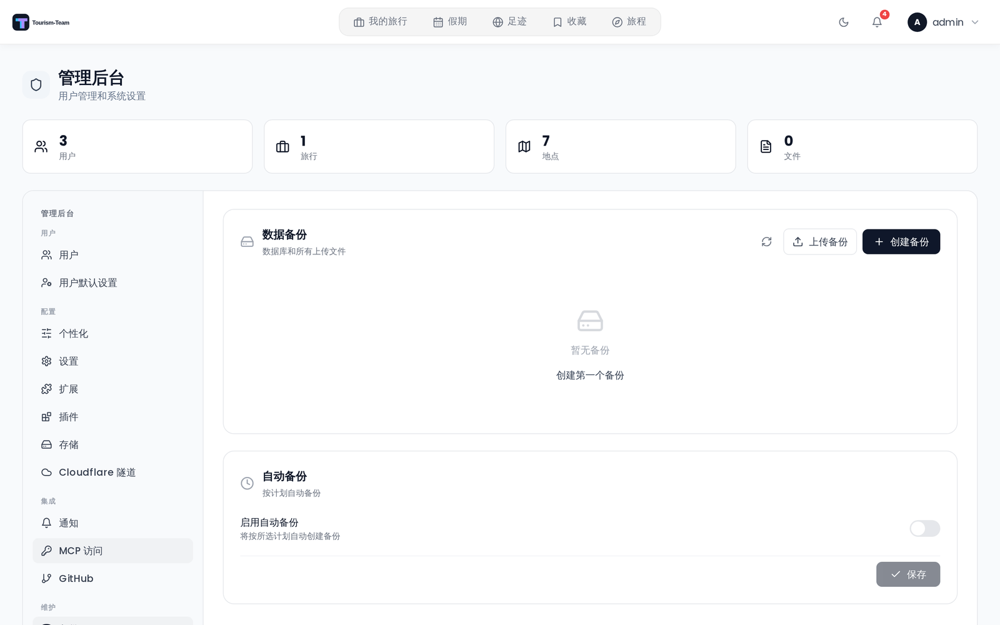

# 备份

Tourism-Team 把所有数据存放在一个 SQLite 数据库（`travel.db`）以及一个 `uploads/` 目录（附件、封面照片和头像）中 —— 这是默认情况；存储后端与副本在 [[管理：存储|Admin-Storage]] 中配置。备份面板让你为两者创建、下载、恢复和定时备份。

## 在哪里找到它

**管理后台 → 备份** 标签页。

## 备份包含什么

备份是一个 ZIP 压缩包，包含以下条目：

| 条目 | 内容 |
|---|---|
| `travel.db` | 完整的 SQLite 数据库 |
| `uploads/` | 所有上传的附件、封面和头像（默认位置 —— 见 [管理：存储](Admin-Storage)） |
| `plugins-data/` | 每个已安装插件自己的数据库 + 文件（仅在安装了插件时存在） |
| `plugins-code/` | 已安装插件的代码，使恢复是自包含的（开发链接的插件会被跳过） |

**还包括：** 静态加密密钥，除非你通过 `ENCRYPTION_KEY` 环境变量提供它 —— 那种情况下该文件不是事实来源，会被略去。把它一并打包，正是备份能够恢复到另一套安装上的原因，同时也让这个 ZIP 与密钥本身同样敏感：请相应地存储和传输它。见 [加密密钥轮换](Encryption-Key-Rotation)。

## 手动备份

在备份标签页中点击 **创建备份**。服务器会创建 ZIP 并使其可供下载。每个 IP 地址每小时最多可创建 3 个手动备份（限流窗口：1 小时）。

你也可以从列表中下载或删除任何已有的备份。

## 恢复备份

你可以从以下来源恢复：

- **已存储的备份** —— 点击列表中任一备份旁的 **恢复**。
- **上传的 ZIP** —— 点击 **上传备份**，然后从你的电脑中选择一个备份文件（默认最大上传大小为 500 MB，可通过 `BACKUP_UPLOAD_LIMIT_MB` 环境变量配置 —— 见 [环境变量](Environment-Variables)）。

第二项限制把恢复压缩包的**解压后**大小默认上限定为 5 GB（`BACKUP_MAX_DECOMPRESSED_MB`）。它对两种途径都适用 —— 已存储的备份和上传的 ZIP —— 超过限制的恢复会被拒绝，并提示 `Backup exceeds the maximum decompressed size.`。如果你自己的备份确实合理地增长到超过默认值，请调高它，否则它们将变得无法恢复。

恢复之前，Tourism-Team 会对上传的数据库运行完整性检查：

1. **SQLite `PRAGMA integrity_check`** —— 验证数据库文件未损坏。
2. **必需的表存在** —— 确认文件包含 `users`、`trips`、`trip_members`、`places` 和 `days`。缺少其中任何一张表的文件都会被拒绝，视为不是有效的 Tourism-Team 备份。

> **警告：** 恢复会替换所有当前数据。如果想保留当前状态，请先备份。

> **插件与重启：** `travel.db` 和 `uploads/` 会被立即替换。插件数据和代码会**暂存**在活动目录树旁，并随即生效：运行中的插件持有其数据库的打开句柄，因此恢复会要求插件运行时关闭它们，并在句柄关闭的那一刻替换目录树。如果运行时未启动（插件被关闭，或恢复发生在启动过程中），暂存的目录树会在下次启动时应用。恢复使用了插件的实例后，请重启服务器 —— 插件为完成替换而被停止，并会一直保持停止直到进程重启，而且打包的加密密钥只在启动时读取。

## 自动备份

在备份标签页的 **自动备份** 区域启用定时备份。

**间隔** 选项：

- 每小时
- 每天
- 每周
- 每月

**保留**（`Delete old backups after`）—— 选择以下预设窗口之一：1 天、3 天、7 天、14 天、30 天，或 **永久保留**。早于所选窗口的自动备份会在每次自动备份运行后被清理；**永久保留**（以 `keep_days = 0` 存储）会无限期保留所有备份。

**计划** 选项（取决于间隔）：

- **执行时间** —— 每天、每周和每月备份的时刻（0–23）。
- **星期几** —— 周日到周六（用于每周备份）。
- **每月几号** —— 1–28（用于每月备份）。29–31 号被排除，以避免遇到天数更少的月份。

自动备份文件命名为 `auto-backup-<timestamp>.zip`（手动备份使用 `backup-<timestamp>.zip`）。

每次自动备份运行后，早于 `keep_days` 的**自动备份文件**会被清理。手动备份永远不会被清理 —— 不再需要时请自行删除。把 `keep_days` 设为 `0` 可完全关闭清理。

## 更新 Tourism-Team 之前

更新前务必先创建一个手动备份。见 [更新](Updating)。

## 审计日志

以下操作会被记录到[审计日志](Audit-Log)中：

| 操作键 | 触发时机 |
|---|---|
| `backup.create` | 创建了手动备份 |
| `backup.restore` | 从已存储的备份恢复 |
| `backup.upload_restore` | 从上传的 ZIP 恢复 |
| `backup.delete` | 删除了备份 |
| `backup.auto_settings` | 保存了自动备份设置 |

## 另见

- [管理：存储](Admin-Storage) —— 把备份复制到兼容 S3 的存储
- [加密密钥轮换](Encryption-Key-Rotation)
- [管理后台概览](Admin-Panel-Overview)
- [安全加固](Security-Hardening)
- [更新](Updating)
