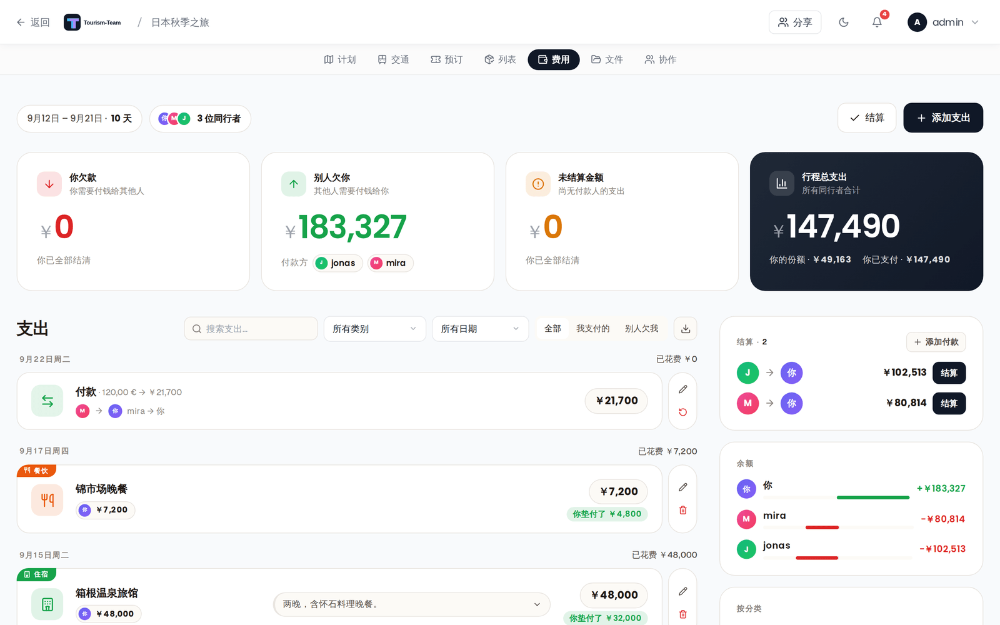
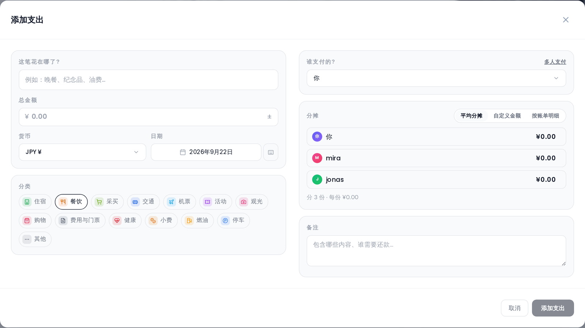

# 费用（预算跟踪）

按分类跟踪行程支出，在成员之间分摊费用，并可视化花费情况。

> **更名为费用（v3.3.0，#1464）：** 该功能现在在界面的所有位置都叫 **费用** —— 规划器标签页显示为 **费用**，在 管理 → 扩展 中也列为 **费用**。它的内部扩展 ID 仍是 `budget`，因此权限是 `budget_edit`，MCP 权限范围是 `budget:read` / `budget:write`。

## 在哪里找到它

打开行程规划器里的 **费用** 标签页。只有启用费用扩展时该标签页才可见。

> **管理员：** 费用是一个扩展。在 [管理：扩展](Admin-Addons) 中启用它。

## 货币

费用是**多货币**的（#551）。涉及三项设置，它们各司其职：

- **行程货币**（旅行 → 编辑旅行）是这次旅行的记账基准。所有余额和结算都以它为基准计算。
- 每笔**支出**都带有**自己的货币** —— 在支出对话框中挑选，并按收据上的内容填写（卢布行程里一顿 100 美元的晚餐记为 `100 USD`）。它按**保存时冻结**的汇率换算成行程货币，因此市场波动不会让一笔已结清的债务重新打开。
- 你的**显示货币**（设置 → 常规）把你*读到*的内容 —— 合计、图表、余额 —— 换算成一种货币。它不改变任何已存储的内容。留为 **行程货币**（默认值）时，每次旅行都以它自己的货币显示。

支持 165 种货币，汇率来自 [Frankfurter](https://frankfurter.dev)（无需 API 密钥）。当某个条目的货币与显示货币不同时，对话框会在换算后金额旁显示原始金额（`$100.00 ≈ 7 668,71 ₽ · live rate`），账目行则两者都显示（`$100.00 → 7 668,71 ₽`）。

> **完整图景请读 [货币](Currencies)** —— 这三者如何相互作用、更改行程货币时会发生什么，以及公开分享链接以哪种货币显示。

## 分类

每笔支出都归属于 **14 个固定分类**之一。你无法添加、重命名、重新排序或删除它们 —— 你在支出对话框的一排胶囊按钮中选一个。每个分类都有自己的图标和颜色，支出行上的彩色标签和侧栏明细里的色块显示的正是它：

**住宿**、**餐饮**、**日用品**、**交通**、**航班**、**活动**、**观光**、**购物**、**费用与票券**、**健康**、**小费**、**燃油**、**停车**、**其他**。

在费用重构之前写入的支出带有自由文本分类。当存储的标签可识别时，它们会被匹配到固定键上（保存为 `Flight` 的预订读作 **航班**，`gas` 读作 **燃油**），否则回退到 **其他**。数据库中不会重写任何内容，改变的只是该行的显示方式。

## 支出条目

支出以按**日期**分组的账目形式列出，最新的日期在最前，每组标题右侧显示当天的合计。记录下来的结算付款也放在同一份列表里，因此整份账目按顺序读起来就是这次旅行的资金上发生的一切。一行显示：分类作为彩色标签、名称、付款人胶囊（含各自投入的金额）、备注，以及按你的显示货币计的合计 —— 当分摊让你在这笔上多付或少付时，金额下方还会有一个绿色的 **你借出** / 红色的 **你借入** 胶囊。以另一种货币录入的支出会在名称下方显示原始金额和换算后金额。

列表上方是搜索框、分类筛选、日期筛选、**全部 / 由我支付 / 被欠** 切换，以及 CSV 导出按钮。

点击 **添加支出**，或某一行旁的铅笔图标，打开支出编辑器：

| 字段 | 说明 |
|---|---|
| 这笔支出是做什么的？ | 支出名称。必填 —— 不填对话框不会保存。 |
| 总金额 | 收据上的金额。在票据模式下它由各条目汇总得出，无法输入。 |
| 货币 | 这笔支出自己的货币。 |
| 日期 | 可选的支出日期。未注明日期的支出归入 **无日期** 分组。 |
| 分类 | 14 个固定分类之一。 |
| 谁付的钱？ | 实际掏钱的人 —— 见 [谁付的钱](#who-paid)。 |
| 分摊 | 总额如何分配 —— 见 [分摊费用](#splitting-costs)。 |
| 备注 | 自由文本备注，显示在该行上。 |

### 关联到预订或地点的支出

一笔支出可以挂在**预订**（订座或交通）或**地点**之下 —— 两者的表单里都提供 **创建支出** 按钮，它会先保存该记录，然后为它打开支出编辑器。关联的支出就是一笔普通支出：和任何一笔一样带有付款人、分摊、日期和货币，并且会出现在结算中。

删除预订或地点会连同其关联支出一起删除。从记录的「费用」区块中移除该支出则只删除这笔支出，记录本身保留。

## 谁付的钱

支出编辑器里的 **谁付的钱？** 记录实际掏钱的人。它是结算运算的另一半 —— 分摊说明谁该为这笔支出出钱，这一项说明谁为它垫了钱：

- **一个人付的钱** —— 从下拉菜单中选择一位成员。这是默认值。
- **多个人付的钱** —— 用标签旁的链接切换，把每位付款人都加进来，并填写各自投入的金额。这些金额之和必须等于总额；在相等之前，对话框会显示 *Payer amounts must add up to …* 并拒绝保存。
- **还没有人付钱**：单人下拉菜单中的第一个条目，用于你只是在计划的支出。该金额仍会计入 **行程总支出**，但不会产生债务：既然没有人为此垫钱，就没有人需要被偿还，因此它会一直留在 **余额** 和结算建议之外，直到你填入付款人。

没有付款人的支出会在其行上标记为 **未完成**，并计入 **未结清金额** 卡片 —— 想找那些已记录但尚未在任何人之间结清的支出，就看那里。

## 分摊费用

**分摊** 决定谁该为这笔支出出钱。每位行程成员都会列出，可以纳入或排除，共有三种模式：

- **平均** —— 在选中的成员之间平均分摊费用。余下的分（由舍入误差产生）会确定性地分配，并使用条目 ID 轮换，以确保在整个行程过程中每个人被收取的金额相等。
- **自定义** —— 为每位旅行者输入特定的自定义金额。各自定义分摊之和必须与总价完全相等。
- **票据** —— 建立一份逐项列出的支出清单（例如 苹果：$10，蛋糕：$50，牛奶：$40），并为每个单独条目指定具体的行程参与者来分摊。各人份额按分精确计算，支出总价自动汇总，逐项分摊清单在多次编辑之间会被保存/恢复。

## 结算计算器

费用会算出结清所有债务所需的最少转账次数（使用贪心匹配算法），并把结果放在右栏，分成两张卡片：

- **结算** —— 转账流向：谁付给谁、付多少。未结清流向的数量显示在卡片标题中，每个流向都有一个 **结算** 按钮，把它记为已完成。
- **余额** —— 净余额：每位成员整体的盈余或亏欠。

面板标题中的 **结算** 会一次性记录所有未结清流向。卡片上的 **添加付款** 手动记录一笔转账，用于没有遵循建议流向的还款。记录下来的付款随后会作为独立行出现在支出账目中，旁边带有编辑和撤销。

余额始终以**行程货币**轧差，并**在最后一次性**换算成你的显示货币 —— 因此即使行程混用多种货币，它们也保持稳定。

记录下来的付款也带有**自己的货币**：用欧元转账结清一笔卢布债务很正常，所以付款对话框有货币选择器，其汇率在你记录时冻结。以另一种货币进行的付款会在账目中显示两个金额（`$30.00 → 27,00 €`）。

## 费用汇总

支出列表上方有四张卡片：

- **你欠款** —— 你还需转出多少，以及你欠谁。
- **你被欠款** —— 反方向上的同一件事。
- **未结清金额** —— 尚无付款人的支出总额，以及这样的支出有多少笔。
- **行程总支出** —— 用大字号显示的总额，下方是你的份额和你支付的金额。

在结算和余额卡片下方，右栏以 **按分类** 结束：每个分类的花费，以该分类颜色的条形按排名列出。只有有花费的分类会出现，按金额排序，条形以最大的分类而非行程总额为基准缩放，因此排名保持清晰可读。

## 导出

点击工具栏中的 **导出 CSV** 把所有支出下载为电子表格（在 v3.3.0 中恢复，#1500）。文件以分号分隔并带 UTF-8 字节顺序标记（因此 Excel 能干净地打开），行按日期排序，文件名为 `costs-<trip>.csv`。各列为：**日期、名称、分类、金额、货币、金额（<显示货币>）、备注** —— 每笔支出都同时显示以其自身货币计的原始金额和换算成你显示货币的金额。

## 权限

所有写操作（添加/编辑/删除支出和结算付款，以及支出的货币）都需要 `budget_edit` 权限。**行程**货币存在于行程本身之上，因此更改它需要 `trip_edit`。

## 另见

- [货币](Currencies)
- [管理：扩展](Admin-Addons)
- [预订与订单](Reservations-and-Bookings)
- [行程规划器概览](Trip-Planner-Overview)
