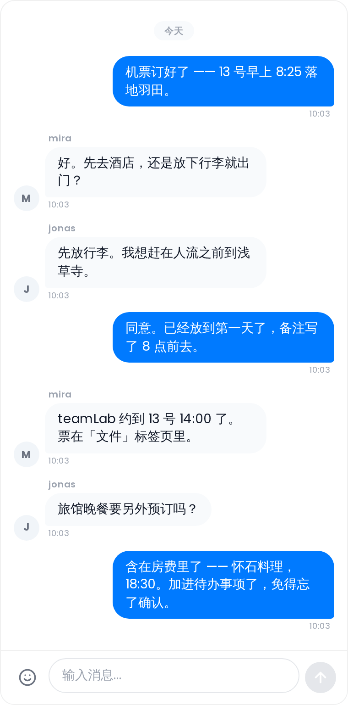

# 群聊

在不离开行程规划器的前提下，与你的团队实时聊天。

## 在哪里找到它

打开行程规划器，选择 **协作** 标签页。如果聊天子功能已启用，就会出现一个聊天面板 —— 桌面端为左栏，移动端为标签栏中的第一个标签页。

协作扩展必须由管理员启用，且聊天子功能必须打开。见 [实时协作](Real-Time-Collaboration)。

## 发送消息

在底部的输入框中输入，然后按 **Enter**（或点击发送按钮）发布。按住 **Shift + Enter** 可插入换行而不发送。

消息按 100 条一页加载。当有更早的消息可用时，聊天顶部会出现一个 **加载更早的消息** 按钮。

## 表情符号

点击编辑器中的笑脸按钮打开表情选择器。选择器有三个分类：

- **Smileys** —— 面部表情和手势
- **Reactions** —— 爱心、火焰、点赞及类似图形
- **Travel** —— 飞机、地图、食物、相机和目的地

表情符号通过 Twemoji 渲染，以保证在各平台上外观一致。

## 回应

在桌面端 **右键单击** 一条消息（移动端则 **双击**）打开快速回应菜单。提供八个快速回应：❤️ 😂 👍 😮 😢 🔥 👏 🎉。点击任意回应即可开启或关闭它。所有用户的回应会聚合显示在消息下方；把鼠标悬停在回应徽章上可查看是谁回应的。

## 回复

把鼠标悬停在一条消息上即可显示操作按钮。点击 **回复** 引用该消息。被引用文本的预览会显示在编辑器中你新消息的上方；点击 **×** 取消回复。发送后，被引用的文本会内联显示在你的气泡中。

## URL 链接预览

当一条消息包含 URL 时，Tourism-Team 会自动获取 Open Graph 预览（标题、描述和缩略图），并显示在消息文本下方。一条消息中只有第一个 URL 会生成预览。

获取在服务端运行，因此受到严格约束：只有行程成员才能请求，目标必须是公网 HTTP(S) 地址（你自己网络内的地址会被拒绝），一个预览会被记住十分钟，并且一位成员每分钟最多触发六十次新的获取。被拒绝或超出配额的预览直接不显示 —— 消息本身不受影响。

## 消息样式

你自己的消息 **右对齐**，带蓝色气泡。其他成员的消息 **左对齐**，带灰色气泡。对于来自同一个人的连续消息，用户名显示在第一条消息的上方；头像显示在该组 **最后一条** 消息的旁边。时间戳显示在每组最后一条消息的下方。

只由 1–3 个表情符号组成的消息会以更大字号显示，且不带气泡。

## 删除消息

把鼠标悬停在你自己的消息上即可显示删除按钮（垃圾桶图标）。删除按钮仅在你拥有 `collab_edit` 权限时可见。删除会把气泡替换为一条斜体提示 —— 显示你的用户名、「删除了一条消息」和时间戳 —— 对所有成员可见。

## 只读查看者

没有 `collab_edit` 权限的用户可以阅读所有消息，但编辑器被禁用 —— 他们无法发送、回应或删除消息。回复按钮对所有用户可见，但完成一次回复仍然需要 `collab_edit`（对只读用户来说发送按钮是隐藏的）。

## 相关页面

[实时协作](Real-Time-Collaboration) · [协作笔记](Collab-Notes) · [协作投票](Collab-Polls)
