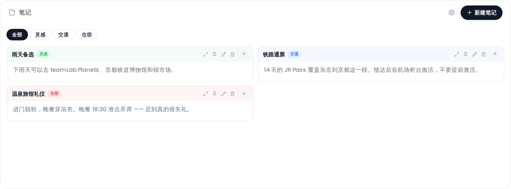

# 协作笔记

与你的群组分享结构化的、格式丰富的笔记。笔记按带颜色编码的分类组织，可以置顶、附加文件，并链接到外部网站。

## 在哪里找到它

打开行程规划器 → **协作** 标签页 → **笔记** 区域。协作扩展必须启用，且笔记子功能必须打开。见 [实时协作](Real-Time-Collaboration)。

## 分类

笔记按分类分组。每个分类有一个名称和一种颜色，颜色从六个色块中选择：**靛蓝**、**红色**、**琥珀色**、**翠绿色**、**蓝色** 和 **紫色**。

要管理分类，点击笔记标题栏中的设置（齿轮）图标（仅拥有 `collab_edit` 权限的用户可见）。在分类设置模态框中，你可以：

- 添加新分类（输入名称并点击 **+**）
- 通过内联点击分类名称来重命名它
- 通过点击色块更改分类颜色
- 删除分类

所有更改（包括颜色更新）都会先在本地暂存，只有在你点击模态框中的 **保存** 后才会应用。保存颜色更改会更新该分类中的每一条笔记。

## 创建笔记

点击笔记标题栏中的 **+ 新建笔记**（仅拥有 `collab_edit` 权限的用户可见）。一个模态框会打开，包含以下字段：

| 字段 | 必填 | 备注 |
|-------|----------|-------|
| 标题 | 是 | 纯文本 |
| 正文 | 否 | Markdown |
| 分类 | 否 | 从已有分类中选择 |
| 网站 | 否 | URL；会在笔记卡片上显示 Open Graph 缩略图 |
| 附件 | 否 | 最大 50 MB 的文件；见下方限制 |

点击 **创建** 保存。

## Markdown 支持

笔记正文以带软换行的 GitHub Flavored Markdown 渲染。支持的语法包括标题、粗体/斜体、链接、有序和无序列表、任务列表、表格、围栏代码块和引用块。

## 置顶

点击笔记卡片上的图钉图标即可置顶。置顶的笔记排到列表顶部（在所有未置顶笔记之上，无论分类）。再次点击（显示为取消置顶图标）即可取消置顶。

## 附件

你可以把图片、PDF 和其他文件附加到笔记上（需要 `file_upload` 权限）。单个文件最大为 **50 MB**。

以下文件类型会被阻止：

- 浏览器会渲染的标记语言：`.svg`、`.svgz`、`.html`、`.htm`、`.shtml`、`.shtm`、`.xml`、`.xhtml`、`.xht`
- 脚本：`.js`、`.jsx`、`.ts`、`.tsx`、`.mjs`、`.cjs`、`.php`、`.py`、`.rb`、`.pl`
- 可执行文件：`.exe`、`.bat`、`.sh`、`.cmd`、`.msi`、`.dll`、`.com`、`.vbs`、`.ps1`、`.app`

当附件的 MIME 类型包含 `svg`、`html` 或 `javascript` 时，无论其扩展名怎么说，它也会被拒绝。同一份阻止清单也守护着旅行文件管理器（见 [文档与文件](Documents-and-Files)），在那里上传还必须额外匹配管理员的 **允许的文件类型** 设置（视频文件豁免于该清单）—— 注意笔记附件完全不受该设置约束。

图片缩略图会显示在笔记卡片上。点击缩略图可打开灯箱。PDF 会在文档查看器浮层中打开。

你也可以把图片或 PDF 直接粘贴到创建/编辑表单中（如果已授予 `file_upload` 权限）。

## 编辑笔记

点击笔记卡片上的铅笔图标打开编辑模态框。所有字段，包括附件，都可以更新。要移除已有附件，在编辑表单中点击它旁边的 **×**。

## 展开笔记

点击笔记卡片上的展开图标（箭头），在传送门浮层中打开完整内容视图。拥有 `collab_edit` 权限的用户会在浮层标题栏中看到一个铅笔按钮，可直接切换到编辑模态框。

## 筛选

使用笔记标题栏下方的分类筛选胶囊，只显示属于某个特定分类的笔记。点击 **全部** 清除筛选。

## 相关页面

[实时协作](Real-Time-Collaboration) · [群聊](Collab-Chat) · [投票](Collab-Polls)
