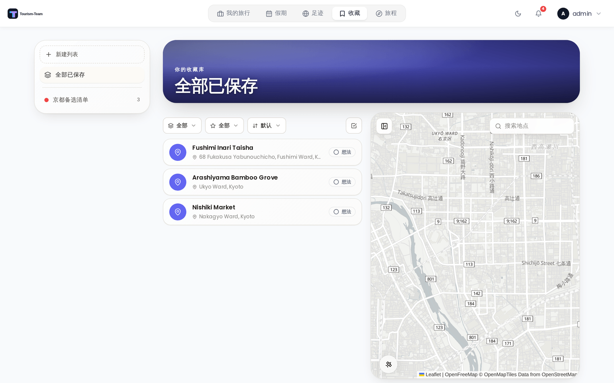
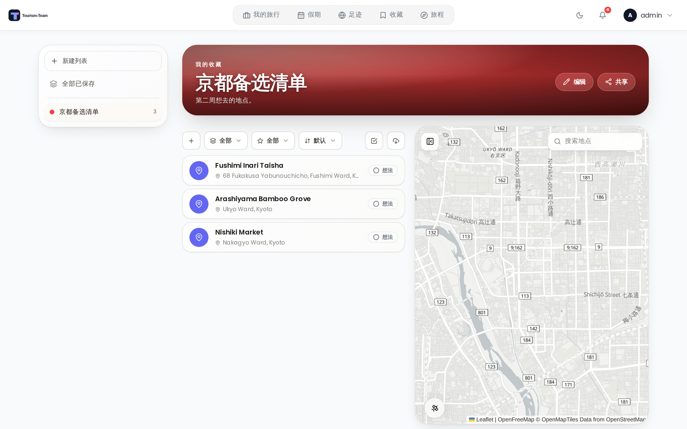

# 收藏

收藏是一个个人的、服务器范围的已保存地点库，独立于任何单次行程而存在。维护多个具名的地点列表 —— 「挪威公路之旅」心愿单、「里斯本最好的咖啡」、「总有一天」—— 每个地点带有想法 / 想去 / 已去过状态，并可与其他用户分享列表。

> **管理员：** 在 [管理：扩展](Admin-Addons) 中启用收藏。

## 收藏是什么

保存到某次行程的地点只存在于那次行程中。收藏恰恰相反：一个属于*你*的地点库，独立于任何行程，因此你在规划一次行程时发现的地点，下一次行程依然还在。地点在行程与收藏之间是复制进出的（绝不链接），因此编辑已保存的地点绝不会改变行程，反之亦然。

## 访问收藏

管理员启用该扩展后，主导航中会出现一个 **收藏** 条目（移动端还有一个底部标签页）。打开后，左侧显示你的列表，中间显示活动列表的地点，右侧显示地图。

仪表盘也会增加一个 **收藏小组件**，把你的列表以紧凑徽章的形式呈现。每位用户都可以在外观标签页的 **仪表盘小组件** 下从自己的仪表盘隐藏该小组件（见 [外观设置](Appearance-Settings)），而不影响任何其他人。

## 列表

- **创建列表** —— 从侧栏中的「新列表」操作开始。列表有名称、颜色、可选封面图片（上传你自己的或搜索 Unsplash）、描述和一组链接。
- **编辑或删除列表** —— 从列表顶部主视觉区的 **编辑** 按钮（仅限所有者）。删除列表会移除它保存的地点。
- **全部已保存** 是一个内置视图，把你拥有或共同拥有的每个列表中的地点合并起来，因此你可以一次搜索并操作整个地点库。

## 地点状态

每个已保存的地点都带有一个状态，轻点一下即可循环切换：

- **想法** —— 你记下但还没确定要去的地方。
- **想去** —— 在候选清单上。
- **已去过** —— 去过了。

状态是收藏的概念，复制地点时不会带入行程。

### 在行程中设置状态

你通常是在看行程时才发现自己去过某地，而不是在浏览地点库时，因此状态也可以从那里设置：

- 行程地点上的 **保存到列表** 对话框会显示已经包含它的每个列表，各自带自己的状态胶囊。轻点胶囊可循环切换该列表的状态，或用 **全部标为已去过** 一次性标记所有列表。
- 地点面板的选择栏中有 **标记为已去过** 操作（手机端的批量工具栏中也有）。选中这些地点 —— *全选* 覆盖整次行程 —— 它们的每一份已保存副本都会被标为已去过。

匹配依据是该地点的提供商 id、它的坐标，或地点从那次行程中保存时已经携带的链接，因此你在列表内重命名过的副本仍能被找到。以只读方式分享给你的列表不会被改动。

## 分类

地点可以从 Tourism-Team 通用的管理员定义分类集中分配一个**分类**（见 [管理：分类](Admin-Categories)）。分类的颜色和图标会显示在地点头像、地点详情和列表行上，你还可以按分类筛选列表。

## 添加地点

- **搜索并添加** —— 「+」操作会打开搜索；选择一个结果，并在保存前设置名称、分类、状态、Markdown 描述和链接，一步完成。
- **从行程保存** —— 地点检查器和行程地点右键菜单都提供 **保存到收藏**，它会把该地点在各个列表中切换为已保存或取消保存。
- **从行程批量添加** —— 在行程地点列表中进入选择模式，勾选多个地点，然后使用选择栏中的 **保存到收藏** 操作把它们一次全部复制到选定的列表。重复项（按名称或坐标）会被自动跳过。
- **导入整次行程** —— 列表筛选行中的下载按钮（以及空列表上的第二个按钮）会打开 **从行程导入**：选择你的一次行程，然后勾选你想要的地点。你已经保存过的地点会变灰且无法再次选择，而该行程任何一天都没有包含的地点初始即为选中，因为那些正是行程遗留的计划。**仅新增** 会隐藏列表中已有的一切，导入按钮上的计数始终显示即将添加的内容。

## 地点详情

点击一个已保存的地点会打开详情面板，显示封面照片（当该地点本身没有照片时自动获取）、它的分类、它的[标注](#custom-labels)、实时状态控件、Markdown 描述和链接。编辑该地点时也可以为它分配标注。在那里你可以编辑该地点、**把它复制进一次行程**，或把它从列表中移除。

要设置自己的封面而不是自动获取的封面，请使用详情面板封面上方的相机按钮上传一张图片（JPG、PNG、GIF 或 WebP，最大 20 MB）；它旁边的移除按钮会清除自定义图片并恢复自动默认值。

## 筛选与批量操作

地点上方是紧凑的筛选器 —— 按**状态**、按**分类**，以及按 [**标注**](#custom-labels) —— 外加一个 **选择** 切换。在选择模式下你可以：

- **全选** 当前筛选出的地点。
- **分配标注** —— 一次把该列表的一个或多个标注添加到每个选中的地点。
- **复制到行程** —— 把选中的地点复制进你的任意一次行程（携带它们的名称、描述、分类、备注、价格、坐标、照片和标签）。
- **移动** 或 **复制** 所选内容到你的另一个列表。
- **删除** 所选内容。

## 自定义标注

每个列表都可以定义自己的**标注** —— 例如「Germany 2026」列表内的 *Berlin*、*Hamburg* 和 *Ostsee* —— 以便在共享的分类集之外对它保存的地点进行分组。标注属于创建它的那一个列表，并与该列表上的所有人共享。

- **管理** —— 标注管理器（可从筛选栏进入）让你创建、重命名、重新着色和删除标注。
- **分配** —— 从地点的详情面板设置它的标注，或用选择栏中的 **分配标注** 一次为多个地点添加标注。
- **筛选** —— 在筛选栏中选择一个或多个标注，把**地点列表和地图两者**都收窄到携带其中任意一个标注的地点。

管理和分配标注需要编辑权限（编辑者或管理员）；**按标注筛选对所有成员都可用，包括查看者**。把地点移动到另一个列表会丢弃它的标注，因为标注属于来源列表。

## 分享列表（融合）

列表默认是私有的。所有者可以通过邀请其他用户来**分享**列表，类似假期的融合。被邀请的用户在接受后即可看到该列表，改动会通过 WebSocket 实时同步。

### 成员角色

分享时，所有者为每位成员分配一个权限角色，并可随时更改：

| 角色 | 可以做 |
|---|---|
| **查看者** | 查看列表，对其中的地点投出自己的星级评分，把其中的地点复制进自己的行程，以及按标注筛选 —— 对列表没有其他改动。 |
| **编辑者** *（默认）* | 添加新地点并编辑已有地点，以及管理和分配列表的标注。 |
| **管理员** | 编辑者能做的一切，外加删除地点。 |

所有者始终拥有完全控制权。所有者还可以移除成员，成员也可以自行离开共享列表。权限在服务器上强制执行，因此一个角色永远只能做它被允许做的事。

## 另见

- [扩展概览](Addons-Overview)
- [管理：扩展](Admin-Addons)
- [管理：分类](Admin-Categories)
- [仪表盘小组件](Dashboard-Widgets)
