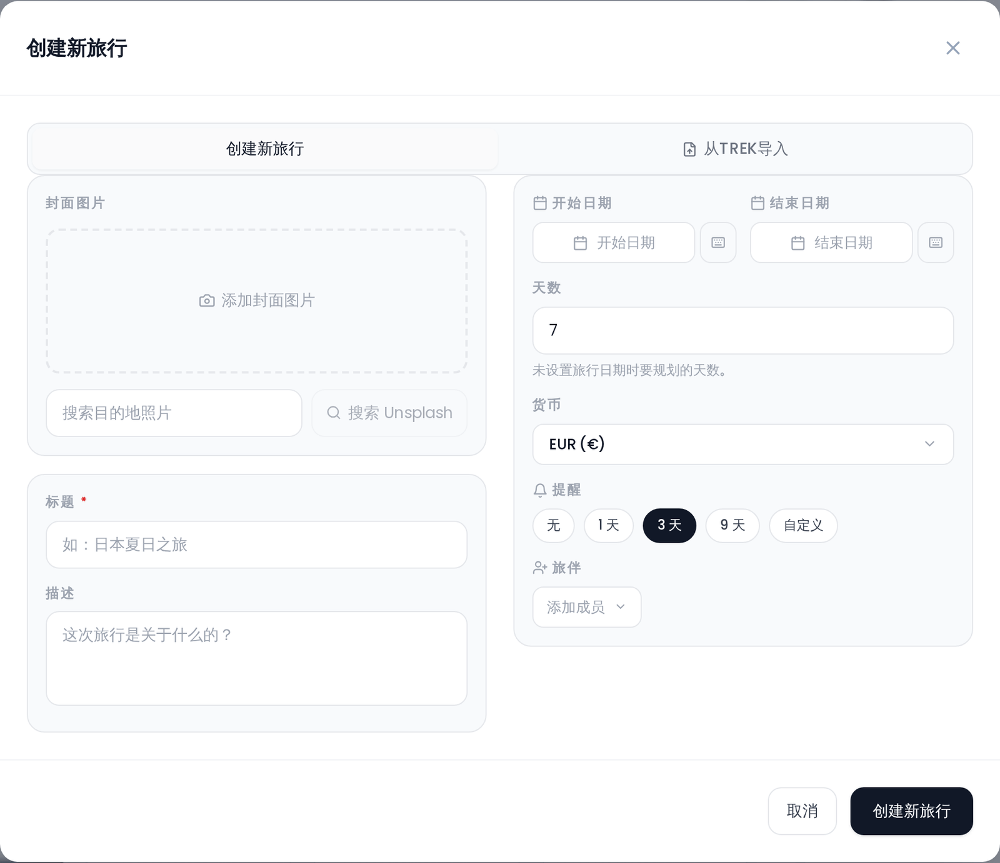

# 创建旅行

## 打开对话框

在桌面端，点击仪表盘右下角的悬浮 **新建旅行** 按钮，或旅行网格末尾的虚线 **新建旅行** 磁贴，即可打开「创建新旅行」对话框。在移动端，悬浮按钮由底部标签栏中央的 **+** 取代，空仪表盘还会提供一个 **创建第一次旅行** 按钮。

你也可以通过深链接直接打开它：导航到 `/dashboard?create=1`。这是系统公告提示你创建旅行时所用的 URL。

## 字段

### 标题（必填）

旅行的名称。不能为空 —— 在输入标题之前无法保存。

### 描述（选填）

一段简短的自由文本描述。它不会显示在旅行卡片或聚焦卡片上。它会出现在 [公开分享页面](Public-Share-Links)、[PDF 导出](PDF-Export)的封面，以及 [日历订阅和 .ics 导出](Calendar-Feeds)中该旅行全天事件的备注里。

### 日期

用日期选择器设置 **开始日期** 和 **结束日期**。两者都设置后，天数会自动计算。

在桌面端，如果你把**两个**日期都留空，会出现一个单独的 **天数** 字段。输入一个 **1 到 365** 之间的数字，即可创建一个固定天数、没有日期的行程。移动端面板没有这个字段：在那里创建的没有日期的旅行始终以 7 天开始。

只有**开始**日期与另一个日期联动。选择开始日期会把结束日期填成与之相同；移动一个已设日期旅行的开始日期时，会为保持原有天数而同步移动结束日期。反方向没有任何联动：你可以单独选择一个结束日期，之后选择器上的 **✕** 按钮可以清除任一字段。因此一次旅行可以带着两个日期保存，也可以只有开始日期、只有结束日期，或者两者都没有。只带一个日期的旅行会得到一个无日期的日程网格（默认 7 天），与没有日期的旅行一样。

### 货币

旅行的货币 —— 它的**记账基准**。费用标签页中的每一笔支出都会换算成它，每一笔余额和结算建议都以它计算。对话框会预填你自己的显示货币（设置 → 常规 → *显示货币*）；如果你把它留为 **行程货币**，则回退到 **EUR**。管理员可以在 管理 → **用户默认设置** 中预设实例范围的值，新用户会继承它，直到他们自己选定。可用货币共 165 种。

选择你实际会用来结算的那种货币。它不是装饰性的标签，但也不是单向门：你可以之后从同一个对话框更改它（需要 `trip_edit` 权限），Tourism-Team 会重新定基现有支出，使没有任何金额发生变动 —— 见 [货币 → 更改行程货币](Currencies#changing-the-trip-currency)。

> 这**不是**设置 → 常规 中的显示货币，后者改变的是*你*在已有旅行上读到什么。见 [货币](Currencies)。

### 封面图片

封面图片显示在旅行卡片上，并作为聚焦卡片的背景。你可以通过四种方式添加：

- **拖放** 一个图片文件到虚线上传区域。
- **从剪贴板粘贴** —— 如果你的剪贴板里有图片，在对话框的任意位置粘贴它即可。
- **文件选择器** —— 点击上传区域浏览文件。
- **搜索 Unsplash** —— 输入查询词挑选一张图库照片。如果它返回 *「Unsplash 搜索不可用」*（在 VPS/机房 IP 上很常见），请配置一个免费的 Unsplash Access Key —— 见 [环境变量 → 图片搜索（Unsplash）](Environment-Variables#image-search-unsplash)。

**创建**新旅行时，封面图片字段始终可见。**编辑**已有旅行时，只有你拥有 `trip_cover_upload` 权限才会显示。对于新旅行，图片在旅行创建完成后立即上传。

### 提醒

在旅行出发前发送的推送通知。该字段显示一组预设选项：

| 选项 | 出发前天数 |
|---|---|
| 无 | 0 |
| 1 天 | 1 |
| 3 天 | 3 |
| 9 天 | 9 |
| 自定义 | 1–30（由你输入数字） |

**创建**新旅行时，提醒字段始终可见。**编辑**已有旅行时，只对 **旅行所有者** 或 **管理员** 用户显示。

如果你的实例禁用了提醒（`trip_reminders_enabled = false`），提醒区域会以降低的不透明度显示，并在预设按钮位置上显示一条说明信息。

> **管理员：** 旅行提醒由一个服务器端功能标志（`trip_reminders_enabled`）控制。请联系你的管理员启用它们。

### 成员

从成员选择器中添加初始旅行成员。在**新建**旅行上，所选成员会先在本地排队，并在旅行保存后立即加入。选择器会列出你实例上除你自己之外的所有已注册用户。

## 保存

点击 **创建新旅行**。旅行被保存，对话框关闭，一条 *「旅行创建成功！」* toast 确认了它 —— 你留在仪表盘上。新旅行会按其日期排入旅行列表；点击它的卡片（或聚焦卡片，如果它是赢得该位置的那次旅行）以打开 [行程规划器概览](Trip-Planner-Overview)。

## 相关页面

- [旅行成员与分享](Trip-Members-and-Sharing)
- [行程规划器概览](Trip-Planner-Overview)
- [我的旅行](My-Trips-Dashboard)
