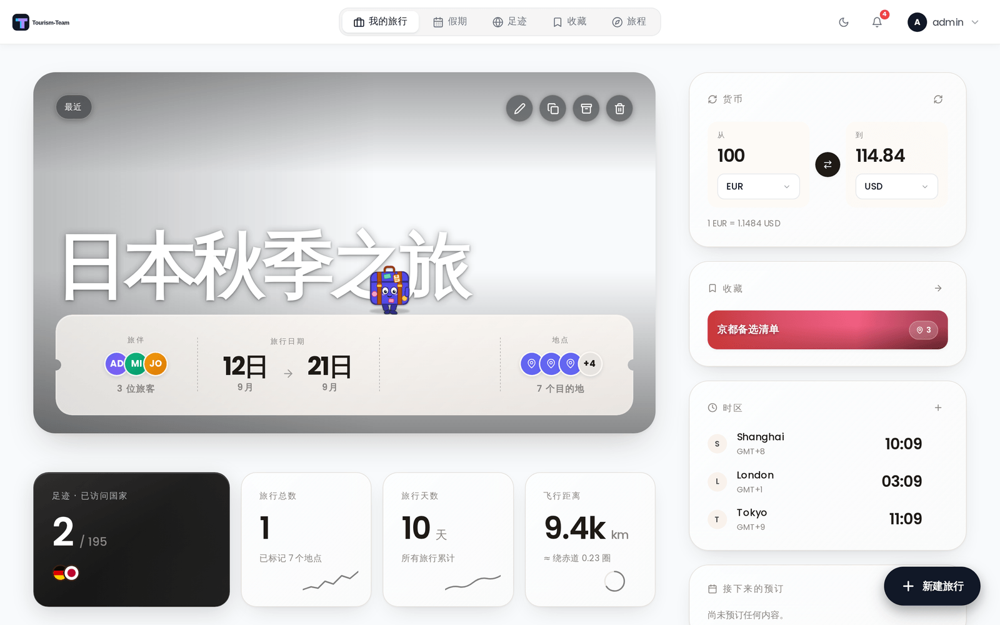

# 仪表盘小组件

「我的旅行」仪表盘有一个小组件侧栏，内含货币换算器、时区时钟和即将到来的预订列表，并且在[收藏](Collections)扩展启用时（该扩展默认关闭）还有一个收藏快捷入口。已安装的插件可以向同一个侧栏贡献更多小组件。本页介绍货币换算器和时区时钟。

## 它们出现在哪里

在大屏幕（桌面/宽屏平板）上，小组件出现在[我的旅行](My-Trips-Dashboard)的粘性右侧栏中。在 1280px 及以下，该栏不再粘性，并作为一行会换行的卡片重排到旅行网格下方。在手机（低于 768px）上，移动端仪表盘接管，把每个启用的小组件渲染为独立的面板，与旅行列表交错排列，顺序可在「设置 → 外观」中调整。任何屏幕尺寸下，这些小组件都没有底部抽屉。

每位用户独立配置自己的小组件。每个小组件显示还是隐藏会保存到服务器上的账户中（跨设备同步）。所选的货币对和保存的时区列表同样保存在你的账户中，因此会跟随你登录的每一台设备。

### 显示和隐藏小组件

小组件可见性位于**设置 → 外观**下的**仪表盘组件** —— 仪表盘本身上没有齿轮图标。桌面端和移动端分别配置：

- **桌面端 → 右侧栏**有一个控制整栏的总开关（关闭后仪表盘会居中显示），外加货币、收藏、时区和接下来的预订各自的开关。
- **桌面端 → 顶部摘要下方**控制足迹 / 国家、行程总数、已旅行天数和飞行距离这些卡片。
- **移动端 → 页面底部**控制货币、收藏、时区和接下来的预订；**移动端 → 顶部摘要下方**控制行程总数和已旅行天数。

关闭某个小组件会把它从仪表盘移除；该偏好会保存到你的账户。

---

## 货币换算器

货币换算器让你快速在两种货币之间换算金额。

**使用方法：**

1. 在输入框中输入金额。
2. 从左侧选择器选择源货币。
3. 从右侧选择器选择目标货币。
4. 换算后的金额出现在右侧（「到」）字段中，正对你输入的金额、位于目标货币选择器上方 —— 显示两位小数，不带货币符号。在该行下方，当前汇率打印为 `1 EUR = 1.0850 USD`；如果无法获取汇率，该字段显示 `—`，该行显示「无法获取汇率」。

你也可以点击交换箭头来反转源货币和目标货币。

**汇率**通过 `https://api.frankfurter.dev/v2/rates?base={from}` 端点从 [Frankfurter](https://frankfurter.dev) 获取。一次请求会返回源货币的所有报价，因此当你更改源货币（包括通过交换箭头）或点击刷新图标时会重新获取汇率；只更改目标货币则复用已加载的汇率。

**支持的货币：**选择器中提供 165 种货币 —— 即 Frankfurter v2 支持的全部集合，包括所有主要法定货币（USD、EUR、GBP、JPY 等）和许多次要货币。

---

## 时区时钟

时区时钟同时显示多个时区的实时时钟。

**使用方法：**

- 在你更改列表之前，该小组件以你的本地时区加上伦敦和东京作为初始内容。你的本地时区是普通的一行，可以像其他任何一行一样移除。
- 每行显示该时区的当前时间，以及它的时区缩写名或 UTC 偏移（例如 `GMT+9`），而不是相对于你自己时区的偏移。
- 点击 **+** 添加时区。一个可搜索的下拉框会列出你的浏览器知道的所有 IANA 时区（如 `America/Denver`）；输入以筛选并选择其一。该行以标识符中的城市部分作为标签 —— 没有自定义标签。
- 悬停在某个时区行上并点击 **×** 将其移除。

时钟每 30 秒刷新一次，且始终以 24 小时制显示 —— 12 小时制显示设置不适用于该小组件。

---

## 另见

- [我的旅行](My-Trips-Dashboard)
- [扩展概览](Addons-Overview)
