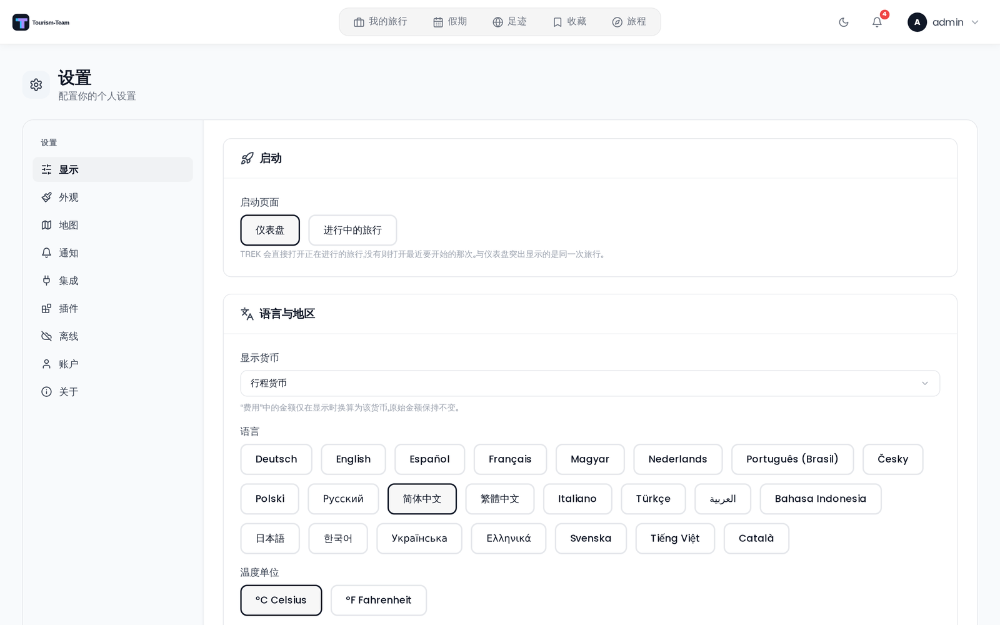

# 常规设置

显示标签页（设置 → 显示）控制你的区域偏好以及一些与地图相关的显示选项。所有更改都会立即保存到你的账户，并在各设备间保持一致。



## 在哪里找到

打开顶部导航栏中的用户菜单，选择 **设置**，然后停留在 **显示** 标签页 —— 页面打开时就在这个标签页。

该标签页分为三个区块：**启动**（打开 Tourism-Team 时落在哪里）、**语言与地区**（货币、语言、温度、距离、时间格式）和 **旅行与地图**（预订路线标签、始终显示预订路线、在地图上探索地点、隐藏预订编号、从住宿地优化路线）。

> 颜色模式（浅色 / 深色 / 自动）**不**在这里 —— 它在 **外观** 标签页。见 [外观设置](Appearance-Settings)。

## 启动页面

打开 Tourism-Team 时前往的位置 —— 应用根路径（`/`），已安装的 PWA 和任何主屏快捷方式启动的也是它。

| 选项 | 行为 |
|--------|-----------|
| **仪表盘**（默认） | 旅行概览，与之前完全一样。 |
| **进行中的旅行** | 直接进入你进行中的旅行，跳过仪表盘。 |

你的 **进行中的旅行** 是今天正在进行的那个；如果没有，则是下一个将要开始的；如果你只有过去的旅行，则是最近的那一次。这与仪表盘在首屏突出显示的是同一次旅行，因此两者永远不会不一致。已归档的旅行永远不会被选中，而如果你完全没有旅行，Tourism-Team 会照常打开仪表盘。

仪表盘仍可在 `/dashboard` 访问 —— 只有根路径会重定向。

## 启动标签页

在选中 **进行中的旅行** 后显示：打开行程规划器的哪个标签页。当你旅途中主要用某一项时很方便，例如在费用标签页里记开销。

如果你选中的标签页属于某个已关闭的扩展，旅行会改为在 **计划** 标签页打开。

### 直接链接到某个标签页

任何行程 URL 都接受 `tab` 参数，启动标签页设置内部用的就是它。它对书签、主屏快捷方式和包装应用同样有效：

```
/trips/42?tab=finanzplan
```

该参数接受规划器的内部标签页 id，这些是历史遗留的德语名称：

| 标签页 | Id |
|-----|-----|
| 计划 | `plan` |
| 交通 | `transports` |
| 预订 | `buchungen` |
| 列表 | `listen` |
| 费用 | `finanzplan` |
| 文件 | `dateien` |
| 协作 | `collab` |
| 旅行页插件 | `plugin:<plugin-id>` |

该参数在到达时即被消费，并从地址栏中消失；之后切换标签页照常工作，刷新页面也会保留你最后停留的那个标签页。

## 货币

你的 **显示货币** —— 你希望在费用标签页中 *读取* 金额时使用的货币（总计、分类图表、结余、结算）。它只影响呈现：它从不改变存储的内容，同一次旅行的两位成员可以按不同货币查看，且双方看到的结余都是正确的。

| 选项 | 行为 |
|--------|-----------|
| **行程货币**（默认） | 每次旅行都按 **它自己的** 货币显示 —— 东京之行用日元，莫斯科之行用卢布。 |
| 某个具体货币（例如 `USD`） | **每次** 旅行都会为你换算成该货币，无论其自身货币是什么。 |

共有 165 种货币可用。换算使用实时汇率，因此换算后的总额可能逐日略有浮动，而旅行实际的结余保持不变。

> 这 **不是** 旅行自身的货币，后者在旅行上设置，是其结余计算所用的基准货币。这个区别很重要 —— 见 [货币](Currencies)。

管理员可以在 管理 → 用户默认设置 中设置实例级默认值。它不只是新账户的起始值：每次加载你的设置时都会把它合并进来，因此它适用于自己显示货币为空的任何用户。你自己选定某个具体货币会覆盖它。**行程货币** 则不会，因为它存储的是被视为「未设置」的空值，所以管理员默认值会在你下次重新加载时再次生效。

## 语言

从按钮网格（桌面端）或下拉菜单（移动端）中选择你偏好的语言。更改立即生效，无需重新加载页面。支持语言的完整列表见 [语言](Languages)。

## 温度单位

影响旅行日程中的天气小组件。

| 选项 | 显示 |
|--------|---------|
| °C Celsius | 公制 |
| °F Fahrenheit | 英制 |

## 距离单位

| 选项 | 显示 |
|--------|---------|
| km Metric | 公里 |
| mi Imperial | 英里 |

## 时间格式

影响应用中所有时间的显示。

| 选项 | 示例 |
|--------|---------|
| 24h | 14:30 |
| 12h | 2:30 PM |

## 预订路线标签

在地图上预订路线的端点标记处显示或隐藏车站 / 机场名称。关闭时仅显示图标。可设为 **开** 或 **关**。

## 在地图上探索地点

在旅行地图上显示一个分类胶囊，用于从 OpenStreetMap 查找附近的餐厅、酒店等。可设为 **开** 或 **关**。

## 始终显示预订路线

为 **开** 时，每个带路线的预订（航班、火车、驾车路段等）都会在每次旅行的地图上自动显示其路线线条，无需逐个预订去切换。可设为 **开** 或 **关** —— 默认关闭。

它只为你尚未改动过的旅行设置 *默认值*。如果你已经在某次旅行中使用过逐条预订的开关或该旅行的「显示全部 / 隐藏全部」按钮（在日程计划工具栏中），那个选择对该旅行会被记住，事后更改此设置不会覆盖它。

## 隐藏预订编号

启用后，确认号和参考编号会被模糊处理，直到你悬停或点击。可设为 **开** 或 **关**。

## 从住宿地优化路线

为 **开** 时（默认），当天路线工具中的 **优化** 按钮会把路线锚定在当天的住宿处，而不只是在各地点之间重新排序：普通的一天会变成从酒店出发再回到酒店的环线，换住的一天则是从你退房的酒店到你当晚入住的酒店的一段行程。可设为 **开** 或 **关**。

没有住宿的一天，或其酒店没有坐标的一天，会像以前一样从第一个地点开始优化。无论在哪种情况下，已锁定和已定时的地点都会保留它们的位置。见 [路线优化](Route-Optimization)。

## 参见

- [货币](Currencies)
- [语言](Languages)
- [外观设置](Appearance-Settings)
- [用户设置](User-Settings)
