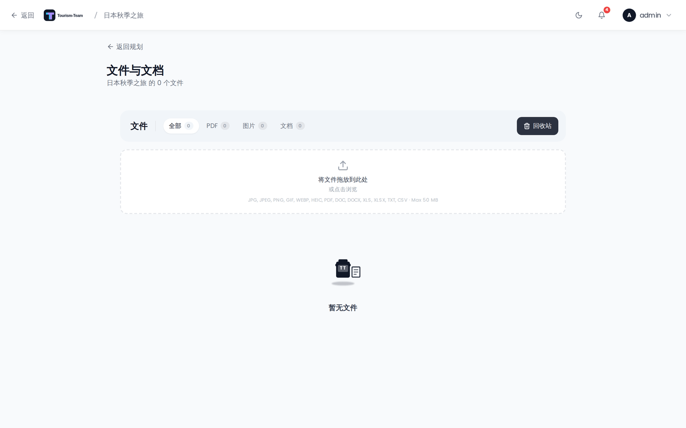

# 文档与文件

为你的旅行附加和管理文档、票据及其他文件。

## 在哪里找到

打开行程规划器中的 **文件** 标签页，或直接访问 `/trips/:id/files`。

> **管理员：** 文件是一个扩展。在 [管理：扩展](Admin-Addons) 中启用它。

## 上传

把文件拖放到上传区域，点击它以打开文件选择器，或直接把图片粘贴到文件面板中。

- **最大文件大小：** 每个文件 50 MB。
- **禁止的文件类型：** 可渲染的文档（`.svg`、`.svgz`、`.html`、`.htm`、`.shtml`、`.shtm`、`.xml`、`.xhtml`、`.xht`），脚本（`.js`、`.jsx`、`.ts`、`.tsx`、`.mjs`、`.cjs`、`.php`、`.py`、`.rb`、`.pl`）和可执行文件（`.exe`、`.bat`、`.sh`、`.cmd`、`.msi`、`.dll`、`.com`、`.vbs`、`.ps1`、`.app`）——这些一律拒绝，MIME 类型包含 `svg` 的文件同样如此。
- **默认允许的类型：** jpg、jpeg、png、gif、webp、heic、pdf、doc、docx、xls、xlsx、txt、csv、pkpass、pkpasses、md、markdown。管理员可以在 **管理 → 设置 → 允许的文件类型** 中自定义允许列表——以逗号分隔的扩展名，或用 `*` 允许除上述禁止类型之外的一切。

需要 `file_upload` 权限。

## 浏览与筛选

工具栏提供筛选标签页，顺序如下：**全部**、**已收藏** 的星形图标（仅在至少有一个文件被收藏时显示）、**PDF**、**图片**、**文档** 和 **协作笔记**（仅在存在来自协作笔记的文件时显示）。每个标签页都显示数量徽章。

## 预览文件

点击既不是图片也不是视频的文件（例如 PDF 或 Markdown）会打开内联预览弹窗，可选择在新标签页中打开或下载。`.pkpass` 和 `.pkpasses` Wallet 凭证是例外：点击会直接下载，好让操作系统把它交给 Apple Wallet，而不是强行放进应用内预览。点击图片或视频文件会打开全屏灯箱。你可以：

- 用 **箭头按钮** 或 **左右方向键** 在图片和视频之间切换。
- 在触屏设备上左右滑动。
- 用底部的 **缩略图条** 跳到某个文件。视频没有存储缩略图，在那里显示播放占位符。
- 从灯箱顶部下载文件或在新标签页中打开。

## 收藏

点击任意文件上的 **星形图标** 即可收藏。已收藏的文件排在列表最前，并可用「已收藏」标签页筛选。

需要 `file_edit` 权限。

## 回收站

删除文件会把它移到回收站。用工具栏中的 **回收站** 按钮切换到回收站视图。在回收站视图中你可以：

- **恢复** 文件，使其重新可用。
- **永久删除** 单个文件。
- **清空回收站**，一次永久移除所有已删除的文件。

恢复和删除操作需要 `file_delete` 权限。

## 把文件关联到地点、预订或分配

一个文件可以同时附加到多个地点和预订上（多对多）。在文件管理器中，点击文件上的 **关联（铅笔）图标** 打开分配弹窗。在那里你可以开关与任意旅行地点或预订的关联。你也可以在同一个弹窗中为文件添加描述性备注。

在预订弹窗中，使用「关联已有文件」选择器直接附加文件。

## 下载

点击任意文件行上的下载图标即可下载。`.pkpass` 文件（Apple Wallet 凭证）以 `application/vnd.apple.pkpass` MIME 类型提供，因此 iOS 和 macOS 上的 Safari 会提示把凭证加入 Wallet，而不是保存为普通下载。

## 权限

| 权限 | 控制内容 |
|---|---|
| `file_upload` | 上传新文件。 |
| `file_edit` | 收藏和关联文件。 |
| `file_delete` | 移至回收站、恢复和永久删除。 |

## 参见

- [预订与订单](Reservations-and-Bookings)
- [管理：扩展](Admin-Addons)
- [行程规划器概览](Trip-Planner-Overview)
