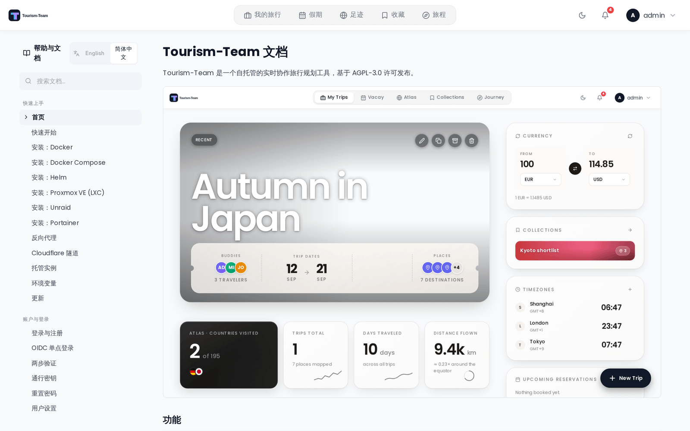

# 应用内帮助

在 Tourism-Team 内部阅读整份 Tourism-Team wiki，无需离开应用或打开 GitHub。

## 在哪里找到它

点击右上角导航栏中的头像，选择 **帮助**，或直接前往 `/help`。单个页面位于 `/help/{slug}` —— 例如 `/help/Packing-Lists`。

该页面标题为 **帮助与文档**。你必须已登录才能访问该路由。

## 语言

wiki 提供多种语言版本。侧栏 **帮助与文档** 标题旁有一个**语言切换器**（移动端抽屉里在顶部），列出随包提供的所有语言。切换后会重新加载页面与该语言的目录；它**不会**改变应用本身的语言 —— 你可以用一种语言读文档，界面仍保持另一种语言。

所选语言会被记住，同时写入 URL 的 `?lang=` 参数，因此复制出去的链接会保留语言；打开带 `?lang=zh` 的链接时，它的优先级高于记忆的选择和应用语言。

尚未翻译的页面会以英文返回，而不是报错，所以只翻译了一部分的 wiki 也能从头读到尾。图片同理：与语言无关的截图（我们无法重新截取的第三方界面）会回退到英文那套。

底层实现上，每种语言就是同一目录下的一个子目录 —— `wiki/zh/Home.md` 与 `wiki/Home.md` 并列 —— 每个端点都接受可选的 `?lang=`（默认为 `en`）：

| 端点 | 用途 |
|---|---|
| `GET /api/help/index?lang=` | 侧栏的分区与页面标题 |
| `GET /api/help/page/:slug?lang=` | 单个页面的 markdown |
| `GET /api/help/asset/*?lang=` | 单张图片或演示动画 |

## 文档随你的安装一起提供

自 **v3.4.0** 起，wiki 被打包进 Tourism-Team 镜像并从磁盘提供（提交 `6c87bf2f`）。这意味着：

- 你读到的帮助始终与你运行的版本一致。v3.4 的安装显示 v3.4 的文档，而不是 `main` 上的内容。
- 帮助在完全没有出站网络访问的情况下也能工作。
- 截图和其他图片由 Tourism-Team 提供，而不是从 GitHub 获取 —— 你的浏览器绝不会为了帮助内容而与 github.com 通信。

### GitHub 回退

如果找不到打包的 `wiki/` 目录 —— 非常规的目录布局，或镜像构建时没有包含它 —— Tourism-Team 会记录一条警告，并回退到通过网络获取公开的 GitHub wiki，把每个页面和图片缓存一小时，并在失败时提供一个陈旧副本而不是直接报错。帮助会降级而不是消失，但那时内容跟随的是最新发布版本，而不是你的版本。

Tourism-Team 会专门探测 `_Sidebar.md`，而不只是目录，因此一个只复制了一半的 `wiki/` 文件夹会回退，而不是提供一个空目录。

### `TREK_WIKI_DIR`

打包的目录会被自动找到。`TREK_WIKI_DIR` 覆盖 Tourism-Team 查找的位置 —— 这是为非常规布局准备的应急出口，普通安装并不需要设置它。见 [环境变量](Environment-Variables)。

## 侧边栏

左侧边栏镜像本 wiki 自己的目录，直接解析自 `_Sidebar.md`：相同的分区、相同的顺序、相同的页面标题。在窄于桌面端的屏幕上，侧边栏折叠到一个 **目录** 按钮之后，点击它以抽屉形式打开。

你正在阅读的页面会以人字形符号高亮。

## 搜索

侧边栏顶部的 **搜索文档…** 框会在你输入时筛选导航。它只匹配 **页面标题** —— 不会搜索页面正文内部。没有匹配页面的分区会消失；当没有任何匹配时，你会看到 **没有匹配的页面。**

要搜索页面内容，请使用 GitHub 上的 wiki，或浏览器的页内查找。

## 渲染

页面以 Tourism-Team 自己的样式渲染：标题、表格、代码块、引用块和图片。有几处做了特殊处理，使同一份 Markdown 在这里和 GitHub 上都能工作：

- 两种 GitHub 写法的 wiki 链接 —— `[[Title|Slug]]` 和裸的相对链接 `[Currencies](Currencies)` —— 都会变成应用内链接，无需重新加载页面即可导航。
- 相对图片路径会被重写为 Tourism-Team 自己的资源端点。
- 标题锚点使用 GitHub 的 slug 方案，因此页面内的 `](#some-heading)` 链接会落到正确的位置。
- HTML 注释（例如 `<!-- TODO: screenshot -->` 占位符）会被剥除而不是显示出来。

外部链接在新标签页中打开。

如果某个页面无法加载，你会看到 **无法加载此页面** —— *帮助内容获取自 Tourism-Team wiki。请检查你的连接并重试。*

## 权限

没有任何权限门控帮助浏览器；任何已登录用户看到的都是相同的页面。底层的 `/api/help` 端点无需认证，因为内容是公开文档 —— 这也正是图片标签能在不发送凭据的情况下加载的原因。

## 另见

- [常见问题](FAQ)
- [疑难排查](Troubleshooting)
- [环境变量](Environment-Variables)
- [更新](Updating)
- [参与贡献](Contributing)
