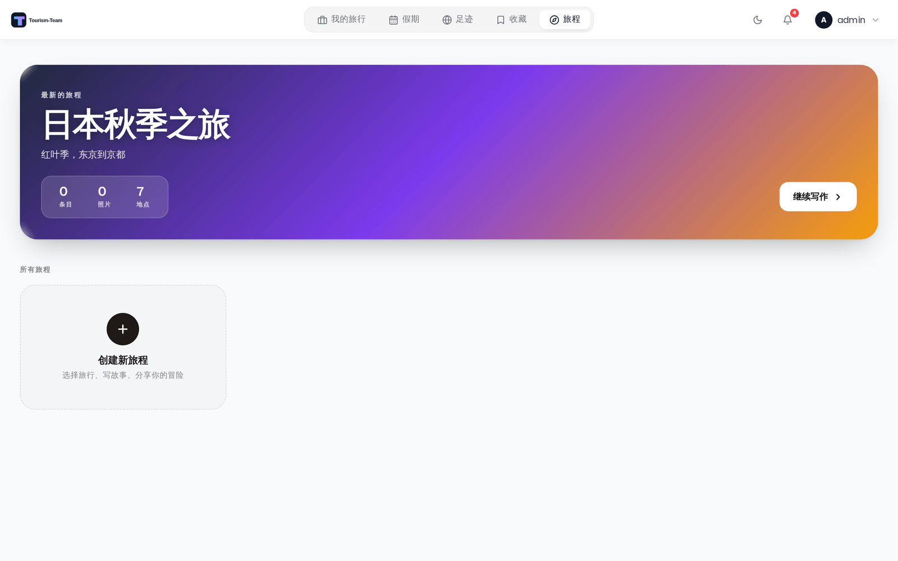
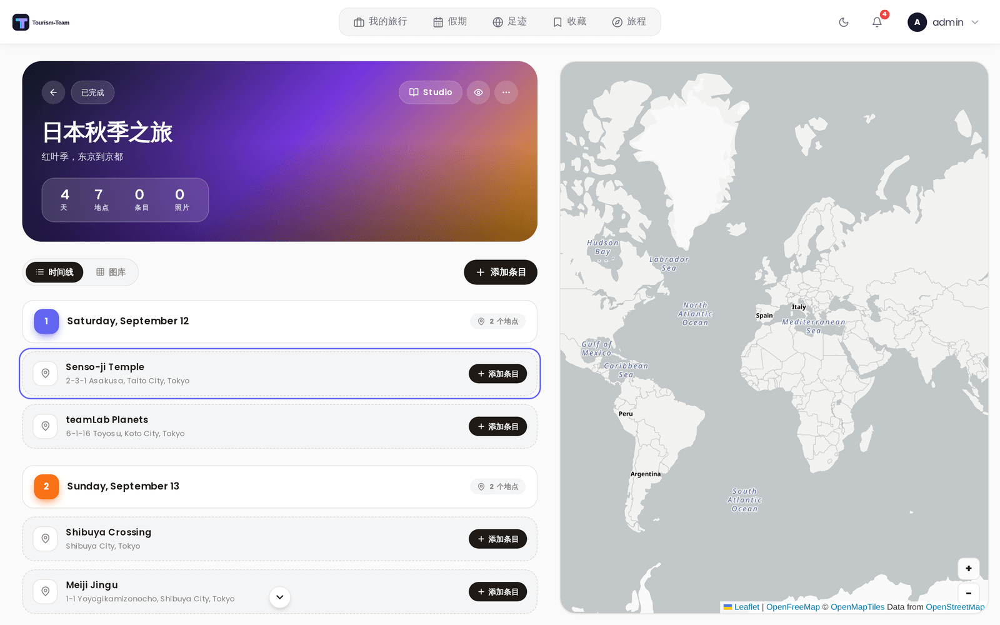
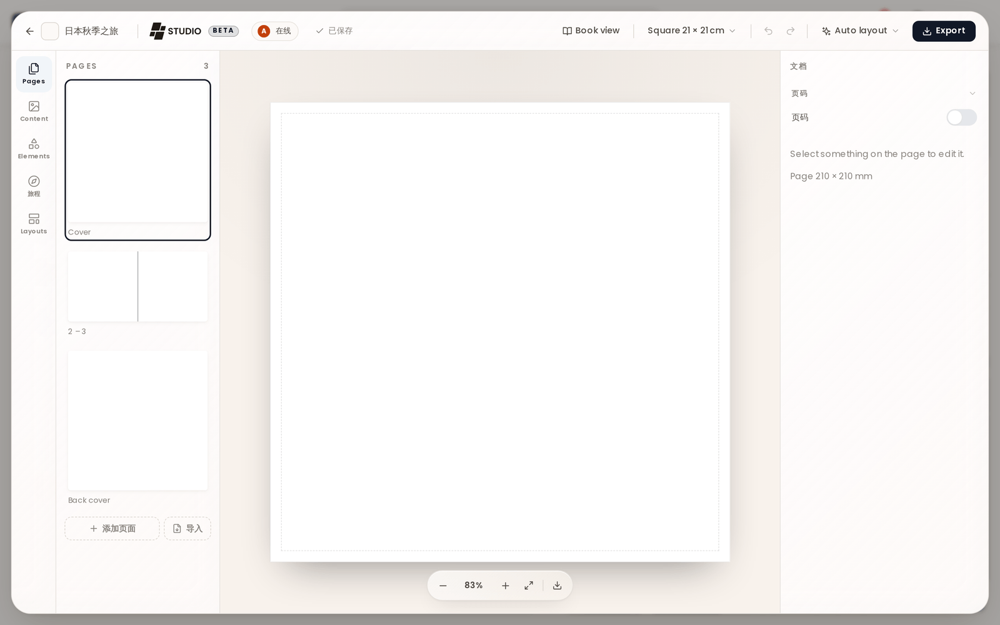

# 旅程

旅程是照片优先的旅行日志。每个旅程关联到你的一次或多次旅行，包含逐日条目，带文字、照片、心情和天气。

> **管理员：** 在 [管理：扩展](Admin-Addons) 中启用旅程。

## 旅程是什么

旅程让你在旅行计划之外，为自己的旅行写一份叙事记录。条目与具体的天数绑定，可以包含散文、照片、心情评级、天气状况和评价卡片。已完成的旅程可以用只读链接公开分享。

## 进入旅程

当管理员启用旅程扩展后，主导航中会出现一个 **旅程** 条目。旅程列表页把你所有的日志显示为卡片，带封面图、条目数、照片数和地点数。

## 创建旅程

在旅程列表中点击 **新建旅程**。给它一个标题和可选副标题，然后选择一次或多次既有旅行进行关联。关联旅行会导入该旅行的地点，作为你条目的位置锚点。之后你可以在日志设置中关联更多旅行。

## 日志条目

每个条目对应你旅程中的一天。条目编辑器提供：

- **标题** —— 这一天的简短标题。
- **故事** —— 支持 Markdown 格式的自由文本。
- **心情** —— 从四个值中选择一个：

  | ID | 标签 | 颜色 |
  |---|---|---|
  | `amazing` | 太棒了 | 粉色 |
  | `good` | 不错 | 琥珀色 |
  | `neutral` | 一般 | 灰色 |
  | `rough` | 糟糕 | 紫色 |

- **天气** —— 从六个值中选择一个：晴天、多云、阴天、雨天、暴风雨、雪天。（雪天存储在 id `cold` 下。）
- **照片** —— 给条目附加照片。第一张照片会成为列表视图中该卡片的缩略图。
  > **关于 HEIC 文件的说明：** HEIC 是 Apple 专有的格式，许多浏览器和平台不把它识别为图片。为确保广泛兼容，HEIC/HEIF 文件会在上传前自动转换为 JPEG。这种转换可能导致内嵌元数据丢失（EXIF 数据，例如 GPS 坐标、相机信息等）。
- **优点 / 缺点** —— 可选的评价卡片。把条目加入 **优点** 列表（大拇指向上）或 **缺点** 列表（大拇指向下），用来总结你喜欢什么、什么本可以更好。它们存储在条目的 `pros_cons.pros` 和 `pros_cons.cons` 数组中。
- **标签** —— 自由形式的标签（例如「隐藏宝藏」「最佳一餐」）。
- **地点** —— 把条目钉在地图上的某个位置。
- **时间** —— 可选地记录该条目一天中的时间。

### 在长日志中导航

所有会为日志添加内容的东西都在页面顶部 —— **添加条目** 按钮、图库上传 —— 而你上次阅读到的位置在底部。在桌面端，一旦滚动距离超过 400 px，两个小圆形按钮就会居中悬浮在时间线上、紧贴其下边缘：一个跳回顶部，另一个跳到最后一个条目。每个按钮只在对应方向上还有可去之处时才出现。

### 外部照片

条目编辑器包含一个 **外部照片** 标签页，面向已连接的 Immich 和 Synology Photos 照片库。它会自动搜索所选日历日。当条目有钉住的地点时，带 GPS 元数据的照片会按离该地点由近到远显示。没有 GPS 的照片，以及同一天在更远处拍摄的照片，仍可在附近结果下方取用；不设距离上限。

外部选择与其他编辑器改动一起排队，只在你点击 **保存** 时才保存。如果某个提供商不可用，或其元数据没有 GPS 坐标，旅程会回退到常规的按日期照片列表。

## 移动端时间线

在移动端，条目以卡片缩略图的横向滚动时间线显示。点击一张卡片即在模态面板中打开完整条目视图。每张卡片显示条目的第一张照片（或一个占位图钉）、日期、天序号、心情图标和天气图标。

## 地图视图

旅程详情页在右侧包含一张地图（桌面端），或一个地图与时间线一体的视图（移动端），显示所有条目的位置，以及来自已关联旅行的地点。

**GPX 轨迹也会被绘制。** 你从 `.gpx`、`.kml` 或 `.kmz` 文件导入到该旅程所关联旅行中的任何路线，也会出现在旅程地图上，颜色与它在行程规划器中相同，并带白色外壳，使其在卫星瓦片上保持清晰可读。无需开启任何东西：这些轨迹属于你条目来源的那些旅行，因此只需在规划时导入该文件即可。把鼠标悬停在一条轨迹上会显示它的名称。

按日期顺序连接各条目的细虚线是另一回事，并保持原样：那条线由 Tourism-Team 绘制，而轨迹是你实际记录的路线。

## Tourism-Team Studio

旅程也可以排版成一本可打印的相册。打开一个旅程并点击页头中的 **Studio**。设计器在旅程之上打开，位于 `/journey/:id/studio`，因此旅程在下方保持打开，**返回旅程** 会把你直接送回去。Studio 被标记为 **Beta**。

- **页面格式** —— 方形 21 × 21 cm（默认值）、方形 30 × 30 cm、A4 横向、A4 纵向、A5 横向，或以毫米为单位的自定义宽 × 高。所有内容都按跨页（两页并排）绘制，带 3 mm 出血和 5 mm 安全边距。
- **自动排版** 有两个入口。**此跨页** 会从该跨页来源的日志条目重新构建屏幕上的跨页，且只在来自条目的跨页上提供。**整本书** 会替换每一页，同时保留你的标题和页面设置。两者都是普通的撤销步骤，因此你可以按一下、看看效果，然后撤销。
- **页面、内容、元素、旅程和版式** 是左侧栏的各个分区。内容存放旅程自己的照片和条目；版式有十三种跨页版式（图片与故事、四宫格、条带加文字、马赛克等），另有一套单独的五个封面和封底版式；元素有文本样式、形状、线条、网格、带框样式的空相框，以及一个可搜索的图标库；旅程会从旅程本身构建图元 —— 路线地图、国家轮廓和列表、国旗、日期、天数和距离标记，以及一份旅行摘要。
- **属性** 在右侧编辑当前选中的任何内容：位置和大小、裁剪和焦点、填充或适应、外观滤镜、圆角半径、相框样式、堆叠顺序、锁定。被自动排版绑定到某条日志条目的元素会跟随该条目，直到你在这里编辑它，那样就会断开链接。
- **导出** 会打开一个打印视图，由你的浏览器把它变成 PDF。选择 **单页**（每张纸一页，印厂要的就是这种）或 **跨页**（一次两页，和翻开书时一样），并可选择裁切标记，它会在每条边加上出血并标出裁切位置。
- **跨页可以在书之间流转。** 把你正在看的跨页下载为设计文件，再把它导入另一本书。该文件只携带设计，不携带照片。
- **多人可以同时设计。** 同一本书里的每个人都能看到其他人的指针及其名字，而一次保存会实时推送给其余人。落在别人已经改过的版本上的保存会以冲突的形式返回，并附上对方的版本，而不是悄悄覆盖他们的工作。

这本书属于它的旅程，并完全继承其访问权限：任何可以读取该旅程的人都可以打开它的书，而只有可以编辑该旅程的人才能保存或删除它。不存在第二套需要保持同步的权限。

Studio 仅限桌面端：它需要至少 1024 px 宽的视口。低于这个宽度 —— 平板，或收窄的浏览器窗口 —— 它会在旅程之上打开，并显示一条「Studio needs a bigger screen」提示以及返回途径。在手机上，旅程照常以移动端视图打开，Studio 完全不提供。制作 PDF 也仅限桌面端。

## 插件条目行

已安装的插件可以通过 `journalEntryProvider` 钩子向日志条目卡片添加额外行。插件返回若干行（`label`、可选的 `value`、可选的 `url`），Tourism-Team 在条目下方以原生方式渲染它们 —— 不使用 iframe。这些行是增量且失败安全的：它们需要旅程扩展，条目所属的旅程会按读取它的同样方式做访问校验，只允许 http/https/mailto 链接，而出错或响应慢的提供方会被直接跳过。

> **插件：** 需要 `hook:journal-entry-provider` 权限。钩子契约见 [插件开发](Plugin-Development)。

## 公开分享

你可以用只读公开链接分享一个旅程。创建链接时，你可以独立切换访客能看到哪些区块：**时间线**（条目和故事）、**图库**（照片）和 **地图**。访客只能看到你已启用的区块，且无需 Tourism-Team 账户。关于独立的旅程分享令牌机制，见 [公开分享链接](Public-Share-Links)。

**照片也会出现在公开地图上**，只要 **图库** 和 **地图** 都开启。一张知道自己拍摄位置的图库照片会变成缩略图图钉，若多张照片拍摄于相近位置则聚合成一个图钉，并位于条目图钉之下，让行程仍是地图的重点。位置来自上传文件自身的 EXIF，或来自 Immich、Synology 中提供商照片的位置；而完全不携带位置的照片干脆不进入地图（见上方关于 HEIC 的说明 —— 那种转换会丢掉 GPS，因此 iPhone 上传通常不带位置到达）。

两个开关都很重要。照片的坐标跟随 **地图** 开关：关闭地图时图库仍会分享，但每张照片的坐标都会在离开服务器之前被剥掉。关闭图库时则完全不发送照片，因此仅地图的分享只显示条目图钉，别无其他。

## 另见

- [扩展概览](Addons-Overview)
- [管理：扩展](Admin-Addons)
- [公开分享链接](Public-Share-Links)
