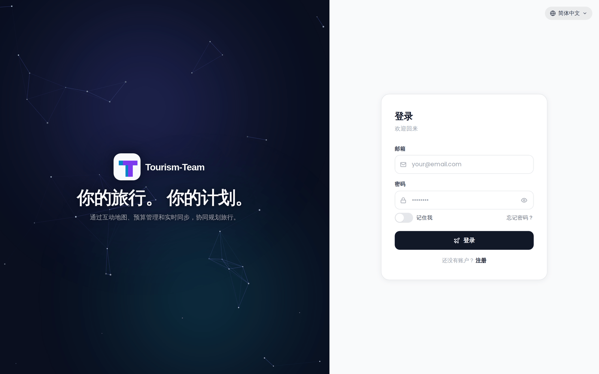

# 登录与注册

## 登录

前往 `/login` 并输入你的邮箱和密码。成功后，服务器会设置一个 `trek_session` Cookie —— httpOnly、sameSite=`lax`，在生产环境为 secure —— 让你在页面刷新后保持登录。它能保持多久取决于下面描述的 **记住我** 开关。在会话过期或你显式登出之前，你无需再次登录。

> **注意：** Cookie 的 `secure` 标志可以通过在服务器环境中设置 `COOKIE_SECURE=false` 来覆盖（对纯 HTTP 的开发环境很有用），或用 `FORCE_HTTPS=true` 强制启用。

如果你的账户启用了两步验证，在密码步骤之后、会话 Cookie 签发之前，会提示你输入 TOTP 验证码（或备用代码）。

如果你忘记了密码，点击密码字段下方的 **「忘记密码？」** 链接即可开始自助重置流程。详情见 [重置密码](Password-Reset)。

### 记住我

密码字段下方的 **记住我** 开关决定会话存活多久：

- **关闭**（默认值）—— 一个没有 `maxAge` 的浏览器会话 Cookie，关闭浏览器时清除，背后是一个在 `SESSION_DURATION`（默认 `24h`）内有效的令牌。
- **开启** —— 一个持久 Cookie，对应一个在 `SESSION_DURATION_REMEMBER`（默认 `30d`）内有效的令牌，因此会话能挺过浏览器重启。

两个时长都按实例可配置，见 [环境变量](Environment-Variables)。你的选择会贯穿 MFA 步骤、密码更改和 SSO 登录。只要你持续使用 Tourism-Team，一旦令牌超过其生命周期的一半，Cookie 就会被静默重新签发，并保持相同的记住我语义，因此活跃的会话绝不会在使用中途过期。只有 Cookie 会话会以这种方式续期 —— 使用 bearer 令牌认证的 API 和 MCP 客户端不会。

不经过这个开关的登录 —— 注册、演示按钮和通行密钥登录 —— 会改用历史默认值：一个持续 `SESSION_DURATION` 的持久 Cookie。

### 强制更改密码

有些账户会被标记为需要设置新密码：Tourism-Team 首次启动时创建的管理员账户始终如此，用 `reset-admin.js` 恢复脚本恢复的账户也是如此（见 [疑难排查](Troubleshooting)）。对这些账户，成功登录后（或在 MFA 步骤之后）会立即显示 **设置新密码** 表单。此时会话 Cookie 已经签发 —— 应用只是把你留在该表单上，直到新密码保存为止，而保存它会重新签发 Cookie 并让你的其他会话退出登录。

管理后台中没有任何控件可以把既有账户标上该标记。管理员设置的密码（见 [管理：用户与邀请](Admin-Users-and-Invites)）既不设置该标记也不清除它，因此已经带有该标记的用户在下次登录时仍会被要求选择自己的密码。

## 注册

注册表单会在以下条件之一出现：

- **开放注册** —— 管理员为实例启用了密码注册（`password_registration` 设置）。
- **有效的邀请链接** —— 你访问了 `/register?invite=TOKEN` 且令牌有效（见下文）。
- **完全没有账户** —— 还没有人注册过；注册表单会自动显示，创建的第一个账户会成为管理员。在正常安装上这永远不会发生，因为 Tourism-Team 会在首次启动时创建管理员（见下文 [首次运行](#first-run)）。

注册字段：**用户名**、**邮箱** 和 **密码**。

### 密码要求

密码必须满足以下全部规则：

- 至少 **8 个字符**
- 至少一个 **大写字母**
- 至少一个 **小写字母**
- 至少一个 **数字**
- 至少一个 **特殊字符**
- 不能是常用密码
- 不能由单个重复字符组成

> **管理员：** 你可以关闭开放注册，让只有邀请链接才能使用。见 [管理：用户与邀请](Admin-Users-and-Invites)。

### 邀请链接流程

当管理员分享一个邀请链接（`/register?invite=TOKEN`）时，访问它会：

1. 向服务器校验该令牌。
2. 自动把登录页切换到注册模式。
3. 在注册时传递该令牌，使其计入邀请的使用次数上限。

如果令牌无效、已过期或已用尽，会显示一个错误。

## 首次运行

在正常安装上，Tourism-Team 会在首次启动时、任何人注册之前创建管理员账户，因此登录页以登录模式打开，注册链接处于隐藏状态。凭据取决于你如何启动容器：

- 当 `ADMIN_EMAIL` 和 `ADMIN_PASSWORD` **两者都** 设置时，使用这两个值。
- 当两者中只设置了一个时，两者都会被忽略（会记录一条警告），并改用下面生成的凭据。
- 否则账户为 `admin@tt.local`，用户名为 `admin`，带一个随机生成的密码打印到容器日志中 —— 运行 `docker logs trek` 取回它。

创建出的管理员被标记为需要更改密码，因此首次登录时你被迫设置新密码。在此之前，即使密码注册默认启用，注册链接也保持隐藏；密码更改后，该链接会正常出现。

有两种安装方式完全跳过这个初始化程序。`DEMO_MODE=true` 会改为写入演示数据（见 [演示模式](Demo-Mode)），而在 **仅 OIDC** 的安装上完全不会创建本地账户 —— 在那里，第一个通过身份提供方登录的用户会被分配 **admin** 角色。

完整的首次启动流程见 [快速开始](Quick-Start)。

## 速率限制

对登录端点的请求按 IP 地址限制为 **每 15 分钟窗口 10 次**。计数器在校验凭据之前就递增，因此成功的登录也计入其中，不只是失败的。超过上限后，后续请求会返回 HTTP 429，直到窗口重置。窗口从第一个被计数的请求开始固定，被拦截的请求不会延长它。

那个计数器是共享的，而不是按端点分开的。`POST /api/auth/login`、`POST /api/auth/register`、`GET /api/auth/invite/:token` 和通行密钥登录仪式各允许从中取用 10 次请求；`PUT /api/auth/me/password`、`POST /api/auth/mfa/disable`、`POST /api/auth/mcp-tokens` 和删除通行密钥也取用同一个计数器，但一旦它达到 5 就会被拒绝。因此来自同一 IP 的无关活动会蚕食这份额度 —— 十次注册尝试会让下一次登录得到 429，而任意类型的五次请求会让密码更改得到 429。

MFA 验证尝试按 IP 地址单独限制为 **每 15 分钟窗口 5 次**。

忘记密码请求按 IP 限制为 **每 15 分钟窗口 3 次**。重置密码提交限制为 **每 15 分钟窗口 5 次**。

## 演示模式

当服务器以 `DEMO_MODE=true` 启动时，登录表单下方会出现一个 **「试用演示 —— 无需注册」** 按钮。点击它即可无需输入凭据而以演示用户身份登录 —— 访客完全不需要看到或输入邮箱地址。预置账户，以及就地升级的实例如何继续工作，见 [演示模式](Demo-Mode)。

## SSO

如果管理员配置了 OpenID Connect，登录表单下方会出现一个 **「通过 SSO 登录」** 按钮（标签为已配置的 `OIDC_DISPLAY_NAME`，默认为 `SSO`）。设置和登录流程的细节见 [OIDC 单点登录](OIDC-SSO)。

当仅 OIDC 模式激活时（密码登录被禁用），访问 `/login` 会自动把浏览器重定向到身份提供方。邮箱/密码表单不会显示。只有在你显式登出后，自动重定向才会被抑制，此时会改为显示 SSO 按钮，好让你选择重新登录。

---

**另见：** [OIDC 单点登录](OIDC-SSO) · [管理：用户与邀请](Admin-Users-and-Invites) · [重置密码](Password-Reset)
