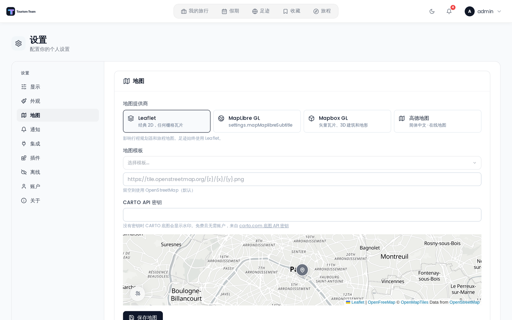

# 地图设置

地图标签页控制 Tourism-Team 在行程规划器和旅程地图中使用哪个地图引擎和瓦片源。

> **注意：** 无论此设置如何，足迹视图始终使用 Leaflet。

## 在哪里找到

打开顶部导航栏中的用户菜单，选择 **设置**，然后选择 **地图** 标签页。与常规标签页不同，这里的更改不会在你操作时自动保存 —— 完成后点击 **保存地图**。

## 地图提供商

选择渲染引擎：

| 提供商 | 说明 |
|----------|-------------|
| **Leaflet** | 经典 2D 渲染器。适用于任何栅格瓦片 URL。无需令牌。 |
| **Mapbox GL** *（实验性）* | 带 3D 建筑和地形支持的矢量瓦片。**需要一个 Mapbox 访问令牌。** |
| **MapLibre GL** | 来自 **OpenFreeMap** 的矢量瓦片。**无需访问令牌** —— 这正是选择它而非 Mapbox GL 的理由。 |

每个 GL 提供商都把样式存在自己的槽位中（Mapbox GL 用 `mapbox_style`，MapLibre GL 用 `maplibre_style`），因此切换提供商永远不会覆盖另一方的样式。

## Leaflet — 瓦片源

选择 Leaflet 时，挑一个预设或输入自定义瓦片 URL。

**内置预设：**

| 名称 | URL |
|------|-----|
| OpenStreetMap | `https://tile.openstreetmap.org/{z}/{x}/{y}.png` |
| OpenStreetMap DE | `https://tile.openstreetmap.de/{z}/{x}/{y}.png` |
| OpenFreeMap Positron | `https://tiles.openfreemap.org/styles/positron` |
| OpenFreeMap Bright | `https://tiles.openfreemap.org/styles/bright` |
| CartoDB Light（需要密钥） | `https://{s}.basemaps.cartocdn.com/light_all/{z}/{x}/{y}{r}.png` |
| CartoDB Dark（需要密钥） | `https://{s}.basemaps.cartocdn.com/dark_all/{z}/{x}/{y}{r}.png` |
| Stadia Smooth | `https://tiles.stadiamaps.com/tiles/alidade_smooth/{z}/{x}/{y}{r}.png` |

**OpenFreeMap Positron 是默认值**，也是所有地图在该字段为空时回退到的目标。它不需要密钥、
不需要账户，也没有请求限制，而且它是 MapLibre 的 *样式* 而不是 XYZ 模板 —— Tourism-Team 在 Leaflet 地图内
用 MapLibre 渲染它，因此标记、路线和聚合的行为与以前完全一致。

你也可以在文本字段中直接输入任何 XYZ 瓦片 URL，或任何 MapLibre 样式文档的 URL。

> **管理员：** 管理员可以通过管理后台的 **用户默认设置** 标签页，为所有新用户设置默认地图瓦片 URL。见 [管理后台概览](Admin-Panel-Overview)。

## CARTO API 密钥

自 2026 年 8 月 26 日起，CARTO 会在每个不带密钥获取的底图瓦片上打上 **API KEY REQUIRED** 水印，因此
两个 CartoDB 预设都需要一个密钥。这就是 CARTO 不再是默认选项的原因；只有当你刻意想要找回 CartoDB 观感时，才需要这一节。密钥是免费的，也无需 CARTO 账户：在
[carto.com/basemaps/apikey](https://carto.com/basemaps/apikey/) 用邮箱地址、你运行 Tourism-Team 的域名，以及
一行项目描述来申请。它会通过邮件送达，没有审批队列。免费额度是每个日历月 500 万次瓦片请求。

把它粘贴到 设置 → 地图 的 **CARTO API 密钥** 中。Tourism-Team 会把它作为 `?key=...` 附加到每个 CARTO 瓦片请求上，一次性覆盖行程规划器、旅程地图、收藏、足迹、Studio 和离线瓦片下载。密钥
永远不会存在瓦片 URL 本身里，因此以后更换密钥不会破坏已保存的模板。

> **管理员：** 管理后台的 **用户默认设置** 中有同一个字段，名为 **共享 CARTO 密钥**。它适用于每一位
> 尚未输入自己密钥的用户，因此可以一次性为整个实例清除水印。它以加密方式
> 静态存储。

其他提供商不受影响，而无密钥的 CARTO 模板会被视为「未配置」，因此地图会回退到
OpenFreeMap，而不是绘制带水印的瓦片。保存密钥后，你的模板会保持你输入的样子。

离线预下载在 OpenFreeMap 和 CARTO 上有效。它在 OpenStreetMap 预设上无效，因为那些瓦片
服务器不允许批量下载。

## 旅程 AMap（高德 JS API）

当部署提供了 Web JS API 密钥时，旅程地图可以使用 AMap。浏览器读取既有的兼容运行时变量 `window.__TREK_AMAP_JS_KEY__`；请通过部署的前端运行时注入来配置该变量，而不要把密钥放进源码管理。如果密钥缺失或 AMap SDK 加载失败，Tourism-Team 会回退到已配置的 Leaflet/GL 地图，并让旅程数据保持可用。

输入你在 [mapbox.com → Access tokens](https://console.mapbox.com/account/access-tokens/) 的 **公开令牌**（`pk.*`）。

所需的权限范围是：
- STYLES:TILES
- STYLES:READ
- FONTS:READ
- DATASETS:READ
- VISION:READ

如果选择了 Mapbox GL 但未保存令牌，Tourism-Team 会回退到 Leaflet 渲染器，因此行程规划器和旅程地图继续工作。只有本设置页面上的预览会保持空白，并显示 *输入 Mapbox 访问令牌以预览* 的提示。

**内置样式预设：**

| 样式 | 标签 |
|-------|------|
| Mapbox Standard | 3D、类 Apple |
| Standard Satellite | 3D、卫星 |
| Streets | 3D、经典 |
| Outdoors | 3D、地形 |
| Light | 3D、极简 |
| Dark | 3D、深色 |
| Satellite | 3D、卫星 |
| Satellite Streets | 3D、卫星 |
| Navigation Day | 3D、类 Apple |
| Navigation Night | 3D、深色 |

你也可以直接输入自定义的 `mapbox://styles/USER/ID` URL。

### 3D 建筑与地形

在所有样式上启用倾斜视角和 3D 建筑。`Mapbox Standard` 和 `Standard Satellite` 自带建筑体块，因此 Tourism-Team 不会在那里添加挤出图层；其他每个样式都会注入一个。地形高程（基于 DEM 的高度）还会在 `Satellite`、`Satellite Streets` 和 `Outdoors` 上应用；`Standard Satellite` 从 Mapbox 自带地形，因此不予改动。其余样式有建筑但没有地形 —— 包括普通的 `Mapbox Standard`，其内置地形会被 Tourism-Team 关闭 —— 因为高程数据会导致路线线条在视觉上偏离 HTML 地点标记。

### 高画质模式 *（实验性）*

启用抗锯齿和地球投影，让边缘更锐利。可能影响低端设备的性能。

## MapLibre GL — 样式

MapLibre GL 渲染 OpenFreeMap 矢量瓦片，且 **完全不需要令牌**，因此这个提供商上没有令牌字段 —— 只有一个样式。

**内置样式预设：**

| 样式 | URL |
|-------|-----|
| OpenFreeMap Liberty *（默认）* | `https://tiles.openfreemap.org/styles/liberty` |
| OpenFreeMap Bright | `https://tiles.openfreemap.org/styles/bright` |
| OpenFreeMap Positron | `https://tiles.openfreemap.org/styles/positron` |

你也可以输入任何 `https://tiles.openfreemap.org/…` 样式 URL。保存时，不是 OpenFreeMap URL 的样式会被拒绝并替换为 Liberty。

**3D 建筑与地形** 和 **高画质模式** 开关是 Mapbox 专有的，在 MapLibre GL 下不会显示。

## 地图打开在哪里

**没有** 默认地图中心或缩放级别设置 —— 它已在 v3.4.0 中移除。取而代之的是，每张地图都会根据它即将绘制的地点自行算出打开时的相机位置，因此一次日本之行会打开在日本，而不是从世界视图开始然后飞越整个星球。

对于每张旅行地图 —— 行程规划器、收藏和共享旅行链接 —— Tourism-Team 会取用给定的坐标，并计算能把它们全部框住的地图中心和缩放（旅程地图用渲染器自己的 `fitBounds` 自行取景，在两种引擎上都以缩放 16 为上限）：

- **多个地点** —— 相机取景它们的包围盒。缩放有上限（Leaflet 上为 16，GL 渲染器上为 15），以免紧密的聚集打开到荒谬的近处，而中心是在投影（墨卡托）空间中取得，而不是取纬度的平均值，因此最北的地点不会掉出画面。
- **单个地点**（或几个堆在同一位置的地点）—— 没有可框取的范围，因此它以城市级打开：Leaflet 上为缩放 12，GL 渲染器上为 11。
- **跨越日界线的地点** —— MapLibre GL 和 Mapbox GL 会环绕世界，因此一次同时覆盖斐济和萨摩亚的旅行会按它实际那样的 10° 宽弧线取景。Leaflet 不环绕，因此它改取平直的自西向东跨度。
- **侧面板** —— 覆盖在地图之上的界面元素会偏移中心，因此地点会留在你实际能看见的那部分地图内。
- **没有可用坐标** —— 一次还没有放置任何内容的全新旅行没有任何可框取的东西，因此地图回退到世界视图（中心 `0, 0`，缩放 2）。

本设置页面上的小地图预览是例外：它固定停在一个城市（巴黎）—— 两个 GL 预览上为缩放 16，Leaflet 下为城市级的缩放 12 —— 好让你判断标签密度、3D 建筑和卫星纹理。它不是一项设置，那里也不会打开任何真实地图。

## 另见

- [地图功能](Map-Features)
- [管理后台概览](Admin-Panel-Overview)
- [用户设置](User-Settings)
