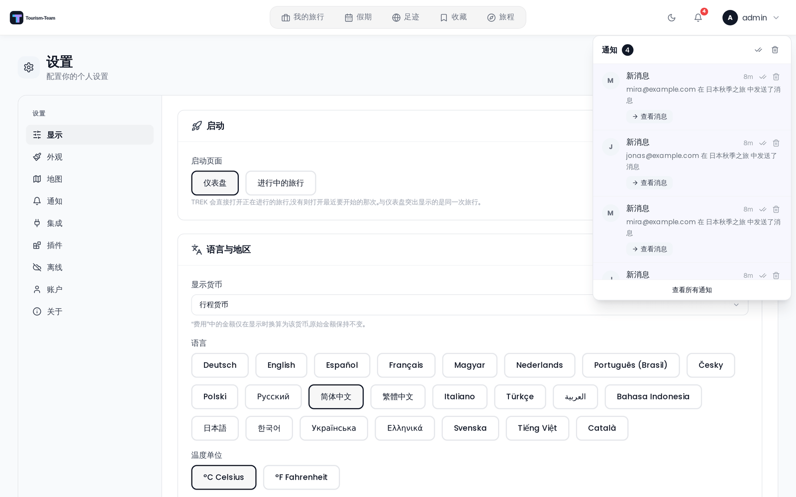
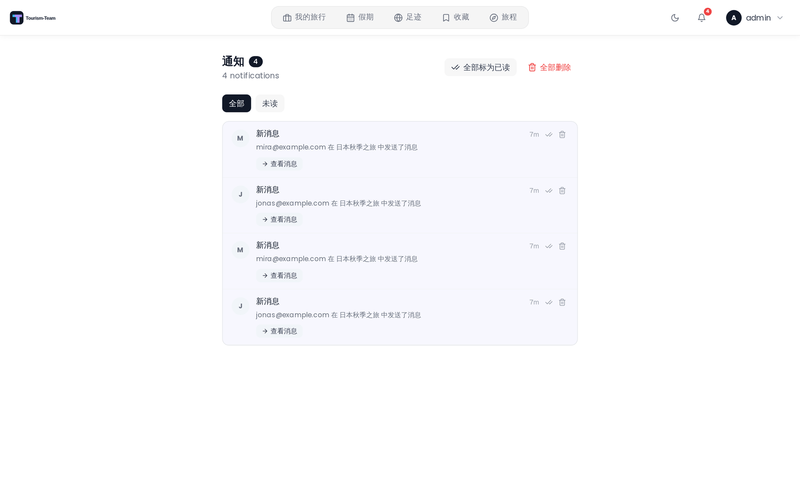

# 通知

通知标签页（设置 → 通知）让你选择哪些事件会通知你，以及通过哪些渠道。每个开关都会立即保存。

## 通知渠道

Tourism-Team 内置四个投递渠道，插件还可以增加更多。具体出现哪些渠道取决于管理员在服务端启用了什么。

| 渠道 | 说明 |
|---------|-------------|
| **应用内** | 导航栏中的铃铛图标。始终可用。通过 WebSocket 实时投递。 |
| **邮件** | 投递到你的账户邮箱。需要管理员配置 SMTP。 |
| **Webhook** | Tourism-Team 向指定的 URL POST 一个 JSON 负载。Discord 和 Slack 的 webhook URL 会被自动识别，并收到原生格式的负载。 |
| **ntfy** | 通过 [ntfy.sh](https://ntfy.sh) 或自托管的 ntfy 服务器推送通知。 |

### 插件渠道

插件可以实现 `notificationChannel` 钩子来注册一个**额外渠道** —— Gotify、Pushover、Telegram，任何能接收消息的东西。见
[插件开发](Plugin-Development#notification-channels)。

管理员安装该插件并打开它的渠道后，它会作为偏好矩阵中的一个新列出现在邮件和应用内旁边，并且行为与其他渠道一致：每位用户提供自己的凭据（在该插件自己的设置中），并逐事件选择希望在该渠道上收到哪些通知。

有两点是插件渠道特有的：

- **它们的作用域是用户。** 仅管理员可见的事件（如 `version_available`）始终走内置的管理员渠道，绝不走插件的渠道。
- **插件永远看不到你的旅行。** 通知由 Tourism-Team 渲染 —— 用你的语言、深链接也已构建好 —— 然后才交给插件。插件拿到的是那条消息和你在其服务上的凭据，仅此而已。

## 通知事件

以下事件可以在用户设置中配置：

| 事件 | 说明 |
|-------|-------------|
| `trip_invite` | 有人邀请你加入某个旅行 |
| `booking_change` | 你参与的旅行中新增、更新或移除了一个预订 |
| `trip_reminder` | 旅行开始前的提醒 |
| `todo_due` | 分配给你的，或你参与的旅行中的某个待办事项即将到期 |
| `vacay_invite` | 有人邀请你融合假期计划 |
| `vacay_share` | 有人与你分享了他的假期日历（仅查看） |
| `collection_invite` | 有人邀请你共享一个收藏 |
| `photos_shared` | 有照片被分享到某个旅行 |
| `collab_message` | 协作旅行中收到一条新消息 |
| `packing_tagged` | 你在某个旅行中被分配到一个行李分类 |
| `plugin_notification` | 某个已安装的插件给你发了一条通知（只有被授予 `notify:send` 能力的插件才能这样做） |

所有面向用户的事件都支持全部四个渠道（应用内、邮件、webhook、ntfy）。矩阵中的破折号（—）表示该渠道/事件组合尚未实现。

### 仅管理员的事件

以下事件显示在管理后台中（管理 → 通知），不可按用户配置：

| 事件 | 说明 | 渠道 |
|-------|-------------|---------|
| `version_available` | 有新的 Tourism-Team 版本可用 | 应用内、邮件、webhook、ntfy |
| `replica_failure` | 对某个存储副本的写入失败（一小时内重复的会被抑制并计数） | 应用内、邮件、webhook、ntfy |

### 仅应用内的事件

以下事件会自动触发，且只能在应用内投递 —— 它出现在偏好矩阵中，带一个应用内开关，其他每一列都是破折号：

| 事件 | 说明 | 渠道 |
|-------|-------------|---------|
| `synology_session_cleared` | 你的 Synology 账户或 URL 发生变化，清除了你的照片会话 | 仅应用内 |

## 配置矩阵

偏好面板显示一个事件 × 渠道的网格。每个交点都可以独立开关。改动会自动保存。

## Webhook 配置

输入一个 URL，当通知触发时 Tourism-Team 会向它 POST。保存后，该 URL 显示为 `••••••••`。使用 **测试** 按钮向已保存的 URL 发送一个测试负载。

Tourism-Team 会自动识别 webhook 目标并调整负载格式：

- **Discord**（`discord.com/api/webhooks/…`）—— 发送一个富嵌入，含标题、描述和时间戳。
- **Slack**（`hooks.slack.com/…`）—— 发送一个格式化后的 Slack 消息块。
- **通用** —— 发送一个纯 JSON 对象，含 `event`、`title`、`body`、`tripName`、`link`、`timestamp` 和 `source`（`"Tourism-Team"`）字段。

## ntfy 配置

输入你的 ntfy **主题**，可选地输入自定义 **服务器 URL**（默认为管理员设置的实例级 ntfy 服务器）以及用于私有主题的 **访问令牌**。令牌以加密方式存储，保存后显示为 `••••••••`。使用 **测试** 按钮验证投递。

## 应用内通知中心

导航栏中的铃铛图标显示你的未读通知数量。点击它打开通知面板，你可以在其中：

- 把单条通知标为已读或未读。
- 一键把所有通知标为已读。
- 删除单条通知或一键清空全部。
- 回应**布尔通知**（例如旅行邀请会直接在面板中提供接受 / 拒绝操作）。

应用内通知通过 WebSocket 实时推送，因此徽标和面板无需刷新页面就会更新。

## 按旅行的偏好设置

通知偏好是在 设置 → 通知 中全局配置的。没有按旅行覆盖的设置 —— 同一个开关适用于所有旅行。

## 另见

- [环境变量](Environment-Variables)
- [用户设置](User-Settings)
