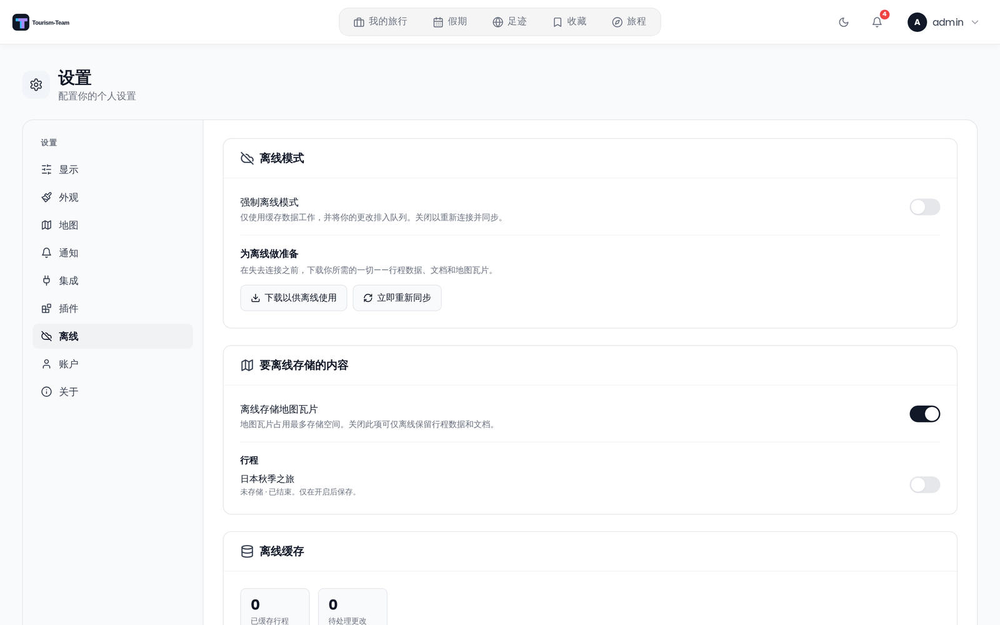

# 离线模式与 PWA

Tourism-Team 可以安装为渐进式 Web 应用（PWA），并在没有互联网连接时用于之前已同步的旅行。

## 安装为应用（PWA）

Tourism-Team 必须通过 **HTTPS** 提供服务 —— 安装提示不会在纯 HTTP 下出现。

**iOS（Safari）：**
1. 在 Safari 中打开 Tourism-Team。
2. 点击分享按钮。
3. 选择 **添加到主屏幕**。

**Android（Chrome / Edge）：**
1. 在浏览器中打开 Tourism-Team。
2. 点击浏览器菜单。
3. 选择 **安装应用** 或 **添加到主屏幕**。

安装后，Tourism-Team 会以 **独立** 模式启动（全屏、无浏览器界面），使用 Tourism-Team 图标。

已安装的应用从应用根路径启动，因此 **起始页** 设置决定你点击图标时看到什么 —— 仪表盘，或直接进入你当前活动的旅行并停在所选标签页。见 [显示设置](Display-Settings)。

## 离线可用的功能

Tourism-Team 使用 Workbox service worker 缓存，外加一个 IndexedDB 数据库（Dexie）来存放结构化旅行数据。以下内容在首次同步后离线可用：

**Service worker 缓存（Workbox）**

| 内容 | 缓存名称 | 策略 | 时长 | 最大条目 |
|---------|------------|----------|----------|-------------|
| 栅格地图瓦片（OpenStreetMap、CartoDB、自定义 XYZ） | `map-tiles` | CacheFirst | 30 天 | 12 288 |
| Mapbox GL 和 OpenFreeMap 样式文档 | `gl-map-styles` | NetworkFirst（5 秒超时） | 30 天 | 20 |
| Mapbox GL 字形、精灵图和矢量瓦片 | `mapbox-tiles` | StaleWhileRevalidate | 30 天 | 3 000 |
| OpenFreeMap 字形、精灵图和矢量瓦片 | `gl-map-offline` | CacheFirst | 90 天 | 6 000 |
| 封面图片和头像（`/uploads/covers`、`/uploads/avatars`） | `user-uploads` | CacheFirst | 7 天 | 300 |
| 应用外壳和应用中的每个页面（HTML / JS / CSS） | precache | 预缓存 | 直到下次部署 | — |

> **注意：** API 响应**绝不会**存储在 service worker 缓存中。Workbox 以 URL 作为条目的键，无法按会话 Cookie 区分，因此在共享设备上，一个账户的缓存数据可能被提供给下一个人。离线读取改为来自下文所述的按用户 IndexedDB 缓存。

> **注意：** 预缓存覆盖每个页面，而不仅是你恰好先打开的那一个。你从未访问过的页面在你失去连接后依然可用 —— 代价是初始安装更大。

**IndexedDB（Dexie）—— 结构化旅行数据**

在登录时、浏览器恢复在线时，以及你关闭 **强制离线模式** 时，Tourism-Team 会运行一次后台同步，把完整的旅行包写入 IndexedDB —— 你也可以用 **立即重新同步** 手动启动一次，用 **下载以供离线使用** 获得一次带进度跟踪的运行，或通过重新启用某个旅行的离线开关：

- 旅行、日程、地点、行李项目、待办事项、预算项目、预订、住宿、旅行成员、标签和分类。
- 既非照片也非视频的文件附件（PDF、文档等）会被下载并以 blob 形式存储在 IndexedDB 中。视频被有意跳过 —— 一个片段可能就有数百兆字节，会挤掉旅行真正的文档。
- 地图瓦片会被预取到 service worker 的 `map-tiles` 缓存中，覆盖每个旅行边界框的 10–16 级缩放，并在即将使总数超过 12 288 块瓦片（约 180 MB）的那个缩放级别停止。

> **注意：** WebSocket 重连*不会*运行此同步。它会重放你排队的更改，然后重新读取你当前打开的那个旅行 —— 日程、地点、行李项目、待办事项、预算项目、预订和文件 —— 这会刷新那一个旅行的缓存行。它绝不会重新下载你其他旅行的包、文件 blob 或地图瓦片；在那里跳过完整同步是有意为之，这样一台本就在线的设备上掉一次连接，不会撞上服务器的限流器。

**同步范围与驱逐**

- 只有进行中和未来的旅行会被缓存（`end_date` 为今天或更晚，或没有结束日期的旅行）。
- 结束超过 7 天的旅行会在下次同步时自动从 IndexedDB 中驱逐。

## 设置 → 离线

**离线** 标签页让你控制此设备上存储什么，并让你可以有意地离线。

### 离线模式

- **强制离线模式** —— 一个开关，会先下载你所需的一切（见下文 *为离线做准备*），然后把整个应用路由到本地缓存，并将你做的每次更改排队。把它关回去即可重新连接：排队的更改会被重放，缓存会被刷新。该覆盖设置在应用重启后仍会记住，因此一次在航班前强制离线的会话在 PWA 重新启动时仍保持离线。
- **为离线做准备** → **下载以供离线使用** —— 一键、带进度跟踪地下载你保持离线的每个旅行的旅行数据、文档和地图瓦片。与后台同步不同，它会*等待*下载完成，因此完成状态意味着你确实拥有了一切。
- **立即重新同步** —— 从服务器刷新缓存。离线时禁用。

### 离线存储什么

- **离线存储地图瓦片** —— 地图瓦片占用的存储远多于其他一切。关闭它可让设备上只保留旅行数据和文档；预下载的瓦片缓存会被立即清除。
- **按旅行的开关** —— 每个旅行都有自己的开/关切换。关闭一个旅行会从设备上驱逐其缓存的读取数据（你未同步的编辑会被保留并且仍会同步）。

### 同步冲突

如果你在离线时所做的更改与服务器上更新的更改相撞，它会被作为**冲突**呈现，而不是静默覆盖任何内容。冲突列表让你可以逐项选择 **保留我的** 或 **保留对方的**。一条默认规则（*每次询问我* / *始终保留我的版本* / *始终保留服务器版本*）可在 **发生冲突时** 下配置。冲突检测覆盖地点和行李项目。

### 统计与缓存

统计面板显示已缓存的旅行、待处理更改、冲突和失败的更改。**清除缓存** 会从 IndexedDB 中移除所有离线数据（在线时你随时可以重新同步）。每个已缓存旅行条目会显示其日期范围、地点/文件数量和上次成功同步时间。

## 限制

- 离线**编辑**支持地点和行李项目（带冲突检测）。其他实体 —— 预算、待办事项、预订、日程 —— 需要连接才能编辑；在强制离线期间，那些编辑在确实有连接时仍会发往实时服务器。
- 你在离线时所做的**删除**某个项目的更改会胜过服务器对同一项目的并发编辑（「删除获胜」）；只有编辑对编辑的冲突会被呈现以供解决。
- 冲突令牌的分辨率为一秒，因此同一秒内对同一字段的两次编辑无法区分，会回退为后写获胜（仅与亚秒级竞争有关；正常的离线窗口不受影响）。
- 创建旅行需要连接。旅行创建不会排队，因此离线时无法开始一个新旅行。
- 照片上传需要连接。照片和视频附件不会被预缓存；其他每个文件附件都会在同步期间自动预缓存。
- 实时协作功能需要活动的 WebSocket 连接。
- Leaflet 底图会被预下载，无论它是 OpenFreeMap 矢量样式（样式、精灵图、字形以及旅行所在区域的矢量瓦片）还是栅格模板。Mapbox GL 瓦片不会被预下载。关闭地图瓦片存储时，单独查看过的瓦片仍可能被 service worker 机会性地缓存。

## 另见

- [用户设置](User-Settings)
- [显示设置](Display-Settings)
