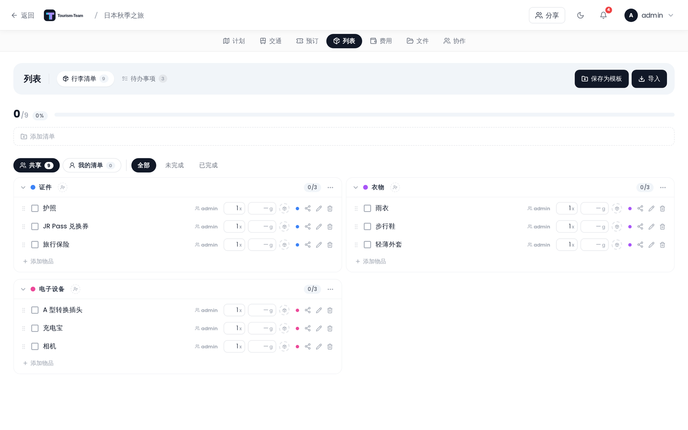

# 行李清单

创建按分类整理的行李检查清单，支持成员分配和可选的行李追踪。



## 在哪里找到它

在行程规划器中打开 **列表** 标签页并选择 **行李**。该标签页仅在列表扩展启用时可见。

> **管理员：** 启用 **列表** 扩展（其内部 id 是 `packing`，同时覆盖行李和待办事项），并可选地在 [管理：扩展](Admin-Addons) 中打开其嵌套的 **行李追踪** 开关。

## 进度条

进度条显示已勾选（已打包）的项目数占总数多少。它在小屏幕上隐藏，在较大视口中可见。当所有项目都被勾选时，一条 **全部打包完成！** 消息会取代已打包/总数计数器，进度条变成绿色。

## 筛选

三个筛选按钮让你缩小项目视图：

- **全部** —— 每个项目，无论是否勾选。
- **未完成** —— 仅未勾选的项目。
- **已完成** —— 仅已勾选的项目。

## 分类

项目按分类分组。每个分类都有一个彩色圆点，会在 10 色调色板中循环。新建的行李清单是空的 —— 不会预填任何内容，面板只会显示 *行李清单为空*，直到你添加东西。你可以手动添加分类和项目、应用已保存的模板（见 [模板](#templates)），或一次性粘贴整份清单（见 [导入清单](#importing-a-list)）来填充它。

界面把这些分组标为 **列表** 而不是分类：创建其中一个的按钮显示 **添加清单**，占位文字是 *清单名称（例如：衣物）*，在它们之间移动项目显示 **移动到清单**，确认对话框询问的是删除 *清单“{name}”*。REST API 和本页仍称它们为分类。

每个分类标题都有一个折叠/展开切换，以及一个包含以下操作的溢出菜单：

- **重命名** —— 重命名该分类。
- **全部勾选** —— 把该分类中的每个项目标记为已打包。
- **取消全部勾选** —— 取消该分类中每个项目的标记。
- **删除清单** —— 删除该分类及其所有项目。

**重命名** 和 **删除清单** 需要 `packing_edit` 权限；**全部勾选** 和 **取消全部勾选** 始终显示。

### 为分类分配成员

使用分类标题中的人员选择器芯片行，把旅行成员分配到该分类。被分配的成员会收到一条行李通知。详情见 [通知](Notifications)。

## 项目

每个项目行包含：

- 一个用于把项目标记为已打包的**复选框**。
- 一个可编辑的**名称**（点击可重命名；项目被勾选时重命名被禁用）。
- 一个**数量**字段（始终可见）。
- 启用行李追踪时：一个**重量**字段（以克为单位）和一个**行李选择器**。

每一行还带有一个**分类选择器**（彩色圆点）、一个**重命名**按钮（铅笔图标）和一个**删除**按钮。使用每个分类底部的内联「添加项目」行来添加新项目，或用 **导入** 一次性引入整份清单（见下文）。

在手机上，该行保留名称并精简其他一切：共享显示为图标而不是一句话，没人填写的重量不打印任何内容，而在列表处于编辑模式时，编辑/删除位于该行末尾的 **⋯** 按钮之后。

## 导入清单

列表标题栏中的 **导入** 会打开一个粘贴框，或使用 **加载 CSV/TXT** 选择一个文件。每行一个项目：

```
Category, Name, Weight in g (optional), Bag (optional), checked/unchecked (optional)
```

```
Toiletries, Toothbrush
Clothing, T-Shirts, 200
Documents, Passport, , Carry-on
Electronics, Charger, 50, Suitcase, checked
```

逗号、分号和制表符都可用作分隔符，带引号的值会保留其逗号（`"Shirt, blue"`）。只有单个值的行会被视为仅是一个名称。没有分类的行会归入 **其他**，尚不存在的行李名称会为你创建。导入的项目是追加的；清单上已有的内容不会被移除。

导入是界面中唯一能批量加载重量和行李分配的地方 —— 应用模板只会带入名称和分类。它需要 `packing_edit` 权限。

## 共享行李项目

每个行李项目都有一个共享层级，控制谁能看到它以及谁在带它。默认情况下一切都位于共享的团体池中，与之前完全一致 —— 这些层级是按项目可选启用的。

### 两种视图

列表顶部的两个胶囊按钮切换你正在查看的内容：

- **共享** —— 团体池：旅行中每个人都能看到的项目。
- **我的清单** —— 你自己的项目：你的个人物品、被要求携带的东西，以及你与特定的人共享的东西。

每个胶囊按钮都会显示其中项目的数量。

### 三个层级

打开某个项目的 **共享** 控件（该行上的共享图标）可在层级之间移动它：

- **共享** —— *在小组共享池中，所有人可见。* 每个项目都从这里开始。
- **个人** —— *私密 — 仅你可见。*
- **共享给…** —— 在两个层级选项下方挑选特定的旅行成员。该项目随后只显示在你的清单和他们的清单上。（如果你是旅行中唯一的人，这里显示 *此行程中暂无其他人*。）

新项目会继承你添加它们时所在的视图：在 **我的清单** 中添加项目会使其成为个人项目，在 **共享** 中添加则放入共享团体池。要与特定的人共享某个项目，请先添加它，然后打开其共享控件并选择他们。

只有项目的所有者（携带它的人）才能更改其共享设置。一个你与之共享项目的人只会在自己的 **我的清单** 上看到它，并带有一个 **由 {name} 携带** 徽标，可以勾选它 —— 他们不管理它还与其他谁共享。

### 谁带什么

**共享** 池中的每个项目都会显示谁在带它。对于别人添加的项目，其他成员会看到两个快捷操作而不是共享控件：

- **我也可以带** —— 承诺共同携带它。该项目的徽标随后会在原携带者旁显示 **+1**。再次点击（*我不带了*）可撤回。
- **复制到我的清单** —— 把该项目克隆到你自己的个人清单上，作为一个单独的私密副本，共享的那份保持不动。

> 在此功能之前创建的项目没有指定携带者，因此在有人编辑其共享设置之前，它们不显示「由谁携带」徽标。

> **注意：** 这种按项目的共享与把 **成员分配到分类**（见上文）是分开的。分类分配只会发送一条行李通知 —— 它们不改变谁能看到某个项目。

所有这些仍受 `packing_edit` 权限门控；没有额外的扩展或管理员开关。

## 行李追踪

行李追踪仅在管理员启用它时可用。

> **管理员：** 在 [管理：扩展](Admin-Addons) 中打开行李追踪。

启用后，一个 **行李** 面板会出现在宽屏上的右侧栏中，或在窄屏上作为模态面板出现（点击标题栏中的 **行李** 按钮打开它）。每个行李显示：

- 名称和彩色圆点。
- 总重量，以及你设置的上限（如果你设置了）。点击重量旁的 **设置上限**（或点击上限本身来更改它）并以千克为单位输入上限 —— 这是航空公司表述它的方式，而 Tourism-Team 以克存储。清空该字段会再次移除上限。
- 一个填充条。有上限时它对照该上限显示；没有上限时，行李会对照最重的行李缩放，因此行李之间仍可比较。
- 分配到该行李的成员头像。
- 项目数量。

侧栏还会显示一个 **未分配** 区块，用于没有行李的项目，以及一行汇总所有项目的 **总重量**。

使用行李：

1. 点击 **+ 添加行李** 并输入名称。彩色圆点会从固定调色板自动分配；没有取色器。
2. 使用每个项目行上的行李选择器把项目分配到行李（启用行李追踪时可见）。
3. 使用行李卡片上的成员芯片行把成员分配到行李。

## 模板

你可以在各次旅行之间保存和复用行李清单：

- **另存为模板**（仅管理员）—— 点击标题栏中的 **另存为模板** 按钮，把当前清单的项目和分类保存为一个具名模板。它只对实例管理员显示，且仅在清单有项目时显示。
- **应用模板** —— 如果存在模板，标题栏中会出现一个 **应用模板** 下拉菜单。选择一个模板会将其项目追加到当前清单，而不移除已有项目。

模板由管理员在 [管理：打包模板](Admin-Packing-Templates) 中管理。

## 权限

所有写操作都需要 `packing_edit` 权限。在此之上把清单保存为模板还需要一个实例管理员账户；应用模板则不需要。

## 另见

- [打包模板](Packing-Templates)
- [管理：扩展](Admin-Addons)
- [通知](Notifications)
- [行程规划器概览](Trip-Planner-Overview)
