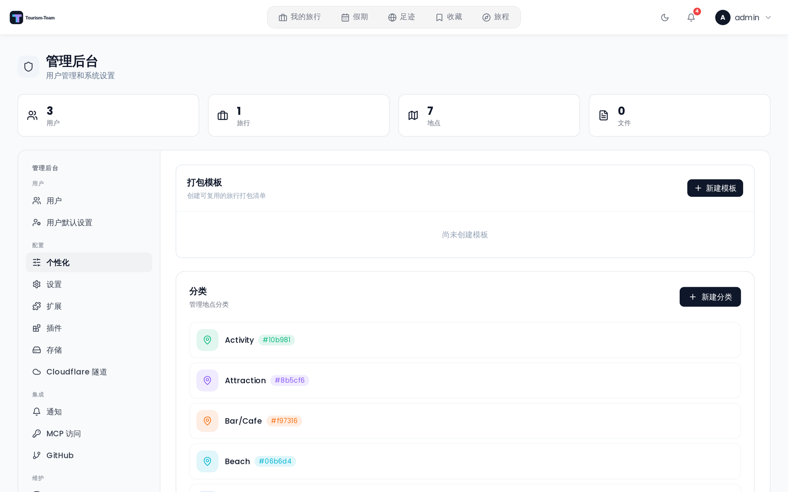

# 打包模板

使用预置模板在各次旅行之间复用行李清单。

## 应用模板

在行李清单面板中，点击 **应用模板** 按钮（工具栏中显示为包裹图标）。下拉菜单会列出所有可用模板，每个都显示其名称和物品数量。点击某个模板即可应用。

应用模板会把模板中的所有分类和物品复制到当前行程的行李清单中 —— 已有物品不会被移除。物品会以模板中定义的相同分类名称插入，因此它们会与任何同名的既有物品并列显示。

需要 `packing_edit` 权限。

在桌面端规划器中，只要至少存在一个模板，**应用模板** 按钮就会出现 —— 它在界面上不受权限门控。没有 `packing_edit` 的成员仍然能看到它；服务器会以 `403 No permission` 拒绝应用，应用则弹出 *应用模板失败* 的提示。在移动端，行李标签页确实对它做了门控：承载「应用模板」的操作菜单只对有 `packing_edit` 权限的成员打开。

## 把当前清单保存为模板

在行李清单面板的工具栏中，当清单中有物品时点击 **保存为模板** 按钮（文件夹加号图标）。工具栏中会出现一个内联的名称输入框 —— 输入名称并按 **Enter**，或点击确认按钮。模板会收录 **共享** 池以及你自己的物品 —— 其他成员的**个人**物品，以及他们分享给特定人员的物品，都会被有意排除。只存储每个物品的名称和分类；数量、重量、行李分配和勾选状态都不会保存。

只有清单中有物品、你拥有 `packing_edit` 权限，并且你是实例管理员时，「保存为模板」按钮才会出现。非管理员可以应用模板，但不能创建模板；对于非管理员，API 会返回 `403 Admin access required`。

> **管理员：** 模板在 [管理：打包模板](Admin-Packing-Templates) 中创建和管理。每个模板都有三级结构：模板 → 分类 → 物品。

## 另见

- [行李清单](Packing-Lists)
- [管理：打包模板](Admin-Packing-Templates)
