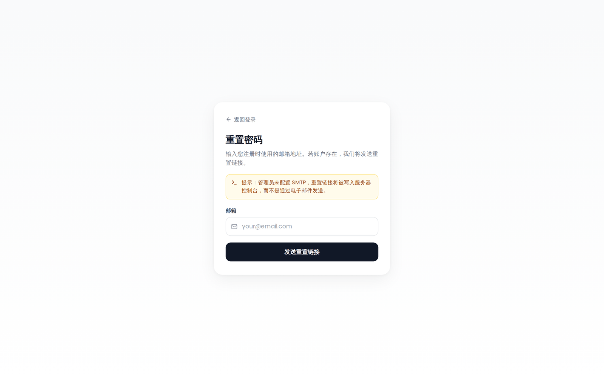

# 重置密码

## 自助重置（忘记密码？）

Tourism-Team 支持基于邮件的自助密码重置。在登录页面点击 **「忘记密码？」** 链接前往 `/forgot-password`。输入你的邮箱地址并提交 —— 如果该地址对应一个本地账户，重置链接会发送到那个邮箱。无论是否找到该邮箱，页面始终显示同一条确认消息，以防止账户枚举。

> **没有配置 SMTP？** 当服务器没有设置 SMTP 凭据时，重置链接不会通过邮件发送。它会被打印到 **服务器控制台**，放在一个清晰划定的区块中，以便自托管者手动复制并转达。忘记密码页面也会显示一条可见的提示，说明 SMTP 未配置。

### 重置流程

1. 在登录页面点击 **「忘记密码？」**。
2. 输入你的邮箱地址并提交。
3. 打开邮件（或控制台）中的重置链接 —— 有效期 **60 分钟**。
4. 输入新密码。如果你的账户**已启用 MFA**，你还必须提供有效的 TOTP 验证码或备用码，重置才能完成。
5. 重置成功后，页面会显示 **密码已更新** 的确认（「你现在可以用新密码登录了。」）以及一个返回登录页面的 **登录** 按钮 —— 不会自动跳转。**所有现有会话都会失效** —— 每台设备都会立即退出登录。

### 安全属性

| 属性 | 细节 |
|---|---|
| 令牌熵 | 256 位加密随机，base64url 编码 |
| 存储 | 数据库中只存 SHA-256 哈希 —— 绝不存原始令牌 |
| 有效期 | 60 分钟，一次性使用；签发新令牌时，任何此前未消费的令牌都会失效 |
| 枚举安全 | `/forgot-password` 始终返回 `{ok:true}`，并带一个最小响应延迟垫 |
| 限流 | `/forgot-password` 上每 IP 3 次请求 / 15 分钟；`/reset-password` 上每 IP 5 次请求 / 15 分钟 |
| MFA 门禁 | 如果账户启用了两步验证，必须提供有效的 TOTP 验证码或备用码才能完成重置 —— 仅凭一个被攻陷的邮箱无法接管受 2FA 保护的账户 |
| 会话失效 | 重置密码会提升账户上的 `password_version` 以及所有 JWT 中的 `pv` 声明，从而立即拒绝每一个活动会话 |
| 审计日志 | 会记录 `user.password_reset_request`、`user.password_reset_success` 和 `user.password_reset_fail` 事件 |

### SMTP 要求

邮件发送使用与其他通知邮件相同的 SMTP 设置。`SMTP_*` 配置见 [环境变量](Environment-Variables)。

### OIDC 账户

任何链接到身份提供方的账户都无法使用忘记密码流程 —— 既包括由 SSO 创建的账户，也同样包括在首次 SSO 登录时被自动链接到 IdP 的本地账户。忘记密码页面仍然显示通用确认信息，以免泄露该邮箱是否与 SSO 关联。请继续使用 [OIDC 单点登录](OIDC-SSO) 登录；本地密码仍可由管理员设置，或者，如果你知道当前密码，也可以自己在 **设置 → 账户** 中设置。

### 密码登录已禁用

如果管理员已在全局禁用密码登录，则永远不会签发重置链接。出于枚举安全的考虑，该端点仍然回答同样的通用确认信息，因此页面看起来和平时完全一样 —— 只是那封邮件（或控制台里的那一行）永远不到达。该拒绝会以 `user.password_reset_request` 记录在审计日志中，并带 `reason: password_login_disabled`。

## 管理员发起的重置

管理员可以直接在管理后台为任何用户设置新密码（**管理 → 用户**，编辑该用户）。把 **新密码** 字段留空会保留当前密码；输入一个则立即保存 —— 不需要邮件。以这种方式设置密码也会提升该账户的 `password_version`，从而让该用户在所有活动会话中退出登录；另外，它会删除该用户的全部 MCP 令牌并撤销其 OAuth 令牌。

管理后台中没有 **「下次登录时强制修改密码」** 选项。该提示只会为 Tourism-Team 首次启动时播种的管理员账户，以及用 `reset-admin.js` 恢复脚本还原的账户而出现（见 [疑难排查](Troubleshooting)）。管理员设置的密码既不设置该标志，也不清除它，因此一个已经带有该标志的用户在下次登录时仍会被要求选择自己的密码。

分步说明见 [管理：用户与邀请](Admin-Users-and-Invites)。

## 密码要求

在选择新密码时（无论是通过重置流程、强制修改提示，还是 **设置 → 账户** 中的 **修改密码** 表单），密码必须：

- 至少 **8 个字符** 长
- 至少包含一个 **大写字母**
- 至少包含一个 **小写字母**
- 至少包含一个 **数字**
- 至少包含一个 **特殊字符**
- 不是常用密码

## 限流

| 端点 | 限制 |
|---|---|
| `/auth/forgot-password` | 每 IP 3 次请求 / 15 分钟 |
| `/auth/reset-password` | 每 IP 5 次请求 / 15 分钟 |
| 修改密码（设置中） | 按 IP 限流 |

---

**另见：** [登录与注册](Login-and-Registration) · [管理：用户与邀请](Admin-Users-and-Invites) · [两步验证](Two-Factor-Authentication) · [OIDC 单点登录](OIDC-SSO)
