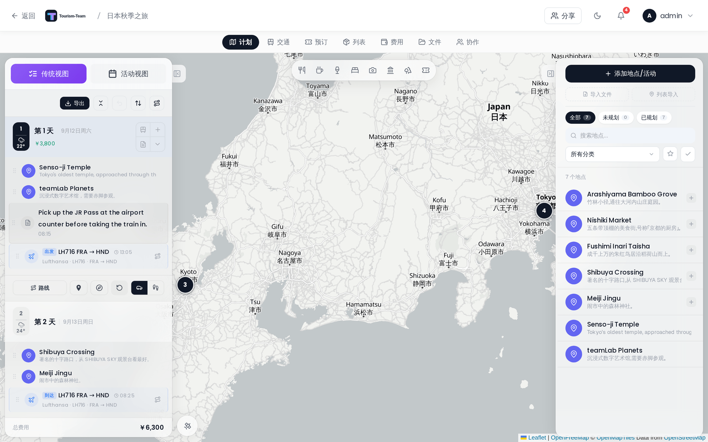

# 地点与搜索

地点是旅行的基本组成单元。你可以通过搜索、粘贴 URL、输入坐标或导入文件来添加它们。

## 添加地点

点击地点侧边栏顶部的 **+ 添加地点** 打开地点表单。你也可以 **在地图上任意位置右键点击**，在该确切位置创建地点 —— 地址会通过逆地理编码自动填入。

## 搜索地点

在表单顶部的搜索框中输入。输入 2 个或更多字符后，经过 300 ms 的防抖，建议会出现在下拉框中。

- 用 **↑ / ↓** 浏览结果，**Enter** 选中，**Esc** 关闭。
- 搜索结果会偏向你现有旅行地点的地理中心。当这些地点的跨度超过约 500 km 时，该偏向会被跳过。

## 使用 AMap（高德地图）

管理员保存高德 Web Service 密钥并开启**使用高德搜索地点**后，表单会优先查询高德。这是中国地址、名称、POI、营业时间、照片和中国境内路线规划的推荐提供商。表单中的提供商切换可以只针对当前搜索切回原生提供商，不改变实例默认值。密钥、坐标转换和限制见 [高德地图](AMap)。

## 有 Google Maps API 密钥时

> **管理员：** Google Maps API 密钥是实例级的，在 **管理 → 设置 → API 密钥** 中设置。它加密静态存储，并供实例中的每位成员使用；在托管实例上由运维方提供，该面板会被隐藏。

当密钥存在时，自动补全会使用 Google Places API，它可以从 Google 的数据库中返回评分、营业时间、照片和电话号码。

> **API 密钥限制：** Tourism-Team 从服务器端而非浏览器调用 Google Places API。如果你在 Google Cloud Console 中为密钥设置了 **HTTP 来源** 限制，那么你还必须在环境中设置 `APP_URL` —— Tourism-Team 会在每个发往 Google 的请求上把它作为 `Referer` 头发送。没有它，Google 会以 `REQUEST_DENIED` 拒绝所有服务器端调用。对于服务器端部署，**IP 地址** 限制更简单，且无需额外配置。如果添加密钥后照片缺失，见 [疑难排查](Troubleshooting)。

### 没有 Google Maps API 密钥时

Tourism-Team 会自动回退到 OpenStreetMap（Nominatim）—— 无需 API 密钥。搜索框上方会出现一条提示 —— *正在使用 OpenStreetMap。添加 Google API 密钥可获得评分和营业时间。* 结果包含名称、地址和坐标。

## 搜索时的地点详情

在桌面端，地点表单左侧带有一个 **地点详情** 栏。选择一个搜索结果，它就会自行填入 —— 无需额外点击，常规的「搜索、选择、保存」添加地点流程也不会有任何变化。如果你已经知道该地点，忽略该栏，像以前一样保存即可。

该栏显示：

- 地点附近或属于该地点的 **图片**。点击一张即可把它设为该地点的缩略图；再次点击则清除该选择。随后这张图片会出现在该地点出现的所有地方 —— 列表、地图标记、行程、PDF 导出和共享旅行 —— 与 [自定义地点图片](#custom-place-image) 完全一样。
- 在可用时显示 **一段描述**。它 *不会* 被自动写入地点。使用 **使用此文本** 把它复制到描述字段；当你已经写了自己的描述时该按钮会被禁用，因此你写的内容不会被覆盖。

图片网格下方有一行署名信息，它属于当前正在使用的那张图片：你正在悬停的那张，若没有则为你已选择的那张，若两者都还没有则为第一张图片。它会列出作者姓名、把该姓名链接到来源页面，并附上许可证及其条款链接。其他图片只在提示中携带作者和许可证，不带链接。Google 的图片只有一行作者信息，没有别的，因为 Google 不为其授予可复用的许可证。大多数 Wikimedia Commons 图片是 CC BY 或 CC BY-SA，这意味着署名必须随图片一起传播，因此一旦你选择了一张，该署名也会继续显示在该地点详情面板的缩略图下方。

### 这些信息来自哪里

维基百科和 OpenStreetMap 始终会被使用，且无需配置：

- 图片来自 **Wikimedia Commons**，优先依据地点自身的标签解析 —— Wikidata 图片、其维基百科条目的主图、其 Commons 分类 —— 只有当这些解析出的结果太少时，才回退到仅按坐标搜索。
- 描述来自 OpenStreetMap 的 `description` 标签，或来自该地点所标记的维基百科条目。Tourism-Team 依据该标签解析条目，而不是从名称猜测，因此有歧义的名称永远不会拉进错误的条目。没有该标签的地点就是没有描述。

在有 Google Maps API 密钥、且相应的管理端开关开启时，最多三张 **Google Places** 照片和 Google 的编辑摘要会额外加入。

图片会被复制到你自己的服务器并从那里提供 —— 你浏览时不会直接从 Google 或 Wikimedia 加载任何内容，因此没有访问者的地址会离开你的实例。

> **管理员：** 该栏由 管理 → 设置 → API 密钥 中的 **地点信息补充** 控制，默认开启。Google 那部分还额外遵循 **地点照片** 和 **地点详情**。关闭「地点信息补充」后，该栏只会显示一条简短说明，且不会发起任何出站调用。

该栏仅在桌面端可用；移动端地点面板保持不变。

## 粘贴 Google Maps URL

把一个 `maps.app.goo.gl/…`、`goo.gl/maps/…` 或 `maps.google.*/…` URL 直接粘贴到搜索框中，然后按搜索按钮。Tourism-Team 会在服务器端解析它并填入名称、地址和坐标。

## 手动输入坐标

把一个 `lat, lng` 坐标对（例如 `48.8566, 2.3522`）**粘贴** 到 **纬度** 字段中 —— 以逗号、分号或空格分隔。Tourism-Team 会识别该坐标对并一次性填入两个坐标字段。这只在粘贴时有效：坐标字段接受数字、小数点和开头的负号，因此手动输入坐标对时会把分隔符丢掉，留下一个无效的单个数字（`48.85662.3522`）。请改为把两个值分别输入各自的字段。

## 地点字段

| 字段 | 备注 |
|---|---|
| 名称 | 必填 |
| 描述 | 自由文本 |
| 备注 | 自由文本，最多 2 000 个字符 |
| 地址 | 自由文本 |
| 纬度 / 经度 | 十进制度 |
| 分类 | 选择一个现有分类，或输入新名称以内联创建（默认颜色 `#6366f1`，图标 `MapPin`） |
| 开始时间 / 结束时间 | 仅在编辑现有地点时显示 |
| 网站 | URL |
| 文件附件 | 点击回形针图标附加文件，或从剪贴板粘贴图片或 PDF。回形针接受实例 **允许的文件类型** 列表上的任何内容 —— 默认是 jpg、jpeg、png、gif、webp、heic、pdf、doc、docx、xls、xlsx、txt、csv、pkpass、pkpasses、md 和 markdown —— 外加视频，视频不受该列表限制。见 [文档与文件](Documents-and-Files) |

编辑时间时会显示两条内联警告：一条在结束时间被设为早于或等于开始时间时出现，另一条在这些时间与已分配到同一天的另一地点重叠时出现。

> **打卡：** 地点详情面板里有一个 **打卡** 按钮，用来记录你真的去过这个地点。它会出现在[足迹](Atlas#打卡点)的打卡点清单和地图上，并自动把所在的国家/地区标记为去过。

## 地点的费用

启用 [费用/预算扩展](Budget-Tracking) 后，地点表单会带有与预订和交通相同的 **费用** 区块。**创建支出** 会保存地点，然后为与之关联的新支出打开费用编辑器 —— 博物馆门票、导览团、入场费。关联之后，该区块会显示这笔支出并提供编辑和移除操作。

这笔支出属于 **地点**，而不是某一天。把同一个地点放在好几天里不会让它翻倍：你只买过一次那张票。如果你确实每次都付费，请从费用标签页添加第二笔支出。

删除地点也会删除其关联的支出，与删除预订的方式相同。

## 自定义地点图片

默认情况下，地点的缩略图是自动获取的（在该地点被导入或匹配时来自 Google/OpenStreetMap，否则为分类图标）。要改用自己的照片，请打开该地点的详情面板并点击它的圆形缩略图 —— 选择一张图片，它就会成为该地点在所有地方的缩略图（列表、地图标记、行程、PDF 导出和共享旅行）。缩略图上的一个小移除按钮会清除自定义图片并恢复自动默认值。接受的格式为 JPG、PNG、GIF 和 WebP（HEIC 会自动转换），最大 20 MB。

同样的控件在 [收藏](Collections#place-detail) 中的已保存地点上也可用。

## 导入多个地点

把一个 `.gpx`、`.kml` 或 `.kmz` 文件拖到地点侧边栏上，即可一次性导入所有路点或要素。你也可以用侧边栏标题栏中的 **导入列表** 按钮导入已保存列表的分享 URL —— 同时支持 Google Maps 和 Naver Maps 列表 URL。

导入的轨迹各自获得自己的线条颜色，以便多条路线在地图上彼此区分；你可以从地点详情中逐条轨迹覆盖它。详情见 [地图功能](Map-Features)。

再次导入同一个列表不会重复旅行中已有的内容。地点在考虑其名称或坐标之前，会先按导入时所用的提供方 id（Google place id、Google feature id 或 OSM id）进行识别，因此在 Tourism-Team 中重命名某个地点 —— 或移动它的图钉 —— 都不会让它在下次导入时作为第二份副本回来。

> **管理员：** Google Maps API 密钥在 **管理 → 设置 → API 密钥** 中按实例设置。没有它时会自动使用 OSM 搜索。

**参见：** [日程计划与备注](Day-Plans-and-Notes) · [地图功能](Map-Features) · [标签与分类](Tags-and-Categories)
