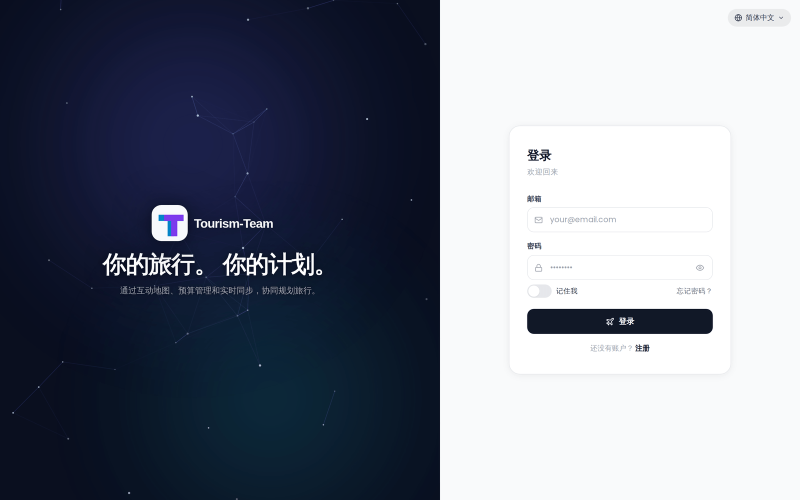

# 快速开始

用一条 Docker 命令，五分钟内跑起 Tourism-Team。



## 前提条件

- 本机已安装并运行 Docker
- `3000` 端口可用（或换一个不同的主机端口）

## 运行 Tourism-Team

一步生成加密密钥并启动容器：

```bash
docker run -d \
  --name trek \
  -p 3000:3000 \
  -e ENCRYPTION_KEY="$(openssl rand -hex 32)" \
  -v ./data:/app/data \
  -v ./uploads:/app/uploads \
  --restart unless-stopped \
  mauriceboe/trek:latest
```

**参数说明：**

| 参数 | 用途 |
|---|---|
| `-d` | 在后台运行 |
| `-p 3000:3000` | 把容器的 3000 端口映射到主机的 3000 端口 |
| `-e ENCRYPTION_KEY=...` | 存储机密的静态加密密钥 |
| `-v ./data:/app/data` | 持久化数据库和机密 |
| `-v ./uploads:/app/uploads` | 持久化上传的文件 |
| `--restart unless-stopped` | 重启后自动启动 |

**为什么需要加密密钥？** Tourism-Team 用这个密钥加密存储的机密（API 密钥、MFA 种子、OIDC 凭据）。如果跳过它，Tourism-Team 会自动生成一个并保存到 `./data/.encryption_key`。显式设置意味着密钥由你掌控，可以单独备份。上面内联生成的密钥不会被打印出来，但 Tourism-Team 会在首次启动时把它写入 `./data/.encryption_key`，所以想要在别处留一份副本时，`cat ./data/.encryption_key` 就能把它取回来。

随时生成一个独立密钥：

```bash
openssl rand -hex 32
```

## 访问 Tourism-Team

在浏览器中打开 `http://localhost:3000`。

## 首个用户

首次启动时，Tourism-Team 会在任何用户注册之前自动创建一个管理员账户。凭据取决于你启动容器的方式：

- **设置了 `ADMIN_EMAIL` 和 `ADMIN_PASSWORD` 环境变量：** 直接使用这两个值。
- **没有设置这些环境变量：** Tourism-Team 用邮箱 `admin@tt.local`、用户名 `admin` 和一个随机生成的密码创建账户。凭据会打印到容器日志 —— 运行 `docker logs trek` 即可获取。

首次登录时会提示你修改密码。

> **管理员：** 作为管理员，你会解锁管理后台 —— 用户管理、扩展开关、打包模板、备份和 API 密钥配置。

## 后续步骤

- [安装：Docker Compose](Install-Docker-Compose) —— 带安全加固的生产环境部署
- [反向代理](Reverse-Proxy) —— 把 Tourism-Team 放到 HTTPS 之后（PWA 安装和安全 Cookie 所必需）
- [环境变量](Environment-Variables) —— 完整配置参考
- [管理后台概览](Admin-Panel-Overview) —— 了解管理后台能做什么
