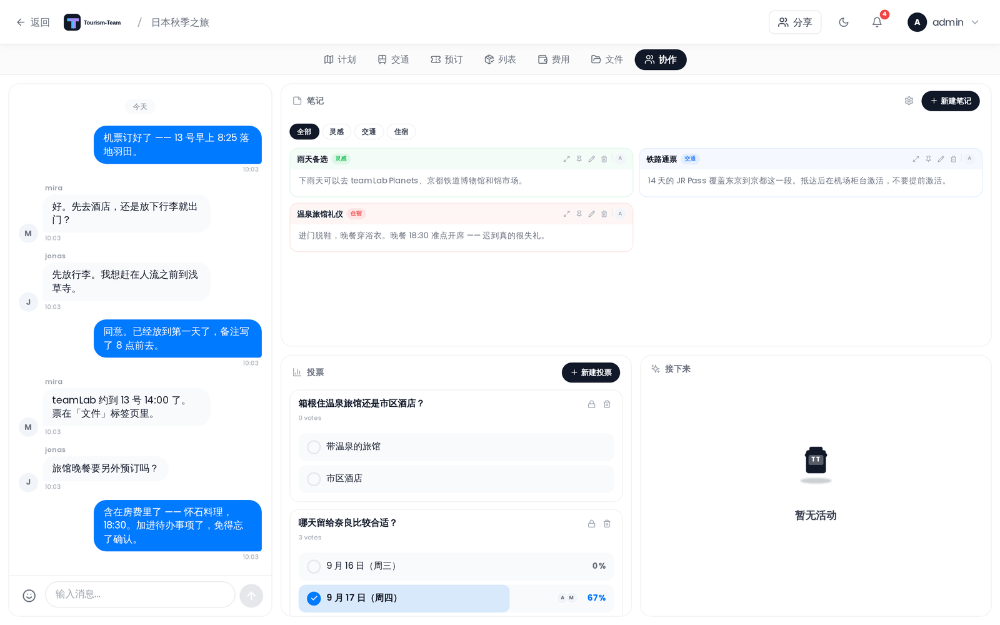

# 实时协作

Tourism-Team 让每一次旅行在所有在线成员之间保持同步，无需刷新页面。一个专门的 **协作扩展** 在那层同步之上再添一层：群聊、共享笔记、投票，以及一个显示即将到来的已分配地点的「接下来」小组件。

## 实时同步

旅行上的所有改动 —— 地点、日程计划、预订、预算条目和行李清单 —— 都会通过 WebSocket 立即广播给每位在线成员。别人的编辑一发生你就能看到。

## WebSocket 传输

| 参数 | 取值 |
|-----------|-------|
| 路径 | `/ws` |
| 范围 | 每次旅行一个房间 |
| 速率限制 | 每 10 秒窗口 30 条消息，另有一个更宽松的上限：每 10 秒 200 帧，每一帧在解析之前都要计入。实时光标帧（`book:cursor`）不受较严限制的约束，但仍受较宽松那个的约束 |
| 最大载荷 | 每条消息 64 KB |
| 心跳 | 每 30 秒 Ping 一次；漏掉 pong 的套接字会被终止 |
| Origin 检查 | 仅在设置了 `ALLOWED_ORIGINS` 时强制执行：`Origin` 头与列表条目不完全一致的升级请求，会在握手期间以 HTTP **403** 拒绝。完全没有发送 `Origin` 头的升级请求总是被放行 |

**认证** 使用一个短时效的临时令牌，在连接时作为查询参数传入。如果认证失败，服务器会以以下代码之一关闭连接：

- **4001** —— 令牌缺失、无效或已过期；用户不存在
- **4403** —— 站点范围要求 MFA，但该账户未启用 MFA

Origin 拒绝发生在套接字存在之前，因此它完全不产生关闭代码 —— 浏览器只会报告连接失败。而且由于不发送 `Origin` 头的客户端被豁免，curl 和其他 CLI 客户端仍能连接，而所有浏览器都失败，这看起来像是客户端 bug。如果实时同步在反向代理后面停止工作，请检查 `ALLOWED_ORIGINS` 是否列出了浏览器所用的确切协议、主机和端口：比较是纯字符串匹配，因此 `https://tt.example.com` 既不匹配 `http://tt.example.com`，也不匹配 `https://tt.example.com:443`。见 [环境变量](Environment-Variables) 和 [反向代理](Reverse-Proxy)。

## 协作扩展

协作扩展（`collab`）必须由管理员启用后，旅行内的面板才会可见。启用后，它提供四个子功能，每个都可以独立开关：

| 子功能 | 提供什么 |
|-------------|-----------------|
| **聊天** | 带回应、回复和 URL 预览的群聊 |
| **笔记** | 可分类、可置顶、Markdown 格式的共享笔记 |
| **投票** | 单选或多选投票，可设截止时间 |
| **接下来** | 跨所有旅行日的即将到来的已分配地点 |

> **管理员：** 在 [管理：扩展](Admin-Addons) 中启用协作扩展和各个子功能。

在 **桌面端**，当其他子功能也启用时，面板会把聊天显示为左侧固定 380 px 的一列；如果只开启聊天，它会扩展为占满整个宽度。笔记、投票和接下来共享右侧的剩余空间。在 **移动端**，顶部的标签栏让你一次切换一个已启用的子功能。被禁用的子功能会从标签栏中隐藏。

## 冲突处理

Tourism-Team 采用 **最后写入获胜** 模型。每次变更都在服务器上应用，产生的规范状态会广播给所有在线客户端。如果两位成员同时编辑同一个字段，最后到达服务器的改动会保留下来；所有客户端都会收敛到那个由服务器权威裁决的状态。

重新连接时，本地排队的任何变更都会先刷到服务器，然后客户端才重新拉取旅行数据，因此离线改动会在读回最新状态之前被应用。

不存在操作转换或 CRDT 合并 —— 对同一字段的并发编辑不会被合并；其中一个会悄悄获胜。

## 访问控制

所有协作读取都要求旅行成员身份。写入 —— 发送消息、创建笔记、创建投票、投票 —— 需要 `collab_edit` 权限。没有 `collab_edit` 的成员可以读取，但不能发帖或互动。

## 相关页面

[群聊](Collab-Chat) · [协作笔记](Collab-Notes) · [投票](Collab-Polls) · [接下来小组件](Whats-Next-Widget) · [行程规划器概览](Trip-Planner-Overview) · [管理：扩展](Admin-Addons)
