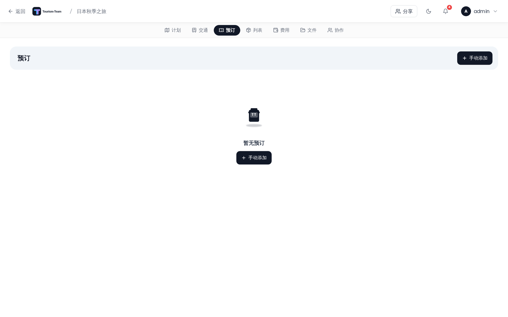

# 预订与订单

在一处跟踪你旅行中的所有预订 —— 酒店、餐厅、活动、旅游团等。

## 在哪里找到

在规划器中打开你的旅行并选择 **预订** 标签页。该面板按状态分组列出你的酒店、餐厅、活动、旅游团、停车和其他预订，顶部有一个类型筛选栏。交通预订位于它们自己的 **交通** 标签页 —— 见 [交通：航班、火车与汽车](Transport-Flights-Trains-Cars)。

## 预订类型

Tourism-Team 支持十六种预订类型，分布在两个标签页上：

| 类型 | 如何创建 |
|------|--------------|
| 航班 | [交通弹窗](Transport-Flights-Trains-Cars) |
| 火车 | [交通弹窗](Transport-Flights-Trains-Cars) |
| 公交车 | [交通弹窗](Transport-Flights-Trains-Cars) |
| 汽车 | [交通弹窗](Transport-Flights-Trains-Cars) |
| 出租车 | [交通弹窗](Transport-Flights-Trains-Cars) |
| 自行车 | [交通弹窗](Transport-Flights-Trains-Cars) |
| 邮轮 | [交通弹窗](Transport-Flights-Trains-Cars) |
| 渡轮 | [交通弹窗](Transport-Flights-Trains-Cars) |
| 公共交通 | [交通弹窗](Transport-Flights-Trains-Cars) |
| 其他（交通） | [交通弹窗](Transport-Flights-Trains-Cars) |
| 住宿（酒店） | 预订面板中的添加按钮 —— 见 [住宿](Accommodations) |
| 餐厅 | 预订面板中的添加按钮 |
| 活动 | 预订面板中的添加按钮 |
| 旅游团 | 预订面板中的添加按钮 |
| 停车 | 预订面板中的添加按钮 —— 一种固定地点的预订（例如机场停车） |
| 其他 | 预订面板中的添加按钮 |

十种交通类型通过 **交通** 标签页上专门的交通弹窗创建，在那里你可以输入端点和交通特有的字段。其余六种直接从预订面板创建，也只有这六种会出现在那里。

## 待确认与已确认

预订被分组为两个可折叠的区域：**待确认** 和 **已确认**。你可以独立折叠或展开每个区域 —— 展开/收起状态按旅行保存，因此能在页面重新加载后保留。状态在你创建或编辑预订时设置。

在桌面端，类型筛选栏让你只显示特定类型。筛选选择会为当前浏览器会话保留。

出行人按每条预订从旅行成员名册中设置，访客也包括在内。

> **AI / MCP：** `set_reservation_travelers` 写入该列表；它会整体替换该列表，并忽略任何不在该旅行上的人。见 [MCP 工具与资源](MCP-Tools-and-Resources)。

一旦旅行有多位成员，且至少有一条预订分配了出行人，出行人筛选器就会出现在它旁边 —— 桌面端和移动端都是如此。点击一个头像即可只显示那个人的预订；可以同时激活多个人。在桌面端，该选择像类型筛选一样会为浏览器会话保留；在移动端，离开该标签页时会重置。

## 预订卡片的内容

每张卡片显示：

- **状态圆点** —— 绿色表示已确认，琥珀色表示待确认
- **类型标签** —— 该预订类型的图标和标签
- **需要审阅徽标** —— 一个琥珀色徽标，显示在由导入器标记为可能需要你注意的预订上
- **标题** —— 预订名称
- **编辑和删除按钮** —— 仅在你拥有编辑权限时可见

> **管理员：** 编辑和删除按钮受 `reservation_edit` 权限门控。没有该权限的成员看到的是只读卡片。

- **日期和时间范围** —— 开始日期，以及设置后的结束日期/时间
- **从 → 到** —— 起点和终点，对交通类型显示
- **确认号** —— 以等宽字体显示。如果你在常规设置中启用了 **隐藏预订编号**，该编号默认被模糊处理，悬停或点击时显示
- **类型特有的元数据：**
  - 航班：航空公司名称、航班号
  - 火车：车次、站台、座位
  - 酒店：入住时段、退房时间（见 [住宿](Accommodations)）
- **地点 / 地址** —— 只要该预订有的话；对酒店来说，这是其酒店区块中的地址
- **关联的住宿** —— 如果该预订关联到一条住宿记录，则为酒店名称
- **日程计划分配** —— 该预订关联到的天数和地点
- **链接** —— 预订 URL，在新标签页中打开。带有 Tourism-Team 拒绝打开的协议的链接会改为以纯文本显示
- **备注**
- **附件** —— 显示为可点击的下载链接
- **出行人** —— 分配到此预订的成员和访客的头像，仅在至少分配了一位时显示

## 创建一条预订

在预订面板中点击 **添加**（或 + 按钮）。填写表单：

1. **类型** —— 选择住宿、餐厅、活动、旅游团、停车或其他
2. **标题** —— 必填
3. **关联到日程计划分配** —— 可选；跨所有天数和地点搜索，按天分组。住宿类型不可用
4. **开始日期和时间** —— 住宿类型不显示
5. **结束日期和时间** —— 住宿类型不显示
6. **地点 / 活动** —— 可选地把一个既有的旅行地点关联到该预订。选择一个只会填补你留空了的标题和地点。住宿类型不显示，它下面有自己的酒店地点选择器
7. **地点 / 地址** —— 对住宿类型，该字段位于酒店专属区块中（第 10 项）
8. **确认号**
9. **状态** —— 待确认或已确认
10. **酒店特有字段** —— 仅对住宿类型显示，紧接在状态之后：酒店地点、入住日、退房日、地点 / 地址、入住时间（时段起止）和退房时间。地址会从选定的酒店地点预填，如果该地点没有地址，则保留手工输入的地址。见 [住宿](Accommodations)
11. **链接** —— 可选的预订 URL，每种类型都显示
12. **备注**
13. **出行人** —— 把旅行成员和具名访客分配到此预订。访客与成员出现在同一个选择器中
14. **文件** —— 从你的设备附加（PDF、Word 文档、文本文件、图片），或链接一个既有的旅行文件。保存前添加的文件会在预订创建后自动上传
15. **费用** —— 仅在费用扩展启用时显示。该表单没有价格字段，而是带一个 **创建支出** 按钮：它会保存该预订，然后打开费用编辑器，新建一条关联到它的支出，因此这条支出跟其他支出一样有付款人、分摊和日期。关联之后，该区块会显示这条支出，并带编辑和移除操作。见 [费用](Budget-Tracking)

## 从预订确认导入

Tourism-Team 可以解析预订确认邮件、PDF 和通行凭证，并使用 [KDE Itinerary](https://apps.kde.org/itinerary/) 自动创建预订。

### 支持的格式

| 格式 | 扩展名 |
|--------|-----------|
| 预订确认邮件 | `.eml` |
| PDF 票据或确认单 | `.pdf` |
| Apple Wallet 通行凭证 | `.pkpass` |
| HTML 确认页面 | `.html`、`.htm` |
| 纯文本邮件 | `.txt` |

每次导入最多 5 个文件，每个 10 MB。

### 如何导入

1. 打开 **预订** 标签页 —— 同一个导入按钮也位于 **交通** 工具栏中。
2. 点击工具栏中的 **从文件导入**（下载）按钮 —— 只有当你的服务器上有提取器，或 AI 解析扩展已启用时，该按钮才会显示。
3. 把你的文件拖放到上传区域，或点击浏览。
4. 上传对话框会立即关闭，右下角的一个 **后台小组件** 会显示 *正在解析文件…*，当你上传了多个文件时还会带一个运行中的计数。解析期间你可以继续在 Tourism-Team 中工作 —— 该小组件会跟随你到其他页面，并在重新加载后继续存在。
5. 解析完成后，点击小组件的 **导入** 按钮开始审阅。如果什么都无法提取，小组件会改为说明这一点，并在 AI 解析扩展启用时，为同一批文件提供 **尝试 AI 解析**。
6. 每条检测到的预订都会**在常规预订（或交通）表单中预填打开**，一条接一条，并已附加它来自的文件。在你逐条确认之前，不会保存任何内容。

每条预订在保存时会出现在面板中，并实时广播给所有在线的旅行成员。

### 会自动创建什么

- **酒店** —— 一条预订 *以及* 日程计划中一条关联的住宿记录（入住/退房日期从确认单中读取）。
- **酒店 / 餐厅 / 活动** —— 当提取器返回位置数据时，场地会自动创建为一个带坐标的地点。
- **所有类型** —— 如果费用扩展已启用且存在价格，会创建一条预算条目。

### 当按钮不可见时

**从文件导入** 按钮只有在 `kitinerary-extractor` 二进制文件和 [AI 解析扩展](AI-Booking-Import) 都不可用时才会隐藏。启用并配置好 AI 扩展后，没有该二进制文件也能导入 —— 每个文件都直接交给模型。该二进制文件随官方 Tourism-Team Docker 镜像一起发布。如果你从源码运行 Tourism-Team，请安装 `libkitinerary-bin` 包（Debian trixie / Ubuntu 25.04+），或把 `KITINERARY_EXTRACTOR_PATH` 设为该二进制文件的完整路径。见 [环境变量](Environment-Variables)。

### 需要审阅标记

提取器只能部分解析的条目会被标记为 **需要审阅** —— 卡片上的一个琥珀色徽标。导入后请审阅这些预订，并手工补上任何缺失的字段。

### 难读文件的 AI 兜底

KDE Itinerary 只识别结构化票据。对于它读不了的确认单 —— 纯文本邮件、不常见的 PDF 版式、它不认识的供应商 —— Tourism-Team 可以选择把文件交给 AI 模型。可选的 **AI 解析** 扩展只对 Itinerary 返回空结果的文件运行，在后台解析它们，并在你保存之前把每个结果标记为需审阅。它可与自托管的本地模型配合工作，因此预订数据无需离开你的服务器。见 **[AI 订单导入](AI-Booking-Import)**。

## 从 AirTrail 导入

在 **AirTrail** 集成扩展启用、且你的实例已在 **设置 → 集成** 下连接后，**交通** 工具栏会显示一个 **AirTrail** 按钮。它会列出你 AirTrail 账户中的航班 —— 落在旅行日期内的航班会被预先选中 —— 并把每个航班导入为一条航班预订，与 AirTrail 保持双向同步。

### 联程航班（中转）

当选中的航班构成一次联程 —— 每一段都从上一段降落的机场起飞，且在 24 小时内继续 —— 选择器会把它们分组，并提供 **把它们作为一次带中转的航班导入**。该选项默认开启；取消勾选即可保留为分开的预订。合并后的预订会保留每一段自己的航空公司、航班号、时间和座位，中转机场会成为航线上的一个中转 **经停**，而每一段会分别归入规划器中各自的那一天。由于经停不是目的地，中转国在足迹中不再显示为已访问。

AirTrail 本身没有多段航班，因此合并后的预订会 **不带实时同步** 地导入。它会保留蓝色的 **AirTrail** 徽标 —— 悬停它，提示会说明该中转没有单一的 AirTrail 航班可以同步回去。灰色的 *未同步* 徽标则是另一回事：该航班在 AirTrail 中被移除了。它的源航班仍被识别 —— 选择器不会再提供它们以供导入。当你手工给一条已同步的单段航班添加经停时也是如此：该预订会与 AirTrail 脱离，而不是去同步一个 AirTrail 无法表示的形态。

## 编辑和删除

每张卡片都有一个铅笔图标用于打开编辑表单，以及一个垃圾桶图标用于删除。删除需要在对话框中确认，之后记录才会被移除。

## 实时同步

预订的改动（创建、更新、删除）会通过 WebSocket 立即广播给所有在线的旅行成员，因此每个人无需刷新就能看到最新状态。

---

**参见：** [交通：航班、火车与汽车](Transport-Flights-Trains-Cars) · [住宿](Accommodations) · [费用](Budget-Tracking) · [文档与文件](Documents-and-Files) · [行程规划器概览](Trip-Planner-Overview)
