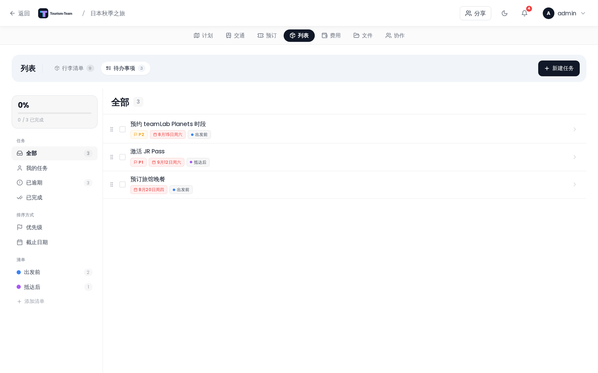

# 待办事项

管理行程任务和出行前准备的待办清单。

## 在哪里找到它

打开行程规划器中的 **列表** 标签页，然后选择 **待办事项**。待办事项功能与行李清单共用同一个扩展，因此只有在该扩展启用时才可见。

> **管理员：** 在 [管理：扩展](Admin-Addons) 中启用「列表/行李清单」扩展。

## 布局

该面板默认分为两栏：

- **左侧边栏** —— 清单导航、智能筛选、排序开关，以及一张完成进度卡片。
- **任务列表** —— 符合当前筛选条件的任务。

点击某个任务时，**详情面板**会作为第三栏出现在任务列表右侧（桌面端），或者从底部滑出（移动端）。新建任务表单同样以模态浮层打开。

在小屏幕上，侧边栏会折叠成一条窄图标栏，只显示彩色圆点和带数量角标的图标。

## 任务字段

每个任务都有以下字段：

| 字段 | 说明 |
|---|---|
| 名称 | 必填。 |
| 已勾选 | 布尔值 —— 将任务标记为完成。 |
| 清单 | 可选的分组标签。侧边栏标题是 **清单**，按钮文字是 **添加清单**，没有清单的任务显示 **无清单**。 |
| 截止日期 | 可选日期。 |
| 描述 | 可选的自由文本正文。 |
| 分配给 | 可选的旅行成员。 |
| 优先级 | 0（无）、1（P1）、2（P2）或 3（P3）。 |

点击任务行可在右侧打开详情面板（移动端则为模态面板），在其中编辑所有字段。

## 优先级

| 级别 | 标签 | 颜色 |
|---|---|---|
| 1 | P1 | 红色（`#ef4444`） |
| 2 | P2 | 琥珀色（`#f59e0b`） |
| 3 | P3 | 蓝色（`#3b82f6`） |

未设置优先级的任务不显示标签。

## 侧边栏筛选

| 筛选 | 显示内容 |
|---|---|
| **全部** | 所有未勾选的任务。 |
| **我的任务** | 分配给你且未勾选的任务。 |
| **已逾期** | 截止日期已过且未勾选的任务。 |
| **已完成** | 已勾选的任务。 |
| 各清单行 | 该特定清单中的所有任务（已勾选和未勾选）。 |

## 按优先级排序

切换侧边栏中的 **优先级** 按钮，可按 P1 → P2 → P3 对当前任务列表排序（没有优先级的任务排在最后）。

## 添加任务

点击列表面板标题栏右上角的 **+ 新建任务** 按钮（在 **待办事项** 子标签页处于活动状态时可见）。新建任务表单会以模态窗口打开，你可以在保存前设置所有字段。在移动端，它从屏幕底部滑出。

## 权限

所有写操作都需要 `packing_edit` 权限（与行李清单共用）。

## 另见

- [行李清单](Packing-Lists)
- [管理：扩展](Admin-Addons)
- [行程规划器概览](Trip-Planner-Overview)
