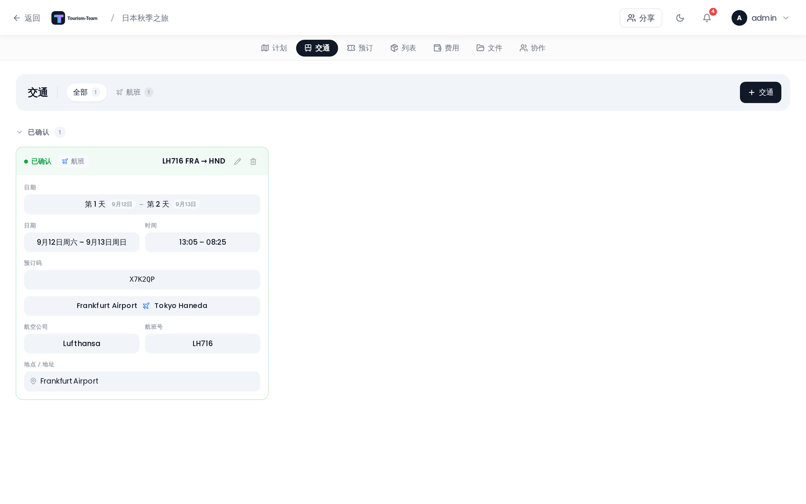

# 交通：航班、火车与汽车

记录航班、火车、租车和邮轮，包含出发与到达端点、时间以及各类交通特有的详细信息。

## 在哪里创建

在行程规划器中打开 **交通** 标签页并点击 **添加**，或从某天的视图打开规划器并使用交通快捷方式。交通记录留在 **交通** 标签页中——[预订](Reservations-and-Bookings) 标签页只列出非交通类预订（住宿、餐厅、活动、旅游团、停车、其他），因此同一条记录不会在两处同时出现。交通确实会与其他预订一起出现在另外两个地方：内联显示在日程计划中，以及在 [公开分享链接](Public-Share-Links) 上——其单一的 **预订** 标签页会同时列出预订和交通。

## 公共交通搜索

**添加交通** 对话框有两种模式：**手动**（经典表单）和 **自动** —— 由 [Transitous](https://transitous.org/) 提供支持的公共交通路线搜索，免费开放数据，无需 API 密钥或付费提供商。每个日期标题上的 **公共交通按钮**（有轨电车图标）会直接以自动模式打开该对话框。（这个按钮取代的重命名铅笔则移到了日程详情面板中日期名称旁边。）

你也可以从单个区间开始搜索：点击日程计划中两个站点之间的行程时间连接线，然后从菜单中选择 **公共交通**。搜索打开时已填好该区间的起点和终点，出发时间取自你正要离开的那一站。

模式开关只在旅行同时有 **开始日期和结束日期** 时出现——公共交通搜索需要有真实日期作为出发依据。在没有日期的旅行中，对话框直接打开手动表单；在旅行设置中添加日期即可恢复自动模式。

- 选择 **出发地** 和 **目的地**（站点/车站搜索；当天的地点和酒店会作为快捷选项出现）、**出发/到达** 时间，并按方式筛选：火车、地铁、有轨电车、公交车、渡轮、缆车。
- 按 **最佳路线**、**减少换乘** 或 **减少步行** 对结果排序。
- 每条结果显示当地出发/到达时间、时长、换乘、步行时间，以及使用官方配色的线路徽章；展开可查看逐站明细。
- **添加到当天** 把选中的线路保存为一条正式的 **公共交通** 条目。它按出发时间插入当天时间线，并在计划中直接显示其线路徽章、换乘和步行时间。点击它会打开 **公共交通行程**：完整的逐站行程，加上可编辑的标题和备注、一个会重新运行搜索并替换行程的 **更改路线** 操作，以及删除。在交通标签页中，这些行程显示在它们自己的 **自动公共交通** 分区里。

自托管用户可以通过 `TRANSIT_API_URL` 环境变量指向自己的 MOTIS 实例。

## 交通类型

共有九种类型：**航班**、**火车**、**公交车**、**汽车**、**出租车**、**自行车**、**邮轮**、**渡轮** 和 **其他**。

> **AI / MCP：** `create_transport` 接受同样的九种。定班公共交通是另一回事：`create_transit_journey` 附带提供商的行程。见 [MCP 工具与资源](MCP-Tools-and-Resources)。

## 通用字段

所有交通类型共享这些字段：

| 字段 | 说明 |
|-------|-------|
| 标题 | 必填 |
| 出发日期 | 关联到某个旅行日 |
| 出发时间 | 可选 |
| 到达日期 | 关联到某个旅行日（可与出发日不同） |
| 到达时间 | 可选 |
| 预订码 / 确认号 | 可选 |
| 状态 | 待确认或已确认 |
| 备注 | 可选的自由文本 |

## 端点

### 航班

出发和到达字段使用 **机场选择器** —— 输入城市名或 IATA 代码（至少两个字符）即可搜索。结果显示 IATA 代码、机场名称、城市和国家。

选定机场后，该机场的 **时区** 会出现在时间字段旁边。这样你就可以输入当地时间作为出发和到达时间，而不会在跨时区时产生混淆。

### 火车、汽车和邮轮

出发和到达字段使用 **通用地点选择器** —— 至少输入三个字符，然后从搜索结果中选一个；只输入过、从未选中的名称不会被保存。结果来自地图搜索服务。

对于 **汽车** 类型，日期字段会重新命名为符合租车语义：出发一侧显示为 **取车** 和 **取车时间**，到达一侧显示为 **还车** 和 **还车时间**。没有单独的租车类型——租来的车和你自己的车都记为汽车。

## 航班特有字段

当类型设为航班时，每一段都会出现三个附加字段：

- **航空公司** —— 承运人名称（如 Lufthansa）
- **航班号** —— （如 LH 123）
- **座位** —— 座位号（如 12A）

机场超过两个的航班会多出第四个分段字段，即自己的 **预订码 / 确认号**，因此中转行程的每一段都可以带各自的参考号。

## 火车特有字段（多区间线路）

长途铁路行程常常是一张票坐好几趟车，因此火车使用 **多区间线路编辑器**（与航班所用的是同一个），而不是一组扁平字段。你要构建一条有序的站点链：

- 用地点选择器搜索每个 **车站**；使用 **添加经停** 在起点和终点之间插入中途车站。
- 每个 **区间**（两个相邻车站之间的段）都有自己的 **车次**、**站台**、**座位**，以及自己的出发/到达 **日期和时间**。
- *N* 个车站构成 *N − 1* 个区间。简单的两站火车就只有一个区间——在那里填写它的车次/站台/座位。

在此功能之前创建的火车仍可正常使用：其现有的车次/站台/座位会作为一个区间读取。

## 在地图上

两端都已设置的交通记录会在旅行地图上显示为线条：

- **航班**、**邮轮** 和 **渡轮** 渲染为遵循地球曲率的大圆测地曲线。
- **汽车**、**公交车**、**出租车** 和 **自行车** 沿 **真实道路** 走，按需通过公共 OSRM 路由器规划（汽车/公交车/出租车为驾车，自行车为骑行）。路线加载期间显示直线，若规划失败或行程超过约 2000 km 则保留直线。
- **火车** 渲染为直线折线；**多区间火车** 会画出完整的站点链（从 → 经停 → 到）。

已确认的预订画成实线；待确认的预订使用虚线。每个端点都有一个带交通图标的胶囊形标记。打开 **预订路线标签**（设置 → 显示 → 旅行与地图）还会把机场代码或车站名称打印在胶囊里；当两个端点在屏幕上足够分开时标签就会出现。

关于这些叠加层如何工作，见 [地图功能](Map-Features)。

## 在日程计划中

当交通被分配到某一天时，它会内联出现在当天时间线中地点之间。跨多天的交通会根据类型显示阶段标签：

| 类型 | 开始日 | 中间日 | 结束日 |
|------|-----------|-------------|---------|
| 航班 | 出发 | 途中 | 到达 |
| 汽车 / 租车 | 取车 | 使用中 | 还车 |
| 火车 / 邮轮 | 开始 | 进行中 | 结束 |

**多区间火车**（以及多区间航班）则改为 **每个区间一行**，各自按自己的时间插入自己的那一天，并可独立重新排序，而不是显示为单个跨天行。

详见 [日程计划与备注](Day-Plans-and-Notes)。

---

> **更快的方式：导入确认文件** —— 如果你有预订确认邮件或 PDF，可以完全跳过表单。见预订指南中的 [从预订确认导入](Reservations-and-Bookings#import-from-booking-confirmation)。

---

**参见：** [预订与订单](Reservations-and-Bookings) · [住宿](Accommodations) · [地图功能](Map-Features) · [日程计划与备注](Day-Plans-and-Notes)
