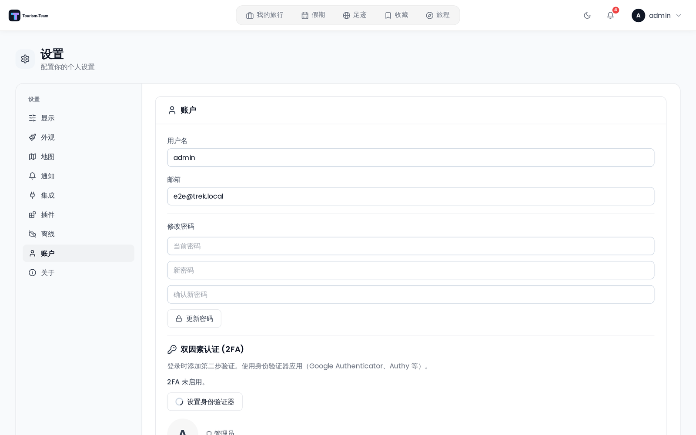

# 两步验证

## 它是什么

Tourism-Team 支持基于时间的一次性密码（TOTP）两步验证，兼容 Google Authenticator、Authy、1Password 以及任何标准 TOTP 应用。2FA 启用后，每次登录时你需要在密码之后再输入一个 6 位验证码（或一个备用代码）。

## 设置 2FA

前往 **设置 → 账户**，找到 **双因素认证 (2FA)** 区域，然后点击 **设置身份验证器**。

1. 界面会显示一个二维码和一段文本密钥。用你的身份验证器应用扫描二维码。
   > **注意：** 设置会话在 **15 分钟**后过期。如果你没有在该窗口内完成设置，请重新开始。
2. 输入你的身份验证器应用中显示的 6 位验证码，然后点击 **启用 2FA**。
3. 保存你的 **10 个备用代码**。这些是一次性代码，只显示一次 —— 请把它们存放在安全的地方（密码管理器、打印出来的纸张）。每个代码格式为 `XXXX-XXXX`。
4. 2FA 现在已在你的账户上启用。

## 使用 2FA 登录

输入邮箱和密码后，Tourism-Team 会再弹出一个提示，要求输入你的 TOTP 验证码。你有 **5 分钟**完成这第二步，之后中间会话令牌会过期。输入以下之一：

- 你的身份验证器应用中当前的 6 位验证码，或
- 你的一个备用代码（格式 `XXXX-XXXX`）。每个备用代码只能使用一次。

## 停用 2FA

前往 **设置 → 账户**，使用 **停用 2FA** 表单。你必须同时提供：

- 你当前的账户**密码**
- 来自你的身份验证器应用的有效 **TOTP 验证码**

> **注意：** 当管理员为所有用户强制要求 2FA 时，你无法停用它（见下文）。持有通行密钥并不能解除这一限制。

## 管理员强制要求的 2FA

管理员可以为所有用户强制要求 2FA。启用此设置之前，管理员必须先用自己的身份验证器应用或通行密钥保护好自己的账户 —— 否则服务器会拒绝该变更，并提示 *Secure your own account with two-factor authentication or a passkey before requiring it for all users.*。

如果该设置处于启用状态，而你的账户既没有 2FA 也没有通行密钥，那么登录后的任何 API 请求都会返回 403 错误，客户端会把你重定向到 **设置 → 账户**，并提示你完成 2FA 设置。在设置完成之前，你无法使用应用。见 [管理：权限](Admin-Permissions)。

经过用户验证的**通行密钥**与 TOTP 身份验证器一样满足该策略：只要你的账户上至少有一个通行密钥，API 就不再拦截你，你也永远不需要身份验证器应用。即使管理员之后再次关闭通行密钥登录，这一条依然成立 —— 已有的通行密钥会持续满足该策略。实时同步是唯一的例外：WebSocket 握手只接受 TOTP，因此在该策略下，仅有通行密钥的账户可以正常使用 Tourism-Team，但永远收不到其他成员的实时更新。不会有任何提示 —— 客户端只是不断重试连接。

注册通行密钥能否成为摆脱锁定的一种途径，取决于实例配置。通行密钥登录默认关闭（见 [通行密钥](Passkeys)）；在管理员已将其开启的实例上，注册端点仍然可达，而 API 的其余部分被拦截，因此你可以从 **设置 → 账户** 添加通行密钥，而不必设置身份验证器应用。在它关闭的实例上，TOTP 设置是唯一能自行解锁的办法 —— 或者请管理员重置你的 2FA。

> **管理员：** 你可以在管理后台为被锁定的用户重置 2FA。见 [管理：用户与邀请](Admin-Users-and-Invites)。

## 速率限制

Tourism-Team 实施基于 IP 的速率限制，以防御暴力破解攻击：

| 端点 | 限制 |
|---|---|
| 登录（`/api/auth/login`） | 每 15 分钟 10 次尝试 |
| MFA 验证码校验（`/api/auth/mfa/verify-login`） | 每 15 分钟 5 次尝试 |

超过限制会返回 HTTP 429。请等待窗口重置后再重试。

## 演示用户

演示用户账户无法启用或停用 MFA。

---

**另见：** [登录与注册](Login-and-Registration) · [通行密钥](Passkeys) · [管理：权限](Admin-Permissions) · [管理：用户与邀请](Admin-Users-and-Invites) · [用户设置](User-Settings)
