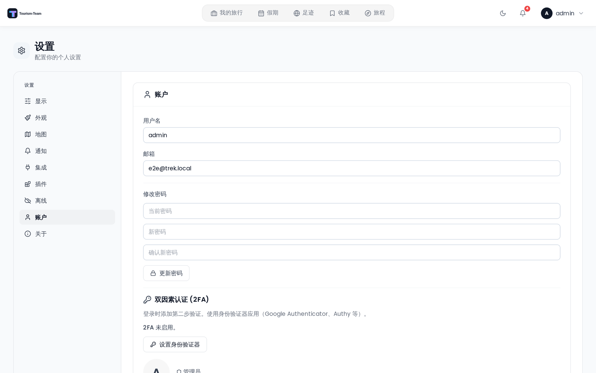

# 用户设置

设置页面让你个性化 Tourism-Team 的方方面面 —— 外观、地图、通知、离线行为，以及你的账户。

## 进入设置

打开顶部导航栏中的用户菜单，选择 **设置**。页面默认打开 **显示** 标签页。

如果你的账户需要设置 MFA，Tourism-Team 会直接把你重定向到 **账户** 标签页（通过 `?mfa=required`）。

## 标签页

| 标签页 | 用途 | 显示条件 |
|-----|---------|------------|
| 显示 | 启动页面和启动标签页、货币、语言、温度单位、距离单位、时间格式、预订路线标签、始终显示预订路线、地图 POI 胶囊、隐藏预订编号，以及从住宿地优化路线 | 始终 |
| 外观 | 颜色模式、配色方案 / 强调色、可读性（透明效果、减少动态效果、布局密度、文本大小），以及哪些小组件出现在你的仪表盘上 | 始终 |
| 地图 | 地图提供商（Leaflet、Mapbox GL 或 MapLibre GL）、瓦片预设、地图样式和 Mapbox 令牌、3D 建筑、高质量模式 | 始终 |
| 通知 | 电子邮件、webhook、ntfy 和应用内通知偏好 | 始终 |
| 集成 | 照片提供商（Immich、Synology 等）、AirTrail 连接、你自己的 AI 解析模型，以及 MCP OAuth 客户端 / API 令牌 | 仅在照片提供商（Immich 或 Synology Photos）、MCP、AirTrail 或 AI 解析启用时 |
| 插件 | 已安装插件的按用户设置 | 仅在至少安装了一个插件时 |
| 离线 | 已缓存旅行、待处理更改、重新同步和清除缓存 | 始终 |
| 账户 | 用户名、邮箱、密码、MFA（TOTP + 备用代码）、通行密钥、头像、删除账户 | 始终 |
| 关于 | 应用版本，Ko-fi / Buy Me a Coffee / GitHub（bug 报告、功能请求）/ Wiki 的链接 | 仅在版本元数据可用时 |

## 显示标签页

显示标签页控制以下偏好，全部在更改时立即保存。细节见 [常规设置](Display-Settings)。

**启动**

- **启动页面** —— 打开 Tourism-Team 时进入仪表盘（默认），或直接进入你进行中的旅行。
- **启动标签页** —— 该旅行打开时所在的规划器标签页，例如在旅途中记账用的费用。

**语言与地区**

- **显示货币** —— 你的显示货币；**行程货币**（默认）按每次旅行自身的货币显示。见 [货币](Currencies)。
- **语言** —— 桌面端显示为按钮网格，移动端为下拉菜单。
- **温度单位** —— 摄氏度（°C）或华氏度（°F）。
- **距离单位** —— 公制（km）或英制（mi）。
- **时间格式** —— 24 小时制（14:30）或 12 小时制（2:30 PM）。

**旅行与地图**

- **预订路线标签** —— 在预订路线端点标记上显示或隐藏车站 / 机场名称。
- **始终显示预订路线** —— 在地图上自动绘制每个航班、火车和其他预订的路线，而不必逐项开启。
- **在地图上探索地点** —— 在旅行地图上显示一个 POI 分类胶囊，用于从 OpenStreetMap 查找附近地点。
- **隐藏预订编号** —— 模糊处理确认号和参考编号（共享屏幕时很有用）。
- **从住宿地优化路线** —— 优化某一天时，路线从你醒来时所在的酒店出发，并在当晚入住的酒店结束。

## 外观标签页

- **颜色模式** —— 浅色、深色或自动（跟随你的操作系统 / 浏览器偏好）。
- **配色方案** —— 一个预设强调色，或使用自己的浅色和深色强调色的 **自定义**。
- **可读性** *（实验性）* —— 透明效果、减少动态效果、布局密度和文本大小。
- **仪表盘小组件** —— 哪些小组件出现在仪表盘上，桌面端和移动端各自独立。

细节见 [外观设置](Appearance-Settings)。

## 地图标签页

地图标签页在更改后需要一个显式的 **保存** 操作。

**提供商** —— 在以下选项中选择：

- **Leaflet** —— 默认选项。可从内置预设中选择（OpenStreetMap、OpenStreetMap DE、OpenFreeMap Positron/Bright、CartoDB Light/Dark、Stadia Smooth），或输入自定义瓦片 URL 模板。未配置的地图绘制的是 OpenFreeMap Positron；CartoDB 预设需要 API 密钥。
- **Mapbox GL**（实验性）—— 带 3D 建筑和地形的矢量瓦片。需要一个公开的 Mapbox 访问令牌（`pk.*`）。支持内置样式预设（Mapbox Standard、Standard Satellite、Streets、Outdoors、Light、Dark、Satellite、Satellite Streets、Navigation Day、Navigation Night）或自定义 `mapbox://styles/USER/ID` URL。额外选项：
  - **3D 建筑与地形** —— 倾斜视角和真正的 3D 建筑挤出（在所有样式上都有效，包括卫星样式）。
  - **高质量模式**（实验性）—— 抗锯齿 + 全球投影，边缘更锐利。可能影响低端设备的性能。
- **MapLibre GL** —— 来自 **OpenFreeMap** 的矢量瓦片，也是选择它而非 Mapbox GL 的理由：**它不需要访问令牌**。样式有 OpenFreeMap Liberty、Bright 和 Positron，或任意 `https://tiles.openfreemap.org/…` 样式 URL。3D 和高质量开关是 Mapbox 专有的，这里不会显示。

每个 GL 提供商都保留各自保存的样式，因此在 Mapbox GL 和 MapLibre GL 之间切换永远不会覆盖另一方的选择。

> 无论提供商设置如何，足迹始终使用 Leaflet。

**打开时的视图** —— 没有默认地图中心或缩放级别设置。每张地图都会根据它正在显示的地点自行取景。见 [地图设置](Map-Settings)。

## 账户标签页摘要

账户标签页让你：

- 编辑你的 **用户名** 和 **邮箱地址**。
- 更改你的 **密码**（服务器以仅 OIDC 模式运行时隐藏 —— 见 [OIDC 单点登录](OIDC-SSO)）。
- 设置或停用 **两步验证**（TOTP）。启用 MFA 后，备用代码只显示一次，可以复制、下载或打印。见 [两步验证](Two-Factor-Authentication)。
- 管理你的 **通行密钥** —— 添加一个（确认密码，然后按设备的提示操作）、重命名或移除。**添加通行密钥** 只在实例开启了通行密钥且 WebAuthn 域名可解析时出现；无论哪种情况，已有通行密钥都会继续列出，因此你总能清理它。见 [通行密钥](Passkeys)。
- 上传或移除你的 **个人头像**。
- **删除你的账户**（不可逆；如果你是唯一的管理员则会被阻止）。

如果你的账户是通过 SSO 关联的，你的角色旁边会出现一个 **SSO** 徽章，其下方显示 OIDC 签发方域名。

## 集成标签页

集成标签页只在 **照片提供商**（Immich 或 Synology Photos）、**MCP**、**AirTrail** 或 **AI 解析** 启用时可见。每个区块随其对应的扩展一起出现，因此该标签页只包含你的实例实际运行的内容：

- **照片提供商**（仅在启用了照片提供商时）—— 配置 Immich、Synology Photos 和其他照片集成。每个已启用的提供商显示一张卡片。
- **AirTrail**（仅在 AirTrail 扩展启用时）—— 你的自托管 AirTrail 的实例 URL 和 API 密钥，外加一个自签名证书开关和一个 **将更改写回 AirTrail** 开关（默认关闭：AirTrail 是事实来源，Tourism-Team 只从它读取）。**测试连接** 会报告它能看到多少个航班。密钥加密存储且从不预填 —— 留空该字段会保留已存储的密钥。
- **AI 解析**（仅在 AI 解析扩展启用时）—— 用于从你上传的文件中提取预订的提供商（OpenAI 或 Anthropic）、模型和 API 密钥，以及面向支持视觉的模型的 **将文档作为图片发送**。这是按用户生效的兜底方案：只有你的管理员没有为整个实例配置模型时它才生效。这里不提供本地 Ollama 端点 —— 那是在管理设置中一次性按实例配置的（#1772）。见 [AI 订单导入](AI-Booking-Import)。
- **MCP 区块**（仅在 MCP 扩展启用时）：
  - 显示 MCP 服务器端点 URL。
  - **OAuth 客户端** 子标签页 —— 创建和管理 OAuth 2.1 客户端（含重定向 URI 和权限范围）。为 Claude.ai、Claude Desktop、Cursor、VS Code、Windsurf 和 Zed 提供了快速填充预设。可以在此查看和撤销活动的 OAuth 会话。
  - **API 令牌** 子标签页（已弃用）—— 创建和管理用于直接 MCP 访问的个人 bearer 令牌。

## 参见

- [常规设置](Display-Settings)
- [外观设置](Appearance-Settings)
- [地图设置](Map-Settings)
- [通知](Notifications)
- [离线模式与 PWA](Offline-Mode-and-PWA)
- [两步验证](Two-Factor-Authentication)
- [语言](Languages)
