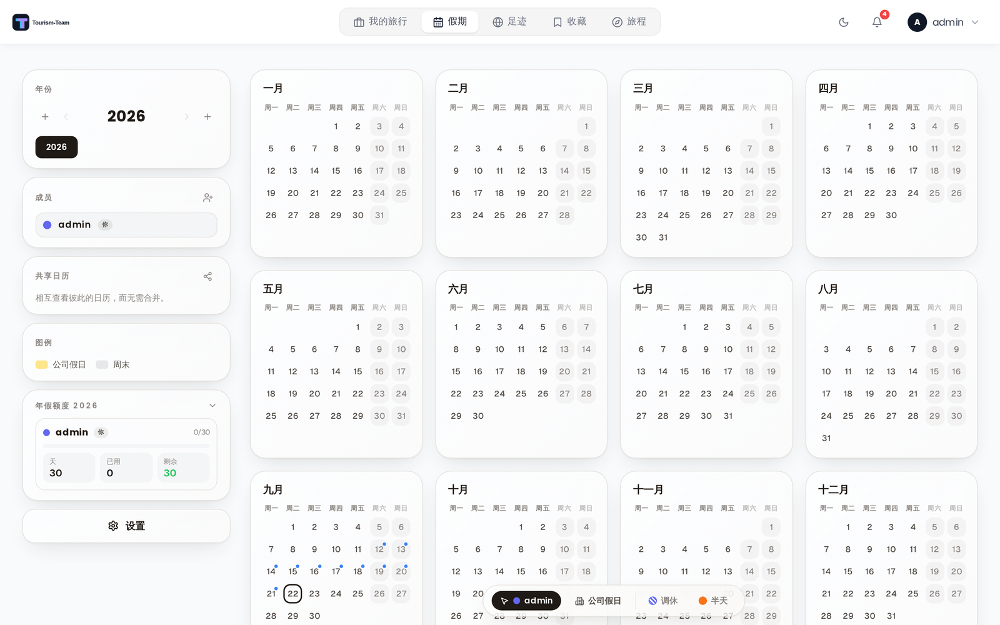

# 假期

假期是一个个人假期日程规划器，独立于你的行程规划之外。它跟踪你每年有多少天假期、已经用了多少天、还剩多少天。

> **管理员：**在 [管理：扩展](Admin-Addons) 中启用假期。

## 假期是什么

Tourism-Team 中的旅行代表具体的出行计划，而假期跟踪的是你的年假额度 —— 雇主或合同给你的假期天数、你已经记录的日子，以及剩余余额。它默认是私人的，但你可以把自己的计划与另一位 Tourism-Team 用户融合，以便并排查看彼此的日历。

## 进入假期

管理员启用假期扩展后，主导航中会出现一个 **假期** 条目。每位用户首次打开该页面时会自动获得自己的计划。

## 年度计划

假期按年份组织。你可以同时有多个年份处于活动状态，并用侧栏中的年份选择器在它们之间切换。

对每个年份，你的额度面板显示：

- **额度天数** —— 该年度的假期配额（点击该字段可就地编辑）。
- **已用** —— 你在日历上记录的日子。
- **剩余** —— 额度加上任何结转天数，再减去已用天数。

**结转** —— 当 `carry_over_enabled` 打开时，上一周期未使用的天数会自动加到下一周期的总数中。切换此设置时，结转数量会在所有既有年度记录上重新计算。关闭它会把所有结转余额清零。

## 休假年度

并非每个休假年度都是 1 月到 12 月，因此你可以在设置中的 **休假年度** 下设置自己的：

- **日历年度** —— 1 月 1 日到 12 月 31 日。默认值，也是所有既有计划使用的。
- **财政年度** —— 从你选择的某月某日开始，例如 7 月 1 日到次年 6 月 30 日。
- **入职日期** —— 从你入职日期的周年日开始。

额度、已用天数和结转都按该周期而非日历年度计算，日历网格也会相应地渲染这十二个月 —— 7 月开始会显示 7 月–6 月，并在中间跨过年度边界。活动周期会在额度标题下明确写出，因此标注为「2026」的卡片永远不会产生歧义。

这是一个**个人**设置。在融合计划中，每个人保留自己的休假年度和自己的数字；网格跟随正在查看它的人，因此大家看到的休息日仍然一致。

> 如果你的休假年度从某个月中间开始（比如 4 月 6 日），十二个月份卡片会对齐到整月，而天数计算仍然精确。起始月的头几天会被绘制出来，但属于上一个周期。

## 日历视图

主区域显示完整的 12 个月网格。每个格子代表一天。点击某一天即可记录或移除一条假期条目。当协作者被融合进你的计划后，已记录的日子会按人着色。

与你既有 Tourism-Team 旅行重叠的日子会在角上标记一个小蓝点。

你还可以把日历工具栏切换到 **公司** 模式，用于标记共享的公司假日；它们以琥珀色高亮，并且不扣减个人额度。

### 半天和调休日

工具栏中的两个开关会改变点击所记录的内容。它们相互独立，因此可以叠加：

- **半天** —— 把该天记为 0.5 天而不是一整天。半天保留该人的颜色，并在角上带一个小橙点。
- **调休 / 弹性** —— 把该天记为补休（弹性工时、取回的加班时间）。它**不**消耗任何假期额度。调休日在渲染时是该人颜色的斜线填充而非实心填充，并在额度卡片旁单独计数。

工具栏中每个开关的图标就是它会放置的标记，因此你在点击之前就能看到点击的效果。用相同设置再次点击某一天会清除它；用不同设置点击则会就地转换它。

**设置**（齿轮图标）让你配置：

- **封锁周末** —— 阻止在周末记录。你可以选择哪些日子算周末。
- **周起始日** —— 周一或周日。
- **结转** —— 如上文所述的开关。
- **休假年度** —— 日历年度、财政年度或入职日期，如上文「休假年度」所述。与这个面板的其他部分不同，它是你个人的设置，而不是计划级的。
- **公司假日** —— 启用一个共享的公司假日图层，任何被融合的用户都可以编辑。
- **法定节假日** —— 添加一个或多个国家/地区的节假日日历，让法定节假日出现在网格上。节假日数据从 nager.at 的法定节假日 API 获取。每个日历有一个标签、一种颜色，以及一个国家或地区选择器（支持德国州、瑞士州这样的次国家级地区）。
- **学校假期** —— 第二个节假日图层，有自己独立的开关，与法定节假日图层互不相关，且纯粹是视觉性的。每个日历有一个可选的标签、一种颜色和一个国家；在来源把国家拆分的地方，你还要选一个地区（德国的州、瑞士的州、法国的学区）或一个学校假期分组（比利时、荷兰），选完之前无法添加该日历。少数国家发布单一的国家级日历（爱沙尼亚、爱尔兰、塞尔维亚），除国家之外无需其他信息。学校假期数据来自 OpenHolidays API 而非 nager.at，覆盖的国家较少，因此选择器中只会出现受支持的国家。在网格上，学校假期当天会在格子底部得到一条彩色带；当多个日历覆盖同一天时会分成最多三段，而处于假期中、且没有其他任何内容（没有已记录条目、没有公司假日、没有法定节假日）的日子会用该日历的颜色淡染。学校假期从不扣减任何人的额度。

## 邀请协作者

你可以邀请其他 Tourism-Team 用户把他们的假期计划与你的融合。用户接受后，你们的计划就合并了：你们会用不同的颜色看到彼此记录的日子，必要时你还可以代对方记录日子。

要邀请某人，点击侧栏 **人员** 面板中的 **+** 图标，选择一位用户，然后发出邀请。对方会收到一条通知，必须接受后融合才会生效。

要撤销一次融合，打开设置并使用 **解除** 操作。每位用户记录的条目会回到各自独立的计划中。

## 分享你的日历（仅查看）

融合会把两个计划合并成一个 —— 所有人都能编辑所有内容。如果你只想让某人*看到*你什么时候休息（不同的雇主、不同的公司假日、各自独立的额度），那就改为分享你的日历。

分享是单向且只读的：

- 点击侧栏 **共享日历** 面板中的分享图标，选择一位用户并分享。无需接受步骤 —— 对方会收到一条通知，并且随时可以从自己的列表中移除该日历。
- 与你共享的日历会出现在同一个面板中。每一个都以彩色**圆环**叠加在网格上，环绕分享者的休息日（假期日、半天以及他所在计划的公司假日），与你自己的计划中那些实心格子明显不同。把鼠标悬停在带圆环的日子上，可以看到谁休息以及休息多少。
- 眼睛开关可以在不移除分享的前提下隐藏或显示某个共享日历；**停止分享** 会撤销你分享出去的日历。

共享日历从不授予编辑权限，两位用户的设置和额度保持各自独立，并且独立于融合工作 —— 你可以同时与一个人融合、与其他人分享。

## 实时同步

各种改动 —— 记录的日子、设置更新、融合、邀请 —— 都会通过 WebSocket 事件（`vacay:update`、`vacay:settings`、`vacay:invite`、`vacay:accepted`、`vacay:declined`、`vacay:cancelled`、`vacay:dissolved`）实时同步给所有被融合的协作者。只读分享会推送自己的事件（`vacay:share`、`vacay:share-removed`、`vacay:shared-update`），因此共享叠加层也会实时更新。你不需要刷新页面。

## 另见

- [扩展概览](Addons-Overview)
- [管理：扩展](Admin-Addons)
