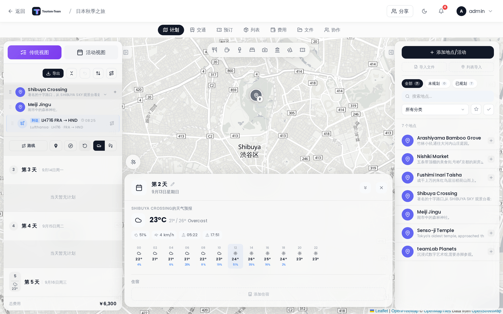

# 天气预报

Tourism-Team 为行程中的每一天显示天气预报和历史气候估算，数据由 Open-Meteo 提供 —— 无需 API 密钥。

## 预报出现的位置

点击左侧边栏中任意一天的标题，打开 **日程详情面板**。天气小组件出现在该面板的顶部。

每天在侧边栏的日程行内还会显示一个紧凑的天气徽章（图标 + 温度）。

## 显示内容

日程详情面板的天气小组件显示：

- 天气图标和天气状况标签
- 当天的最低 / 最高温度
- 降水概率和总降水量
- 风速（km/h，选择华氏度时为 mph）
- 日出和日落时间
- **逐小时条** —— 以 2 小时间隔显示图标和温度；降水概率超过 50 % 的时段会高亮

## 数据来源与时间窗口

| 日期范围 | 数据来源 | 缓存 TTL |
|---|---|---|
| 16 天内（今天 −1 天到今天 +16 天） | Open-Meteo 预报 API | 1 小时 |
| 早于今天 1 天以上 | Open-Meteo 存档 API（真实历史数据），用于侧边栏的紧凑徽章。日程详情面板对过去的日子也向预报 API 请求 | 24 小时（日程详情面板中为 1 小时） |
| 未来 16 天以上 | 取自去年同一天的气候估算 | 24 小时 |

远期估算会带 **Ø** 前缀（例如 "Ø 18 °C"），以明确它们是气候估算而非真实预报。如果某个已缓存的气候估算可以升级为实时预报，侧边栏的紧凑徽章会在后台静默重新获取。

## 温度与风速单位

温度跟随你在 [常规设置](Display-Settings) 中的设置 —— 在那里切换 °C 和 °F。风速以 km/h 显示（°C 模式）或 mph 显示（°F 模式）。

## 会话缓存

侧边栏的紧凑天气徽章会把获取到的数据缓存到 `sessionStorage` 中，持续时间为你的浏览器会话，因此在各天之间切换不会对已加载过的数据反复发起网络请求。日程详情面板每次打开时都会获取新的详细天气数据。

**另见：** [日程计划与备注](Day-Plans-and-Notes) · [常规设置](Display-Settings)
